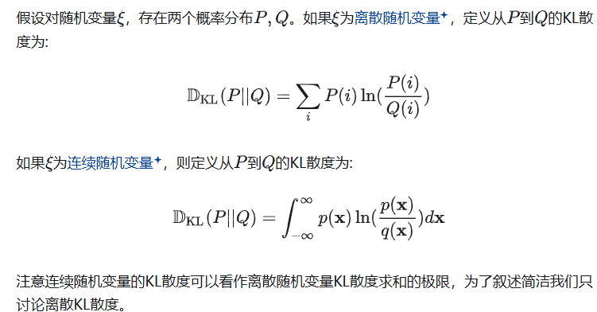
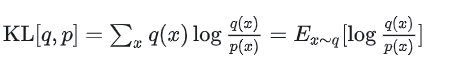
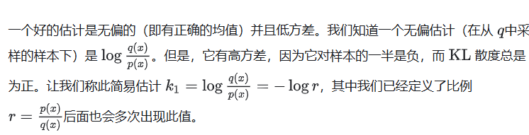
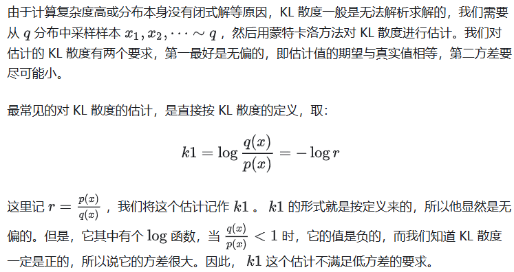
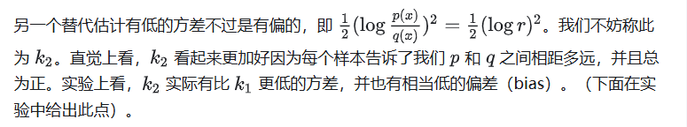
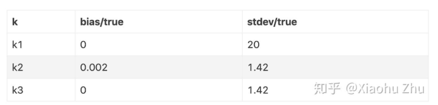

KL散度(Kullback-Leibler Divergence)是用来度量两个概率分布相似度的指标，它作为经典损失函数被广泛地用于聚类分析与参数估计等机器学习任务中

参考链接：

https://zhuanlan.zhihu.com/p/1893782254100115959

https://zhuanlan.zhihu.com/p/139084847（这个写的不错,上文来自于此）

# 1 基本定义

性质：非负性 仿射不变性 非对称

# 2 k1估计

给定样本x1x2..~q ，我们如何构造好的估计？

# 3 k2估计

# k3估计

更进一步，我们能不能既要无偏，又要低方差呢？想要降低方差

通常的办法是[控制变量](https://zhida.zhihu.com/search?content_id=256254533&content_type=Article&match_order=1&q=%E6%8E%A7%E5%88%B6%E5%8F%98%E9%87%8F&zhida_source=entity)（control variate）法，即选用无偏的k1，但是需要再加上一些期望为 0 ，且与k1负相关的项，从而在保证无偏的同时，降低方差

