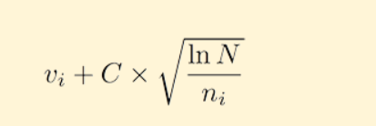

参考链接：

https://www.cs.swarthmore.edu/~mitchell/classes/cs63/f20/reading/mcts.html

https://yey.world/2020/05/05/COMP90054-08/  （例子非常好

# 什么是 MCTS？

蒙特卡洛树搜索（MCTS）是一种在人工智能（AI）问题中做出最优决策的方法，通常用于组合游戏中的走法规划。它结合了随机模拟的通用性和树搜索的精确性。

由于 MCTS 在围棋计算机中的巨大成功，以及在众多复杂问题中的潜在应用，近年来 MCTS 的研究热度迅速上升。其应用范围不仅限于游戏，理论上它可以应用于任何能够用「状态—动作对」描述、并可通过模拟预测结果的领域。

---

# 基础算法

MCTS 的基本思想十分简单：根据模拟走子的结果逐步构建搜索树，每次迭代扩展并评估新的节点。整个过程可以分为以下四个步骤：

---

## **1. 选择（Selection）**

从根节点 R 开始，递归地选择最优子节点，直到到达叶节点 L。

## **2. 扩展（Expansion）**

如果 L 不是终局节点，则创建一个或多个子节点，并从中选择一个子节点 C。

## **3. 模拟（Simulation）**

从节点 C 开始执行一次随机或简单策略的模拟，直到产生游戏结果或达到终止条件。

## **4. 反向传播（Backpropagation）**

利用模拟得到的结果，从 C 将信息沿路径向上回传到根节点，对节点的访问次数与评估值进行更新。

---

每个节点至少需要存储两个关键信息：

* 基于模拟结果得到的节点估计价值
* 节点被访问的次数

在最简单、最节省内存的实现中，MCTS 每次迭代仅添加一个子节点；但在某些应用中，每次迭代添加多个子节点可能带来更好的效果。

---

# 节点选择

## **乐队问题与 UCB**

在向下遍历搜索树时，节点选择可类比为“多臂老虎机”问题：智能体每次选择当前估计奖励最大的臂（动作）。

通常使用 UCB（上置信界限）公式来平衡利用与探索：

* (v)：节点的估计值
* (n)：节点被访问的次数
* (N)：父节点访问次数
* (C)：可调节的探索系数

## **利用与探索**

UCB 公式在「利用已知高收益节点」与「探索访问不足但潜在有价值的节点」之间取得平衡。

由于模拟结果存在随机性，节点通常需要被访问多次才能得到可靠的估计；因此 MCTS 在开始时估计较不稳定，但在充足的时间下会逐步收敛到更可靠的值，在无限时间下可以达到完美估计。

## **MCTS 与 UCT**

2006 年，Kocsis 和 Szepervari 将 UCB 扩展到极小极大树搜索，提出了 UCT 方法，即“树的上置信界限”。UCT 目前是 MCTS 最主流的实现方式。

可以认为：

> UCT = MCTS + UCB

---

# 优点（Benefits）

## **启发式（无需领域知识）**

MCTS 在决策时不需要特定领域的战略或战术知识。除了合法动作与终止条件外，它无需了解游戏本身即可运行。这意味着一个 MCTS 实现可以轻松迁移到多个游戏，非常适合通用游戏博弈（GGP）。

## **非对称性**

MCTS 的搜索树生长呈非对称性，它会自动将更多资源分配给看起来更有希望的分支，而非机械地遍历整棵树。这让它适用于分支因子巨大的游戏，如 19×19 围棋。

## **可随时停止（Anytime）**

算法可在任意时间停止并返回当前最优估计。已经构建的搜索树也可选择丢弃或保留以供后续使用。

## **实现优雅**

算法结构简单、易于实现。

---

# 缺点（Drawbacks）

## **发挥强度有限**

基础版本的 MCTS 在面对中等或更高复杂度的游戏时，可能无法在有限时间内找到合理解，因为一些关键节点可能访问次数不足，导致估计不可靠。

## **速度较慢**

MCTS 通常需要大量模拟才能收敛。

例如：

* 顶尖围棋程序需要**数百万次模拟** 才能做出专家级走法
* 通用游戏程序（GGP）每秒只有几十次随机模拟，面对复杂游戏时甚至难以对每个合法动作做足够遍历

因此在时间紧张的场景下，它的搜索深度可能受限。

幸运的是，已有许多技术可显著提升算法性能。

---

# 改进方法（Improvements）

大量 MCTS 改进方法已被提出，大体分为两类：

---

## **1. 基于领域知识的改进（Domain Knowledge）**

通过结合游戏或任务领域的专业知识，可：

* 在树中筛除不合理的动作
* 在模拟阶段使用更接近真实对局的策略（非完全随机）

这样可让模拟结果更加真实，节点也更快得到可靠估计。

缺点是：速度降低、泛化能力下降。

---

## **2. 与领域无关的改进（Domain Independent）**

这些改进无需依赖具体领域，适用于所有问题。例如：

* 在树中使用 AMAF 等技巧
* 在模拟中优先选择明显更好的动作
