参考链接：

优化器类型：https://www.cnblogs.com/guoyaohua/p/8542554.html

移动平均和偏差修正：https://www.cnblogs.com/jiangxinyang/p/9705198.html

# 1 指数加权移动平均法（EWMA）和偏差修正

指数移动加权平均法，是指各数值的加权系数随时间呈指数式递减，越靠近当前时刻的数值加权系数就越大。

指数移动加权平均较传统的平均法来说，一是不需要保存过去所有的数值；二是计算量显著减小。

EWMA 的表达式如下：

$$
v_t = \beta v_{t-1} + (1 - \beta) \theta_t
$$

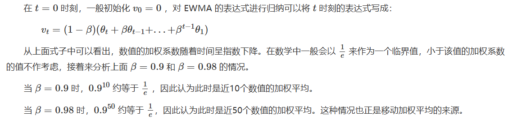

一般认为0.9拟合效果最好了

当 **β**=**0.9** 时，对应着图中的红线，此时虽然曲线有些波动，但总体能拟合真实数据

当 **β**=**0.98** 时，对应着图中的绿线，此时曲线较平，但却有所偏离真实数据

## 偏差修正

在初始化  *v***0** = 0 时实际上会存在一个问题。

理想状况下应该是绿色的曲线 初始化的值太小，导致初期的数值都偏小，而随着时间的增长，初期的值的影响减小，紫色的曲线就慢慢和绿色的曲线重合。

修正:

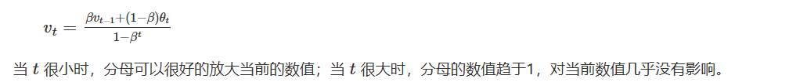

EWMA 主要是被应用在动量优化算法中，比如Adam算法中的一阶矩和二阶矩都采用了上面修改后的EWMA算法。

# 2 Adam

参考资料：

https://www.cnblogs.com/wuliytTaotao/p/11101652.html

这个算法是另一种计算每个参数的自适应学习率的方法。**相当于 RMSprop + Momentum**

RMSprop

Momentum

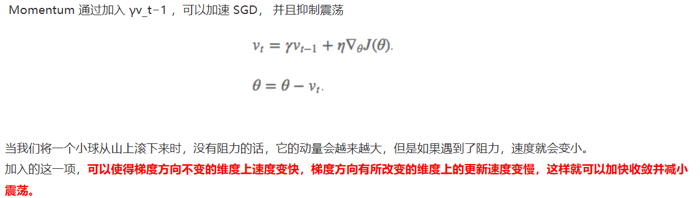

确实是借用上面二者 采用了滑动平均和补偿

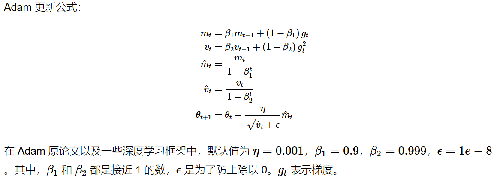

# 3 AdamW：

参考资料：

权重衰减(Weight Decay): https://zhuanlan.zhihu.com/p/607909453

这篇文章写的不错（附录部分）   https://zhuanlan.zhihu.com/p/7272881104

## 3.0 权重衰减

**权重衰减** (Weight Decay)就是减小模型的权重大小，而减小模型的权重大小就可以降低模型的复杂度，使模型变得平滑，进而减小过拟合。L2正则化的目的就是为了让权重衰减到更小的值，在一定程度上减少模型过拟合的问题，所以权重衰减也叫L2正则化

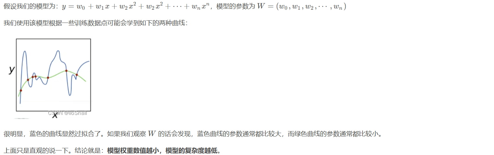

## 3.1 Adam常用的权重衰减

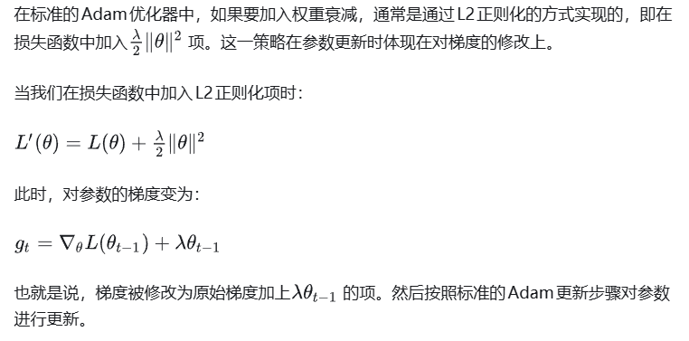

问题：

在使用了**自适应学习率** 这个技巧的优化器中，如Adam，梯度会被动量和自适应学习率进行缩放。将权重衰减项加入梯度后，这个衰减项也会受到影响，导致**实际的权重衰减效果并不等价于直接对权重进行衰减** 。这种方式：

* 不符合真实的权重衰减含义 ：**权重衰减应当是独立于梯度更新，对权重进行直接的缩减。**
* **影响优化器的自适应性** ：梯度中的权重衰减项被动量和二阶矩缩放，改变了原始的正则化效果。

## 3.2 adamw区分

为了解决上述问题，AdamW优化器提出了新的策略

核心思想是：

> 把 “权重衰减” 从 “梯度更新” 里分离出来（decouple），
>
> 直接在更新参数时进行衰减。

AdamW

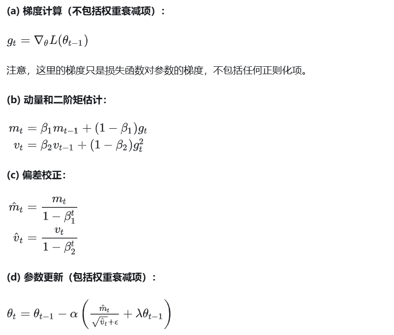

## 3.3 具体区别

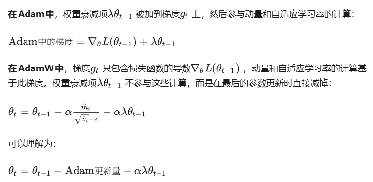

AdamW相对与Adam的改动十分简单，其将**权重衰减项从梯度的计算**中拿出来直接加在了**最后的权重更新步骤上**（式12）。其提出的动机在于：原先Adam的实现中如果采用了L2权重衰减，则相应的权重衰减项会被直接加在loss里，从而导致**动量的一阶与二阶滑动平均均考虑了该权重衰减项**（式6），而这影响了Adam的优化效果，而将权重衰减与梯度的计算进行解耦能够显著提升Adam的效果。目前，AdamW现在已经成为[transformer](https://zhida.zhihu.com/search?content_id=231119964&content_type=Article&match_order=1&q=transformer&zhida_source=entity)训练中的默认优化器了。（紫色绿色二选一就是两种算法）

# 4 **AdaFactor**

参考资料：

苏神博客 不必多说  https://kexue.fm/archives/7302

AdaFactor具有自适应学习率的特性，但比RMSProp还要**省显存**，并且还针对性地解决了Adam的一些缺陷。

## 4.1 adam的显存消耗

Adam优化器13B模型为例
梯度指数平滑值： 13x 4 = 52GB
梯度平方指数平滑值： 13 x 4 = 52GB
模型参数  13 x 4 = 52GB
共计 156GB

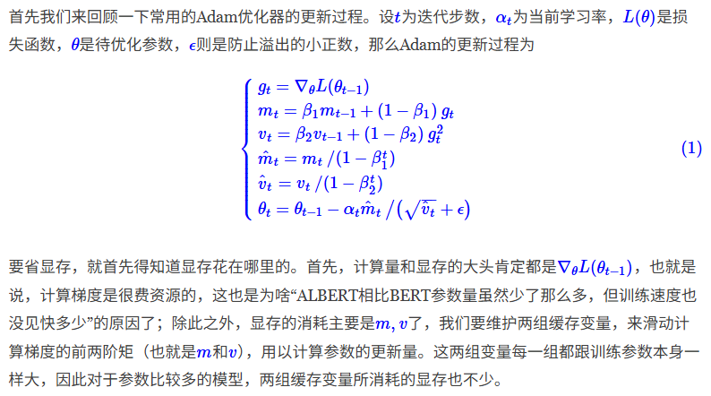

## 4.2 AdaFactor介绍

这公式推导梦回高中 一段难忘的岁月。。。

第一步：抛弃动量 不要一阶量了 自然也就省了显存

第二步：保留自适应学习率（对于NLP模型来说，自适应学习率显得更重要） 的同时压缩V 也就是二阶

采用低秩分解 类似lora？ 梯度平方g_t^2的统计特征可以**近似为行与列方向的乘积**

### AdaFactor雏形

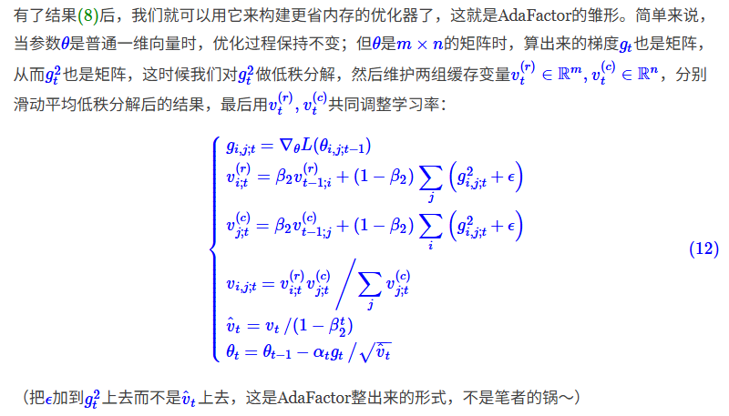

### 滑动权重

在Adam以及上述AdaFactor雏形中，滑动权重$β_2$都是恒为常数，AdaFactor指出这是不科学的，并提出新的策略。

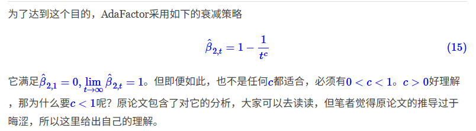

### AdaFactor完整版本

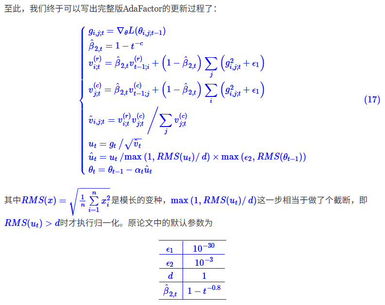

### 总结

本文介绍了Google提出来的AdaFactor优化器，一个旨在减少显存占用的优化器，并且针对性地分析并解决了Adam的一些缺陷。笔者认为，AdaFactor针对Adam所做的分析相当经典，值得我们认真琢磨体味，对有兴趣研究优化问题的读者来说，更是一个不可多得的分析案例。

**T5 模型** ：默认使用 AdaFactor（训练 11B 参数模型成功）；

| 特性         | **Adam** | **AdaFactor**   |
| ------------ | -------------- | --------------------- |
| 一阶动量     | ✅             | 可选                  |
| 二阶动量     | 全量矩阵       | 行列分解近似          |
| 内存占用     | 2× 参数量     | ≈0.01× 参数量       |
| 学习率       | 需手动调度     | 可自适应相对步长      |
| 大模型适应性 | 中             | ✅ 优秀               |
| 稳定性       | 高             | 稍差，需要调 β₂、ε |
