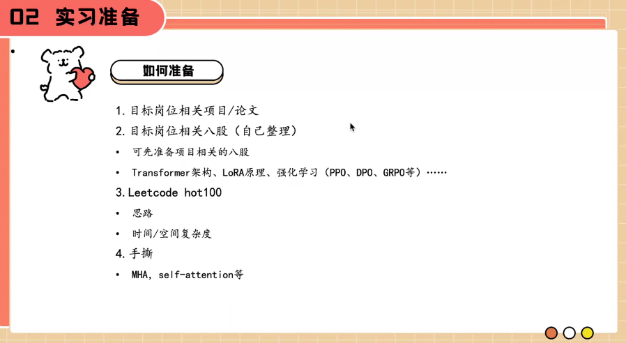
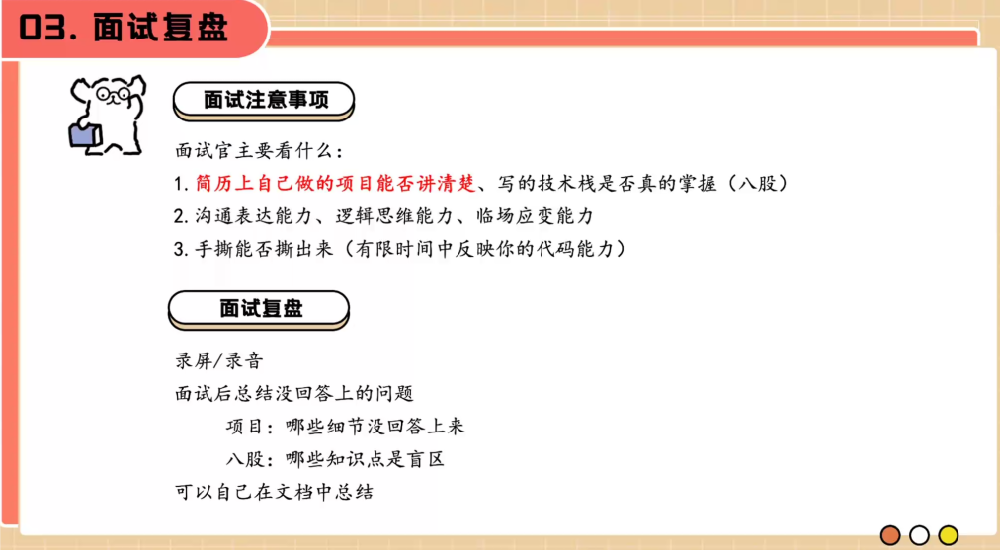

五道口纳什

大模型微调

https://www.zhihu.com/question/638803488/answer/1933462726862148233?utm_campaign=shareopn&utm_medium=social&utm_psn=1951962002122576375&utm_source=wechat_session

无算力做什么
https://www.zhihu.com/question/1936111519252349787/answer/1977020498446657108?utm_campaign=shareopn&utm_medium=social&utm_psn=1977453972194349220&utm_source=wechat_session

接下来是面试的复盘，呃，面试的时候可以进行录屏或者录音之后进行回看，主要是看项目还有哪些细节是你说不清楚的进行总结，八股还有哪些知识点是你不会的进行学习和补充，包括你面试时候的表达能不能说清楚，会不会因为紧张导致会的知识点不会说了，等等，都是可以进行复盘的点。

嗯，DDL 才是第一生产力嘛，用完第一次面试的时候在那天就疯狂复习简历的内容还有八股，效率也比较高，面试这个东西，我觉得实力是一部分，运气也比较重要，有可能你就是比同批候选人优秀，你就是和这个面试官聊得来，或者正好组里缺人等等因素都决定了你是否能拿到这个 offer。

就是我觉得可能如果简历上只有一个项目的话，那可能这个项目你需要做的东西比较多，因为你如果这只有一个项目的话，那面试官肯定会揪着你这个项目一直在问，就是你需要能聊出东西来，就是让面试官有的问，而且你还有的说可以体现出你自己的个人实力。

先中厂熟了再大厂  boss快一点
你就像他刚才说的，从中场开始投，然后再开始投大场，这其实是一个非常好的一个策略，因为你针对你自己的简历的话，你刚开始你不知道面试官会问你，呃，这些简历是什么？

还有一个就是对于第一次实习，第一次找实习的人群来说，你就别选什么岗位了，有什么岗位就瞎眼投就行了，投进去面面完面完不行你再投

呃，我面试，因为我简历上写的是熟悉 ppodpo 和 grpo 等强化
顶多问一下 kl 散度啊，包括奖励函数怎么设置，这都是问的很少的哦哦哦因为我简历突出的不是 rl 的内容，如果你项目做 rl 相关的话，他肯定会是拉你的东西，比如奖励函数怎么设置，如何训练的一些参数等等。

嗯，然后我补一句啊，我实习的时候会会让我首次手撕GRPO 伪代码

我不建议两段三个月的实习，我只建议一段比较核心的实习，不要你不要为了你不要为了你的实习段数去硬找，不要这样，不要这样，除非你觉得我在这个赌没有什么东西学了，那你可以开启下一段。

周末会议直播结束，我觉得一个主要点是，给自己定个ddl，然后投出去简历，不会永远准备好的