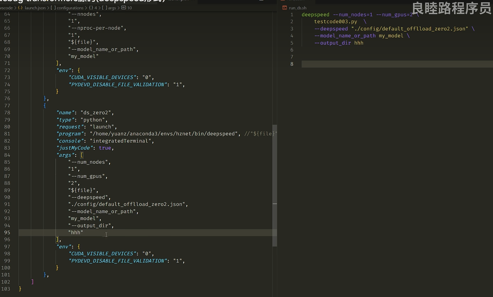

参考链接：

https://zhuanlan.zhihu.com/p/673525708

很多人抱怨vscode不如[pycharm](https://zhida.zhihu.com/search?content_id=237801935&content_type=Article&match_order=1&q=pycharm&zhida_source=entity)调试方便，但官方其实有vscode python debug，而且功能也非常强大，不管是debug本地文件，远程服务器文件，分布式文件还是llm之类的[deepspeed](https://zhida.zhihu.com/search?content_id=237801935&content_type=Article&match_order=1&q=deepspeed&zhida_source=entity)文件，统统好用。

一、基础使用
------------

### 配置launch.json文件

在VSCode中进行调试之前，你可能需要配置launch.json文件（如果你是第一次在这个工程文件下面debug的话），这个文件告诉 VSCode 如何运行和调试你的程序。

* 1点击debug按钮，会弹出如下界面，这个是因为新项目第一次debug，需要先进行配置，之后就不需要了


* 2我们点击`创建launch.json文件` ，会弹出来一个选择框，如上图。
* 3选择 `Python文件` ，自动生成配置文件

VSCode 就会自动生成一个预设的调试配置**launch.json文件，存放在当前工程文件夹目录下\\.vscode子目录里**。有这个配置文件以后再点debug就可以直接开始了。假设你删掉，点击debug又会让你进行配置，那就重新再执行上述操作就好了。

文件配置要怎么写，可以参考我下面的代码，基本上不需要过多改动就可进行debug，但是如果有其他需求，强大的vscode也可以满足你，这个下一节也会详细讲（见：二、为你的debug配置参数（进阶）

```text
{
    "version": "0.2.0",  // 配置文件的版本号，这个值通常由 VSCode 自动生成并管理。
    "configurations": [  // 一个包含一个或多个配置对象的数组。
        {
            "name": "Python: 当前文件",  // 配置的名称，会显示在 VSCode 的调试启动配置列表中。想叫啥叫啥
            "type": "python",  // 指定调试器类型，Python。
            "request": "launch",  // 调试会话的类型。"launch" 表示启动一个新程序的调试会话。
            "program": "${file}",  // 启动文件的路径。${file}是VSCode的预定义变量，代表当前光标所在的文件。也可以直接指定xx.py
            "console": "integratedTerminal",  // 指定输出在哪个终端中显示，这里是 VSCode 集成终端。
            "justMyCode": true,  // 当设置为 true 时，仅调试自己的代码。false时包括非用户代码（如库代码，导入的模块）
            //"args": ["-a","123", "-b", "456"]   // 执行脚本的附加参数，默认生成是没有的，可以自己加
        }
    ]
}
```

有同学问啦，小羊小羊，现在会了本地文件debug，但是**远程服务器上debug**怎么办呢？

其实一样的，只要我们正常的服务器直连（使用remote-ssh扩展），然后像在本地一样调试就好了

> [VS Code配置使用 Python，超详细配置指南，看这一篇就够了\_vscode python环境配置-CSDN博客](https://link.zhihu.com/?target=https%3A//blog.csdn.net/weixin_49895216/article/details/131696960)
> 里面的参数解释可以看看


tips：vscode调试控制台，注意想要换行得 shift加回车

二、为你的debug配置参数（进阶
-----------------------------

之前debug的配置文件是自动生成的，但是他可以手动改写的，添加各种参数来达到想要的效果，比如：指定运行程序的虚拟环境（python解释器）、指定运行路径、传入命令行参数。

### 1创建多个调试配置

用于不同的调试场景，可以调试工程目录下的任意文件

```text
{
    "version": "0.2.0",  // 配置文件的版本号，这个值通常由 VSCode 自动生成并管理。
    "configurations": [  // 一个包含一个或多个配置对象的数组。
        {
            "name": "Python: 当前文件",  // 配置的名称，会显示在 VSCode 的调试启动配置列表中。想叫啥叫啥
            ......
        },
        {
            "name": "超参数设置1",  // 配置的名称，会显示在 VSCode 的调试启动配置列表中。想叫啥叫啥
            ......
        },
    ]
}
```


在这里切换就好

### 2相对路径设置

如果程序里面涉及到了相对路径，可能会报错，解决办法是添加参数

`cwd`：启动程序时的根目录配置

```text
"cwd":"${fileDirname}"  // 设置相对路径，在debug时可以切换到当前文件所在的目录。
```

### 3显式指定显卡

`env`：对象，启动程序时传递的环境变量

```text
"env":{ "CUDA_VISIBLE_DEVICES":"0,1,2,3"},
```

### 4调试时传入命令行参数

args：启动程序时传递的参数

调试带参数的python文件

```text
"args": ["-a","123", "-b", "456"] 
```

### 5调试外部代码

justMyCode设置为true，仅调试工程文件夹下的py文件；false时还包括非用户代码（如库代码，导入的模块）

```text
"justMyCode": true, 
```

### 6指定服务器虚拟环境

通过添加pythonPath参数，指定python解释器

进入conda 虚拟环境，使用whereis或者whcich查看虚拟环境对应的 python 路径

> `which`和`whereis`命令都是Linux操作系统下查找可执行文件路径的命令。所以查找的面比`which`要广，不局限于PATH

在launch.json文件中的configurations列表中加入这一行

```text
"pythonPath": "/root/miniconda3/bin/python",
```

具体launch.json参数都有什么，以及参数的含义可以看下面文章：

[VS Code 配置调试参数、launch.json 配置文件属性、task.json 变量替换、自动保存并格式化、空格和制表符、函数调用关系、文件搜索和全局搜索、\_vscode launch.json各项参数-CSDN博客](https://link.zhihu.com/?target=https%3A//blog.csdn.net/wohu1104/article/details/111464778)

三、分布式程序调试
------------------

### 分布式程序基础调试

先解释一下，[torchrun](https://zhida.zhihu.com/search?content_id=237801935&content_type=Article&match_order=1&q=torchrun&zhida_source=entity)常用于DDP分布式里面，经常训练ViT之类比较大的模型的同学应该会熟悉

启动的命令经常如下形式：

```text
torchrun --nnodes=1  --nproc-per-node=2 \
 xx.py \
 --args1 11
```

torchrun是一个用于启动 PyTorch 分布式训练任务的命令行工具

\--nnodes=1指定了节点（Node）的数量，这里设置为 1；--nproc-per-node=2指定了每个节点上的进程（Process）数量，这里设置为 2。可以简单的理解为一台服务器，上面两张显卡可以用

xx.py是要分布式运行的 Python 脚本文件的路径。如果想从普通py文件改到DDP模式，只需要修改少量代码

\--args1 11是传递给xx.py的参数

torchrun会在当前节点上启动两个进程（1 个节点、2 个进程）。这两个进程会通过 PyTorch 的分布式工具包进行通信和同步，并创建一个分布式训练环境。然后，torchrun会调用xx.py脚本，并将指定的参数传递给它，让脚本在分布式环境中运行。

**那怎么修改配置文件，使得可以debug分布式程序呢？**

**很简单，修改program参数，改为torchrun的路径**

运行程序由运行当前文件变成了运行torchrun。
原理其实是调用torchrun，传入节点等变量，然后传入要分布式运行的xx.py文件，然后传入给xx.py准备的变量

不知道路径可以which torchrun，和我们之前修改python解释器一样

```text
{
    "version": "0.2.0",
    "configurations": [
        {
            "name": "Python: torchrun",
            "type": "python",
            "request": "launch",
            // 设置 program 的路径为 torchrun 脚本对应的绝对路径
            "program": "/home/tim/anaconda3/envs/project/lib/python3.8/site-packages/torch/distributed/run.py",
            // 设置 torchrun 命令的参数
            "args":[
                "--nnodes",
                "1",
                "--nproc-per-node",
                "2",
                "xx.py"，
                "--args1",
                "11"
            ],
            "console": "integratedTerminal",
            "justMyCode": true
        }
    ]
}
```



先是分布式的参数  然后 {file} 最后代码的参数


推荐先1个gpu调通，也就是--nproc-per-node设置为1

**但是当我们想调试两个节点的时候，怎么办呢？**

### **分布式程序的断点（独立/同步）**

多卡并行调试确实比标准的单进程调试复杂

在多进程环境中的每个进程都是**独立运行**的。所以在多进程分布式训练中，预期的行为通常是：当你在代码中设置一个断点，并且某个进程到达了断点时，只有达到断点的那个进程会停下来进入调试状态，其他进程会继续执行。

然而，实际的行为可能还取决于你的调试器和具体的代码。如果你想在所有进程**中同步断点**，有两种方法：

1使用一些调试工具和IDE：比如 PyCharm Professional 。他对多进程调试有更好的支持，让你更容易地连接到所有运行中的进程，并在所有进程中同时查看和控制执行流。

2编程方式同步断点：在达到断点的代码前，插入编程方式的同步操作，如torch.distributed.barrier()。这样当任何一个进程达到这一点时，所有进程都会等待，直到所有其他进程也都到达这一点。利用这一点可以让其他进程等待，而我们调试完成之后跳转到barrier的语句，此时所有进程同步，再次运行。

### 分布式程序的变量查看

在 VSCode 的调试视图中，我们通常只会看到触发了断点的那个进程的状态和变量。

要查看其他进程的变量，我们需要连接到那个特定进程的调试会话，

这要求我们修改launch.json为每个进程配置不同的调试端口，为每个实例开启一个不同的调试视图。

具体怎么做我们下一篇讲~

四、deepspeed程序（LLM）调试
----------------------------

命令行：

```text
deepspeed --num_nodes=1 --num_gpus=2 \
 xx.py \
 --deepspeed "./path/offlload_zero2.json" \
 --args1 11
```

deepspeed 是基于torchrun写的分布式启动程序，基本上区别不大，只是额外多了一个deepspeed参数，传入一个预先写好的json文件，用来调控训练时使用zero系列的优化

一样的，使用which deepspeed命令，获取该程序路径，然后填在program

```text
{
    "version": "0.2.0",
    "configurations": [
        {
            "name": "ds_zero2",
            "type": "python",
            "request": "launch",
            "program": "/home/yuanz/anaconda3/envs/hznet/bin/deepspeed", //"${file}",
            "console": "integratedTerminal",
            "justMyCode": true,
            "args": [
                "--num_nodes",
                "1",
                "--num_gpus",
                "2",
                "${file}",
                "--deepspeed",
                "./path/offlload_zero2.json",
                "--args1",
                "11"
            ],
            "env": {
                "CUDA_VISIBLE_DEVICES": "0,1,2,3",
            }
        }
    ]
}
```

deepspeed的配置文件传给xx.py程序之后。程序里面会有相应部分从这个路径中解析json，然后传入HF的TrainingArguments参数解析器，剩下的和之前的torchrun一样。

五、参考
--------

[vscode python设置debug ? - 知乎 (zhihu.com)](https://www.zhihu.com/question/35022733/answer/3178874019)

[VS Code 配置调试参数、launch.json 配置文件属性、task.json 变量替换、自动保存并格式化、空格和制表符、函数调用关系、文件搜索和全局搜索、\_vscode launch.json各项参数-CSDN博客](https://link.zhihu.com/?target=https%3A//blog.csdn.net/wohu1104/article/details/111464778)

[VS Code 的 launch.json 进行高效代码调试：配置和原理解析\_麦田的守望者\_InfoQ写作社区](https://link.zhihu.com/?target=https%3A//xie.infoq.cn/article/183b37b4d36785b3f18f7e5c1)

[vscode配置task.json和launch.json启动调试\_vscode\_suanday\_sunny-北京城市开发者社区 (csdn.net)](https://link.zhihu.com/?target=https%3A//devpress.csdn.net/beijing/64e2ccb3d1670e7641102d43.html%3Fdp_token%3DeyJ0eXAiOiJKV1QiLCJhbGciOiJIUzI1NiJ9.eyJpZCI6NTUzNDMxLCJleHAiOjE3MDM2Nzc2MTYsImlhdCI6MTcwMzA3MjgxNiwidXNlcm5hbWUiOiJ3ZWl4aW5fNDgwNzY3NTkifQ.se8aHqEIK8PaZvhWGggoB9Y8N0GtgZlzPiITshqAPSU)

[关于Deepspeed的一些总结与心得 - 知乎 (zhihu.com)](https://zhuanlan.zhihu.com/p/650824387)

[VSCode调试Python文件并指定虚拟环境 附调试说明-CSDN博客](https://link.zhihu.com/?target=https%3A//blog.csdn.net/weixin_43629813/article/details/128791741)
