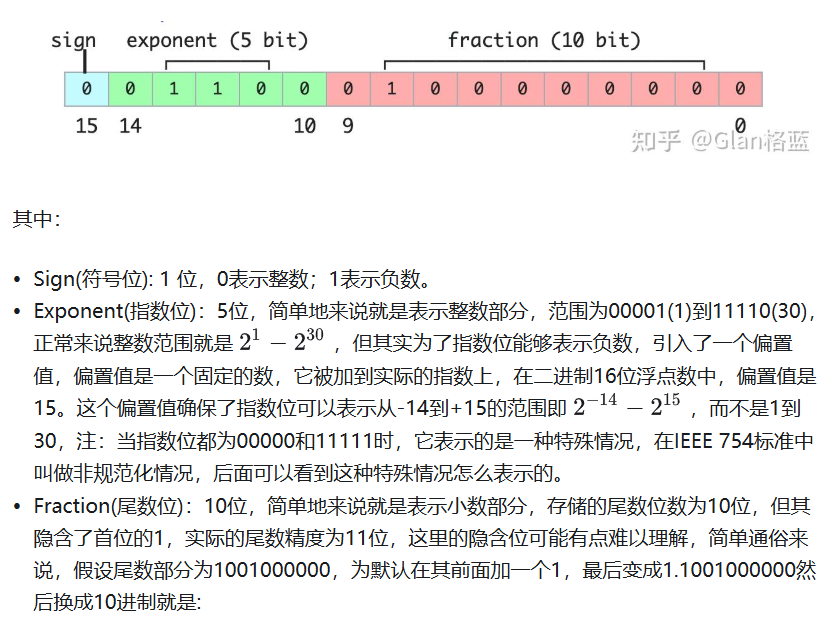
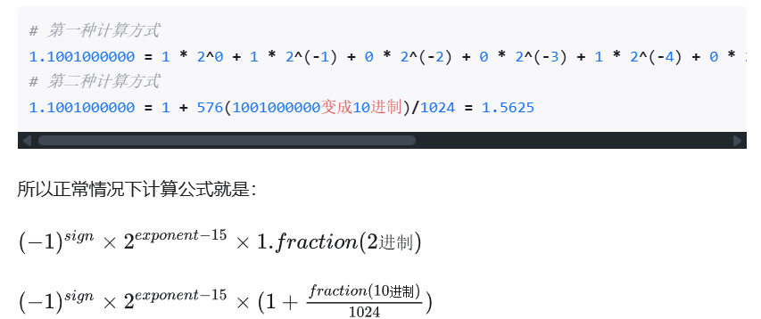
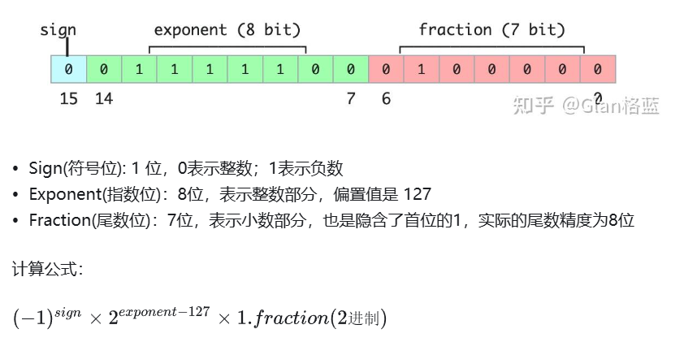
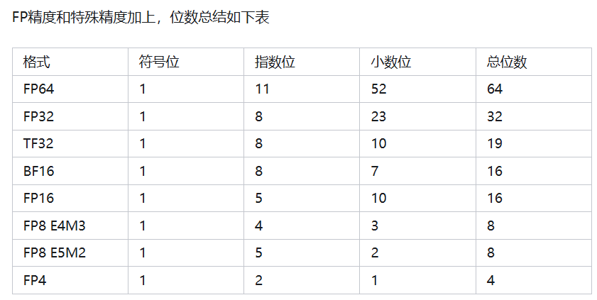

参考链接：

https://zhuanlan.zhihu.com/p/657886517

# 1 FP16

FP16也叫做 float16，两种叫法是完全一样的，全称是Half-precision floating-point(半精度浮点数)，在IEEE 754标准中是叫做binary16，简单来说是用16位二进制来表示的浮点数，

贴一个FP16(float16)特殊数值的情况：

因为在计算机中是以2进制存储计算的，所以转换后的float16值会有很多位小数，但这些后面的小数是没有精度的，换成10进制的精度是只有0.001的。注：在-1~1之间精度是0.0001，因为有隐含位1的关系，大家可以试一下。

### 为什么 float16 的十进制精度大约是 0.001？

* 精度取决于 **有效位数** （mantissa）。
* FP16 有 10 位尾数位，加上隐含的 1，大概相当于 **11 位二进制有效数字** 。
* 11 位二进制精度 ≈ log10(2^11) ≈ 3.3 位十进制有效数字。
* 所以 **float16 在十进制能表示的精度大概就是小数点后三位左右（约 0.001）** 。
  * 举个例子：
    * 1.2345 在 FP16 里可能存成 1.235
    * 1.23449 也可能存成 1.235
  * 后面的变化已经超出 FP16 的表示能力。

# BF16

BF16也叫做bfloat16(这是最常叫法)，其实叫“BF16”不知道是否准确，全称brain floating point，也是用16位二进制来表示的，是由Google Brain开发的，所以这个brain应该是Google Brain的第二个单词。和上述FP16不一样的地方就是指数位和尾数位不一样，看图：

。可以明显的看到bfloat16比float16精度降低了，但是表示的范围更大了，能够有效的防止在训练过程中的溢出。

# FP32

FP32也叫做 float32，两种叫法是完全一样的，全称是Single-precision floating-point(单精度浮点数)，在IEEE 754标准中是叫做binary32，简单来说是用32位二进制来表示的浮点数，看图：

# 概括

