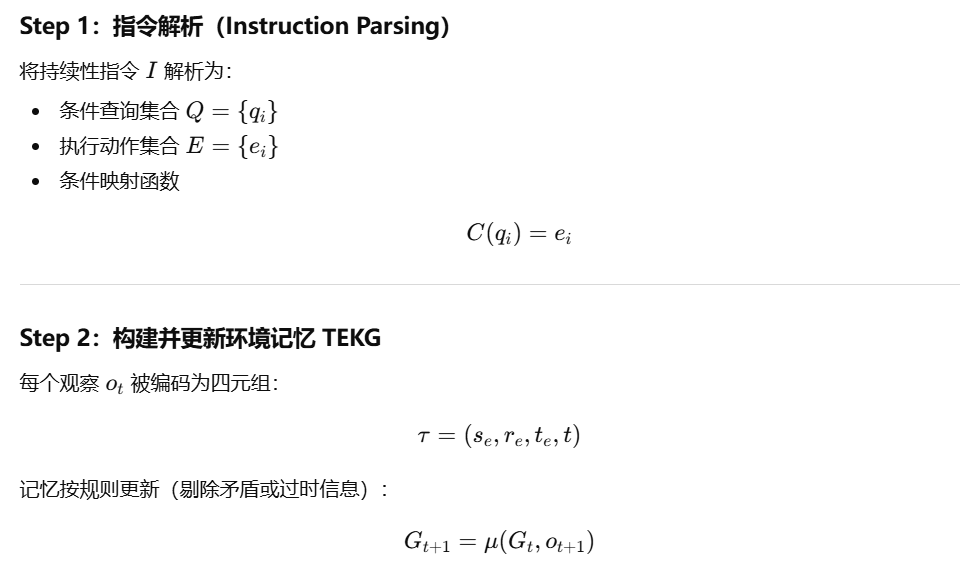
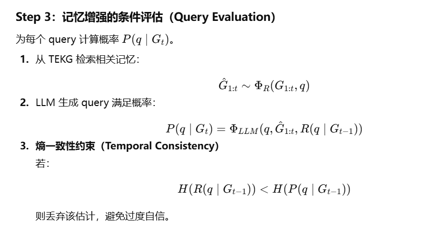
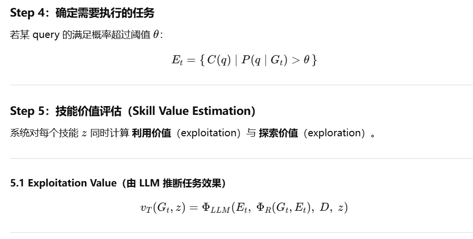
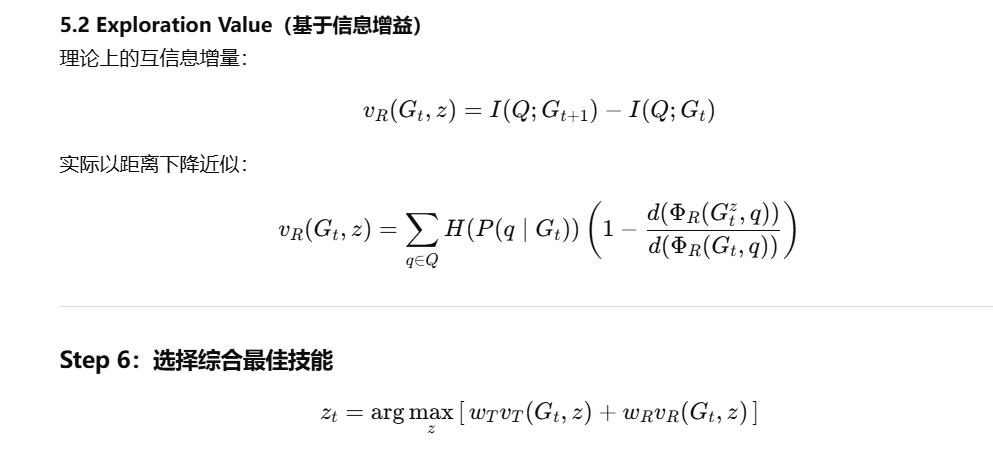
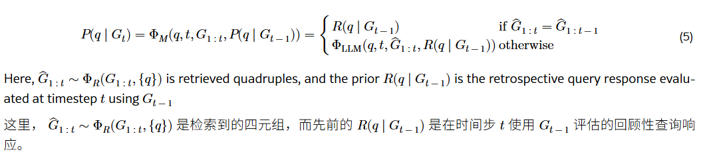
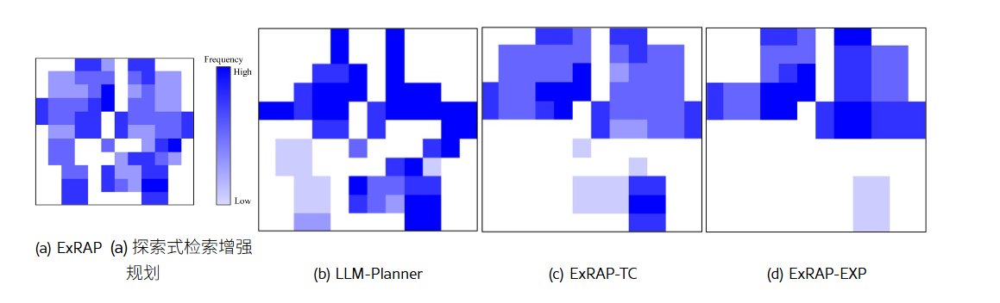

# ExRAP：面向持续具身指令跟随的探索性检索增强规划框架深度研究报告

## 1. 引言：具身智能从情景式向持续式的范式转变

在具身人工智能（Embodied AI）的研究前沿，大语言模型（LLMs）的引入彻底改变了智能体理解和执行任务的方式。传统的具身任务通常被设定为“情景式”（Episodic）的，即智能体接收一个明确的指令（如“把苹果放在桌子上”），在静态或准静态的环境中执行，任务完成后该回合即结束。然而，现实世界的应用场景——如家庭服务机器人或自动驾驶车辆——要求智能体在**非平稳（Non-stationary）**且** 动态变化** 的环境中长期运行。在这种场景下，指令往往不是一次性的，而是**持续且有条件的** 。

本报告对发表于 NeurIPS 2024 的论文《Exploratory Retrieval-Augmented Planning For Continual Embodied Instruction Following》（ExRAP）进行了详尽的深度解析 ^1^。该研究针对“持续指令跟随”（Continual Instruction Following）这一核心难题，提出了一种全新的探索性检索增强规划（ExRAP）框架。与现有的反应式规划方法不同，ExRAP 并不被动等待环境触发，而是通过将**环境上下文记忆** 与**探索集成任务规划** 相结合，主动探索环境以减少信息的不确定性，从而在动态环境中实现高效的任务执行。

本报告将深入剖析 ExRAP 的核心概念、数学原理（涵盖方程 1 至 12 的详细推导）、系统架构以及在 VirtualHome、ALFRED 和 CARLA 等基准测试中的实验表现，揭示其在处理非平稳环境和长程任务时的优越性。

---

## 2. 核心问题定义与数学建模

### 2.1 持续指令跟随任务的本质

持续指令跟随是指智能体在非平稳的具身环境中，同时管理一组条件性指令的任务。这些指令的形式通常为：“如果条件 A 满足，则执行动作 B”。例如：

* “如果温度高，就打开窗户。”
* “当有人看电视时，关掉灯。”
* “如果箱子和水槽靠得很近，就把它们分开。” ^1^

这与传统的单次指令有着本质区别：智能体无法预知条件何时满足。环境是动态变化的（如温度随时间升高，或者人类用户打开了电视），因此智能体必须**持续监控** 环境状态。这种机制类似于数据库系统中的“连续查询”（Continuous Query），而非传统的顺序规划 ^1^。

### 2.2 优化目标函数

ExRAP 的目标是建立一个最优策略 **$\pi^*$**，以最大化持续指令跟随任务的整体性能。该性能由两个核心指标定义：**任务成功率（Success Rate, SR）** 和 **平均挂起步数（Average Pending Step, PS）** 。

(i) SR 是已完成且条件已满足的任务的比率，(ii) PS 是当条件满足时，与指令 i∈ℐC 相关的任务所需的平均步数。

形式化地，给定一组指令 **$\mathcal{I} = \{i_1,..., i_M\}$** 和非平稳环境，策略 **$\pi^*$** 定义如下（方程 1）：

在此方程中：

* **SR (Success Rate)** ：衡量在所有条件实际满足的时刻，智能体成功完成相关任务的比例。这是一个主要的正向奖励信号。
* **PS (Pending Step)** ：衡量任务的响应延迟，即从环境条件实际满足的那一刻起，到智能体完成任务所需的平均时间步数 ^1^。
* ****$\mathbb{E}$**** ：表示期望挂起步数的负值。最小化 PS 至关重要，因为它反映了智能体对环境变化的敏感度。如果电视被打开了，但智能体在一个小时后才发现并关灯，那么即使任务最终完成了，其服务质量也是低下的。

所得策略能够通过整合方式处理多个任务，从而最小化冗余技能执行，**同时考虑任务需求可能的时空重叠。**

优化这一目标要求智能体必须在**利用（Exploitation）** （执行已知满足条件的任务）和**探索（Exploration）** （检查未知条件是否满足）之间找到最佳平衡。

## 2.99 概括介绍

## 3. 方法论架构：基于记忆的感知与分解

ExRAP 框架的核心在于如何高效地管理环境信息并据此进行规划。它通过构建**环境上下文记忆** 来降低对实时交互的依赖，并通过**指令分解** 将复杂的自然语言转化为可操作的逻辑单元。

### 3.1 指令解释器与任务分解

面对持续的自然语言指令，ExRAP 首先利用指令解释器 **$\Phi_I$** 将每条指令 **$i \in \mathcal{I}$** 分解为两个核心组件：**查询（Query, **$q$**）** 和 **执行（Execution, **$e$**）** ^1^。

$$
\Phi_I(\mathcal{I}) = (\mathcal{Q}, \mathcal{E}, C)
$$

$$
\text{where } \mathcal{Q} = \{q_1,..., q_M\}, \mathcal{E} = \{e_1,..., e_M\}, C(q_j) = e_j
$$

* **查询 (**$q$**)** ：这是任务触发的条件（例如，“温度高吗？”、“电视开着吗？”）。查询是针对环境状态的提问。
* **执行 (**$e$**)** ：这是条件满足时需要进行的物理操作（例如，“打开窗户”、“关灯”）。
* **条件函数 (**$C$**)** ：建立了查询与执行之间的映射关系（方程 4）。

这种分解使得智能体能够将“信息收集”与“任务执行”解耦。智能体可以主动规划行动去验证查询 **$q$** 的真值，而不是盲目地尝试执行 **$e$**。

ExRAP 通过两个组件来解决这一挑战：(a) 使用环境上下文记忆进行查询评估，(b) 集成探索的任务规划。

### 3.2 环境上下文记忆：时间具身知识图谱 (TEKG)

为了在非平稳环境中进行推理，ExRAP 建立了一个**时间具身知识图谱（Temporal Embodied Knowledge Graph, TEKG）** 。与传统的静态知识图谱不同，TEKG 显式地引入了时间维度来处理信息的时效性。

TEKG 由一组四元组 $\tau$ 组成：

$$
\tau = (se, re, te, t)
$$

其中：

* **$se$**：源实体（Source Entity，如 "TV"）。
* **$re$**：关系（Relation，如 "is"）。
* **$te$**：目标实体（Target Entity，如 "on"）。
* **$t$**：时间步（Timestep），记录该观察发生的时间 ^1^。

在任意时间步 $t$，环境上下文记忆 $G_t$ 包含了所有累积的有效四元组（方程 2）：

$$
G_t = \{\tau_1, \tau_2,..., \tau_N\} \quad \text{其中 } t_i \le t
$$

### 3.3 记忆更新机制 (**$\mu$**)

当智能体在环境中移动并获得新的观察 **$o_{t+1}$** 时，必须更新记忆 **$G_t$**。更新函数 **$\mu$** 负责合并新信息并解决冲突（方程 3）：

$$
G_{t+1} = \mu(G_t, o_{t+1}) = { \tau \in G_t | c(\tau, \tau') = 0, \forall \tau' \in o_{t+1} } \cup o_{t+1}
$$

在此过程中，冲突检测函数 **$c(\tau, \tau')$** 起着关键作用。它负责识别语义上的矛盾。c 是一个检测四元组之间语义矛盾的函数，例如当 τ 和 τ′ 指示电视既“关闭”又“开启”时。如果存在矛盾，则返回 1，否则返回 0。

1. **代理中心性** ：与代理自身状态（位置、持有物）相关的信息总是更新为最新值。
2. **状态互斥性** ：对于同一对象的互斥状态（如 Open/Closed, On/Off），新观测值覆盖旧观测值 ^1^。

对于语言指定的任务指令 ℒ={l} ，**检索器 ΦR** 与内存 G 交互并采样 k 四元组 {τ^1,⋯,τ^k} 。采样基于多项式 softmax 分布，检索四元组 τ 的概率由 τ 与 ℒ 中任何 l 之间的最高句子嵌入相似度决定。

**(a) 查询评估（Query evaluation）：**

指令解析器 ΦI\Phi_I**Φ****I****** 根据持续性指令生成查询（queries）和对应的执行动作（executions），并构建条件映射函数。随后，记忆增强的查询评估器 ΦM\Phi_M**Φ****M****** 会利用从环境上下文记忆中检索到的 TEKG，再结合 LLM，对这些查询进行概率化评估。

**(b) 探索融合的任务规划（Exploration-integrated task planning）：**

基于 LLM 的利用规划器 vT 会使用技能的执行目标及其相关示例（demos），以 in-context 的方式估计每个技能的利用价值。同时，探索规划器 vR 会基于信息增益，通过预测执行技能后的 TEKG 更新情况来评估技能的探索价值。

在每个步骤中，系统都会根据这两类价值的综合评分选择当前应执行的技能。

## 4. 具备时间一致性的记忆增强查询评估

ExRAP 的推理核心是**查询评估器（**$\Phi_M$**）** 。它基于当前的记忆 **$G_t$** 来判断查询 **$q$** 是否满足。鉴于环境的不确定性，这是一个概率评估过程，而非简单的二元判断。

### 4.1 概率性查询评估

利用大语言模型作为推理引擎，ExRAP 估计查询 **$q$** 成立的概率 **$P(q|G_t)$**。为了提高效率和准确性，评估采用了递归贝叶斯更新的思想（方程 5）：

这里，**$\hat{G}_{1:t}$** 是通过检索器 **$\Phi_R$** 从 TEKG 中提取的与查询 **$q$** 最相关的子图。

* 如果检索到的相关信息没有变化（**$\hat{G}_{1:t} = \hat{G}_{1:t-1}$**），智能体依赖于**回顾性查询响应（Retrospective Query Response）****$ R(q|G_{t-1})$**，即基于上一时刻的先验信念。
* 如果有新的相关信息被检索到，则调用 LLM 结合新信息和先验信念进行重新评估 ^1^。

### 4.2 时间一致性精化 (Temporal Consistency Refinement)

ExRAP 的一项重大创新是引入**时间一致性** 来解决 **信息衰减（Information Decay）**问题。在非平稳环境中，随着时间推移，旧信息的可靠性会降低，即其** 熵（Entropy, H）** 应该增加。

ExRAP 强制执行以下约束（方程 6）：

$$
H(R(q|G_{t-1})) > H(P(q|G_{t-1}))
$$

这意味着，当我们基于上一时刻的记忆来推断当前状态时，不确定性必须增加。**如果 LLM 在没有新证据的情况下变得更加确信（熵减小），这被视为幻觉或逻辑错误。**

为了获得符合这一约束的先验 **$R(q|G_{t-1})$**，ExRAP 对 LLM 的输出进行多次采样并过滤（方程 7）：

这一机制不仅防止了过分自信的错误判断，而且为后续的探索规划提供了数学基础：当某个查询的熵（不确定性）累积到一定程度时，探索该查询的价值就会显著增加 ^1^。

### 4.3 执行集筛选

基于概率评估结果，系统筛选出那些可能性超过阈值 **$\theta$** 的任务，形成当前的待执行集 **$\mathcal{E}_t$**（方程 8）：

$$
\mathcal{E}_t = \{ C(q) | q \in \mathcal{Q}, P(q|G_t) > \theta \}
$$

---

## 5. 探索集成任务规划：信息论视角

在确定了哪些任务可能需要执行（**$\mathcal{E}_t$**）以及哪些查询的状态尚不确定之后，ExRAP 必须决定下一步的最佳行动（Skill, **$z$**）。传统的规划器往往只关注利用（完成 **$\mathcal{E}_t$**），而忽略了探索。ExRAP 提出了一种**探索集成任务规划** 方案，将技能的选择建立在**利用价值** 和**探索价值** 的加权和之上。

### 5.1 利用规划器 (**$v_T$**)：基于上下文学习

利用规划器 **$v_T$** 旨在评估技能 **$z$** 对于完成当前待执行任务 **$\mathcal{E}_t$** 的贡献。它利用 LLM 的上下文学习（In-Context Learning）能力。

假设存在一个专家规划数据集 **$\mathcal{D}_e$**，系统首先根据当前的观察 **$o_t$** 检索出相似的演示案例 **$D$**。然后，利用 LLM 评估在当前上下文 **$G_t$** 和演示 **$D$** 下，执行技能 **$z$** 的价值（方程 9）：

$$
v_T(G_t, z) = \Phi_{LLM}(\mathcal{E}_t, \Phi_R(G_t, \mathcal{E}_t), D, z)
$$

这部分利用了 LLM 蕴含的常识推理能力（例如，要“打开窗户”，必须先“走到窗户前”），确保规划的逻辑连贯性 ^1^。

### 5.2 探索规划器 (**$v_R$**)：基于互信息增益

探索规划器 **$v_R$** 的目标是**减少查询评估的不确定性**。从信息论的角度看，这等价于最大化**互信息（Mutual Information, I）** 。**技能 $z$ 的探索价值定义为执行该技能后，查询集 $\mathcal{Q}$ 的信息增益，即熵的减少量**（方程 10）：

$$
v_R(G_t, z) = I(\mathcal{Q}; G_{t+1}) - I(\mathcal{Q}; G_{t}) = \sum_{q \in \mathcal{Q}} H(P(q|G_t)) - H(P(q|G_{t+1}))
$$

Vr = 当前对 query 的不确定性 - 执行技能 z 后的不确定性

**vᵣ 大 = 不确定性下降多（信息增益最大） →  最好的探索技能**

然而，计算这一价值存在一个悖论：在执行技能之前，我们无法获得 **$G_{t+1}$**（即不知道执行后会看到什么）。ExRAP 提出了一种基于距离的近似方法（方程 11）：

论文提出一个合理的替代：

> **关注与 query 相关的那一部分知识（retrieved quadruples），并预测执行技能后它们与 agent 的距离会如何变化。**

核心假设：

> **当 TEKG 完全与环境同步时，查询评估器的熵会下降到0**

$$
v_R(G_t, z) \approx \sum_{q \in \mathcal{Q}} H(P(q|G_t)) \left( 1 - \frac{d(\Phi_R(G_t^z, {q}))}{d(\Phi_R(G_t, {q}))} \right)
$$

这里，**$d(\cdot)$** 是距离函数，衡量检索到的知识图谱节点与智能体当前位置的距离。**$G_t^z$** 是预测的执行技能 **$z$** 后的图谱状态（主要是智能体位置的变化 预测执行技能 z 后，**仅 agent 位置相关的四元组会变化**）

* 该公式直观地表达了：如果技能**$z$** 能让智能体**物理上更接近** 与高熵查询$q$ 相关的实体，那么该技能的探索价值就越高。
* 通过这种方式，ExRAP 将抽象的“信息增益”转化为**具体的导航目标**，引导智能体去“看一看”那些很久没确认过的对象 ^1^。

一句话概括：论文用“靠近 query 相关知识的距离变化”来近似“信息增益”，并证明这样能有效估计探索价值；探索价值越大，说明技能越能减少不确定性，因此选最大。（对于语言指定的任务指令 ℒ={l} ，**检索器 ΦR** 与内存 G 交互并采样 k 四元组 {τ^1,⋯,τ^k} 。采样基于多项式 softmax 分布，检索四元组 τ 的概率由 τ 与 ℒ 中任何 l 之间的最高句子嵌入相似度决定。）

### 5.3 集成策略选择

最终的技能选择 **$z_t$** 是通过最大化加权集成价值来实现的（方程 12）：

* **$w_T$**：利用权重。
* **$w_R$**：探索权重。

这种机制赋予了 ExRAP 动态调整行为的能力。当所有查询的置信度都很高（熵低，**$v_R$** 小）时，智能体专注于执行任务（利用）。当环境发生变化导致某些查询的熵增加（**$v_R$** 变大）时，智能体会自动切换到探索模式去更新记忆。这种无需硬编码规则的自适应性是 ExRAP 的核心优势 ^1^。

---

## 6. 实验方法与设置

为了验证 ExRAP 的有效性，研究团队在三个具有不同特性的仿真环境中进行了广泛的实验。

### 6.1 实验环境

1. **VirtualHome **：
   * **特点** ：高层级的家庭活动模拟，包含 162 种物体和多样的房间组合。
   * **任务** ：涉及复杂的交互，如“把毛巾放进柜子”、“打开微波炉”等。
   * **规模** ：设置了 16 到 19 条不同的持续指令，测试长程规划能力。
2. **ALFRED **：
   * **特点** ：视觉语言导航与操作基准，要求更低层级的精确控制。
   * **任务** ：包括 Navigation（导航）和 Interaction（交互），如“去拿苹果并放在桌上”。
3. **CARLA **：
   * **特点** ：自动驾驶模拟器，被修改为基于技能的任务环境。
   * **任务** ：车辆作为智能体，根据条件（如“绿色建筑发出请求”）在不同地点间运输货物。这测试了大规模户外环境下的导航与调度能力 ^1^。

### 6.2 基准模型 (Baselines)

ExRAP 与四种最先进的 LLM 基准方法进行了对比：

1. **ZSP (Zero-Shot Planner) **：直接利用 LLM 将指令翻译为技能序列，缺乏环境反馈循环。
2. **SayCan **：结合 LLM 的语义概率和强化学习习得的“可供性（Affordance）”函数。它倾向于贪婪地选择当前可行的动作，缺乏显式的探索规划。
3. **ProgPrompt **：生成 Python 代码形式的计划。虽然结构化强，但在非平稳环境中难以处理动态变化的条件。
4. **LLM-Planner **：一种少样本（Few-shot）规划器，能够根据失败反馈重新规划。为了适应持续任务，研究者将其修改为逐步推理模式 ^1^。

---

## 7. 实验结果与深度分析

### 7.1 非平稳性（Non-Stationarity）的影响

实验设置了低、中、高三种非平稳性程度，对应环境变化的频率（如温度变化、物体移动的速率）。

**表 1：不同非平稳性程度下的性能对比 (SR % / PS)**

| **环境**        | **非平稳性** | **ExRAP (SR ↑)** | **ExRAP (PS ↓)** | **LLM-Planner (SR)** | **LLM-Planner (PS)** | **SayCan (SR)** |
| --------------------- | ------------------ | ----------------------- | ----------------------- | -------------------------- | -------------------------- | --------------------- |
| **VirtualHome** | Low                | **61.12%**        | **11.75**         | 40.97%                     | 17.61                      | 35.12%                |
|                       | Medium             | **55.14%**        | **11.33**         | 39.89%                     | 15.93                      | 33.69%                |
|                       | High               | **50.12%**        | **8.61**          | 34.60%                     | 14.94                      | 27.33%                |
| **ALFRED**      | High               | **59.11%**        | **4.42**          | 35.76%                     | 6.65                       | 19.97%                |
| **CARLA**       | High               | **58.83%**        | **10.84**         | 41.58%                     | 13.59                      | 30.71%                |

数据来源：^1^ 表 1

**深度洞察** ：

* **抗干扰能力** ：随着非平稳性从低到高，所有方法的成功率（SR）都有所下降，但 ExRAP 的下降幅度最小。在 VirtualHome 的高非平稳性设置下，ExRAP 比最强基准 LLM-Planner 高出**15.52%** 。
* **响应速度** ：ExRAP 的平均挂起步数（PS）显著低于基准。在 ALFRED 高非平稳性测试中，ExRAP 的 PS 仅为 4.42，而 SayCan 高达 7.52。这表明 ExRAP 的**探索机制** 能够更快地捕捉到环境变化（如条件满足），从而更及时地触发任务执行。

### 7.2 指令规模（Instruction Scale）的影响

当智能体需要同时监控的指令数量增加时，认知负载和探索难度急剧上升。

**表 2：不同指令规模下的性能对比 (VirtualHome, Medium Non-stationarity)**

| **指令数量**    | **ExRAP (SR)** | **ExRAP (PS)** | **LLM-Planner (SR)** | **SayCan (SR)** |
| --------------------- | -------------------- | -------------------- | -------------------------- | --------------------- |
| **Small (=3)**  | **67.77%**     | 12.29                | 49.28%                     | 40.58%                |
| **Medium (=5)** | **55.14%**     | 11.33                | 39.89%                     | 33.69%                |
| **Large (=7)**  | **53.86%**     | **8.76**       | 31.82%                     | 23.04%                |

数据来源：^1^ 表 2

**深度洞察** ：

* **扩展性优势** ：随着指令数量从 3 增加到 7，LLM-Planner 的性能下降了近 18 个百分点，而 ExRAP 仅下降了约 14 个百分点。
* **批量探索效应** ：ExRAP 的探索规划器能够发现那些能够同时减少多个查询不确定性的动作（例如，走到厨房可能同时看到微波炉和水槽）。这种“一石二鸟”的探索效率是其在大规模指令集下保持高性能的关键 ^1^。

### 7.3 指令类型的鲁棒性

实验还考察了不同指令表述形式对性能的影响，包括标准句子（Sentence-wise）、摘要形式（Summarized）和模糊对象指代（Object Ambiguation）。

**表 3：不同指令类型的性能对比**

| **指令类型**           | **ExRAP (SR)** | **LLM-Planner (SR)** | **SayCan (SR)** |
| ---------------------------- | -------------------- | -------------------------- | --------------------- |
| **Sentence-wise**      | **55.14%**     | 39.89%                     | 33.69%                |
| **Summarized**         | **53.11%**     | 37.19%                     | 32.66%                |
| **Object Ambiguation** | **50.26%**     | 30.88%                     | 13.89%                |

数据来源：^1^ 表 3

**深度洞察** ：

* **语义理解能力** ：在“对象模糊”（如用“可读的东西”代替“书”）的情况下，SayCan 的性能崩溃（跌至 13.89%），这暴露出其固定的可供性函数无法处理抽象语义。相反，ExRAP 利用 RAG 机制，通过计算 Embedding 相似度，成功将“可读的东西”关联到记忆中的书籍实体，保持了 50% 以上的成功率。这证明了 ExRAP 的语义检索模块在处理自然语言模糊性方面的强大能力。

### 7.4 消融研究：解析核心组件的贡献

为了验证 ExRAP 各个组件的必要性，研究者进行了消融实验。

**表 4 & 5：消融实验结果 (VirtualHome)**

| **变体模型**  | **描述**                     | **SR (Mean)** | **PS (Mean)** | **性能差距** |
| ------------------- | ---------------------------------- | ------------------- | ------------------- | ------------------ |
| **ExRAP**     | 完整模型                           | **55.14%**    | **11.33**     | -                  |
| **ExRAP-TC**  | 移除时间一致性精化                 | 43.92%              | 15.47               | SR 下降 ~11%       |
| **ExRAP-EXP** | 移除探索规划器 (**$v_R$**) | 40.68%              | 13.07               | SR 下降 ~15%       |
| **ExRAP-LLM** | 使用 LLM 直接提示进行探索          | 29.42%              | 10.78               | SR 下降 ~26%       |

数据来源：^1^ 表 4, 5

**机制分析** ：

1. **时间一致性的重要性 (ExRAP-TC)** ：移除时间一致性导致性能显著下降。这证实了如果不强制增加旧信息的不确定性，智能体会过度自信地依赖过时的记忆（例如，错误地认为 100 步前关掉的电视现在还是关着的），从而不再去检查，导致任务失败。
2. **数学化探索的优越性 (ExRAP-LLM vs ExRAP)** ：直接提示 LLM “去探索环境”（ExRAP-LLM）的效果远不如 ExRAP 基于互信息公式的探索。这表明，虽然 LLM 具备常识，但在复杂的空间导航和多目标监测中，**基于信息论的显式数学引导** 比单纯的语言提示更高效、更精确。

### 7.5 LLM 规模的影响：效率与轻量化

实验对比了不同参数规模的 LLM（Gemma-2B, Llama-3-8B, Llama-3-70B）对各框架的影响。

**表 6：不同 LLM 模型下的性能**

| **Backbone LLM** | **ExRAP (SR)** | **LLM-Planner (SR)** | **SayCan (SR)** |
| ---------------------- | -------------------- | -------------------------- | --------------------- |
| **Gemma-2B**     | **52.75%**     | 23.31%                     | 19.98%                |
| **Llama-3-8B**   | **54.89%**     | 39.07%                     | 34.31%                |
| **Llama-3-70B**  | **55.12%**     | 47.18%                     | 45.11%                |

**关键发现** ：

* **ExRAP 的高效性** ：即使使用极小的 Gemma-2B 模型，ExRAP 也能达到 52.75% 的成功率，甚至超过了使用 Llama-3-70B 的 LLM-Planner (47.18%)。
* **原因分析** ：其他方法严重依赖 LLM 本身的推理能力来进行复杂的长程规划，因此对模型智力非常敏感。而 ExRAP 将复杂的规划问题**结构化** 为图谱更新和熵计算，LLM 仅需负责局部的语义理解和查询评估。这种**神经符号（Neuro-symbolic）**的结合极大降低了对 LLM 参数量的需求，使其更适合部署在计算资源受限的实际机器人硬件上。

---

## 8. 行为模式定性分析

通过分析智能体的轨迹热图和决策序列，ExRAP 展现出了类似于人类专家的启发式行为策略。

### 8.1 探索热图分析

在可视化分析中（见论文 Figure 3），ExRAP 的探索轨迹覆盖了整个环境的关键区域，呈现出周期性的巡逻模式。相比之下，LLM-Planner 的轨迹往往局限在某个区域，呈现出“盲区”。ExRAP-TC（无时间一致性）则表现出探索不足，一旦确认了某个状态就很少再返回检查，导致热图上的访问频率在后期急剧下降 ^1^。

### 8.2 自适应行为策略

ExRAP 的决策过程（方程 12）自动涌现出了多种经典的启发式策略：

1. **贪婪策略 (Greedy)** ：当所有查询的熵都较低且有明确任务可执行时，利用价值**$v_T$** 占主导，智能体直接去完成任务。
2. **多指令优先 (Multiple Instruction First)** ：当多个高熵查询指向同一区域时（例如厨房里既有微波炉也有水槽），**$v_R$** 会引导智能体优先前往该区域，实现批量信息收集。
3. **最大陈旧度优先 (Max Staleness First)** ：当某个特定查询长时间未被检查（时间一致性导致其熵极高），即使该区域较远，探索价值**$v_R$** 也会激增，迫使智能体前往该处“刷新”记忆，从而避免了指令饥饿（Instruction Starvation）^1^。

---

## 9. 结论与展望

ExRAP 框架通过引入**时间具身知识图谱** 、**时间一致性精化机制** 以及**基于互信息的探索集成规划** ，成功解决了具身智能体在非平稳环境中进行持续指令跟随的难题。其核心贡献在于：

1. **系统性解耦与重组** ：将复杂的持续任务分解为查询与执行，并利用记忆作为中间桥梁，实现了感知与行动的高效协同。
2. **理论驱动的探索** ：将信息论中的互信息概念引入具身规划，为“何时探索”和“去哪探索”提供了坚实的数学依据，超越了传统的启发式或随机探索。
3. **计算效率与鲁棒性** ：实验证明，ExRAP 能够在极小参数量的 LLM（2B）上实现超越大规模模型（70B）的性能，这为具身智能的端侧部署开辟了新的路径。

## 评价

关于LLM（2B）上实现超越大规模模型（70B）的性能

ExRAP 大部分能力来自“环境记忆 + 检索 + 探索价值”，而不是来自 LLM 的语言推理能力；因此大模型对它的提升有限。

论文 hyperparameters：这个设置显然太偏了

* wT=0.01（exploitation）
* wR=1.0（exploration）

RAG-based 结构具有一个特点：

> **一旦检索信息足够强，LLM 的大小就不再是关键因素。**

### 1 过于依赖结构化“辅助系统”，LLM 自身作用被极度削弱

ExRAP 最大的问题是：

> **核心不在于 LLM，而在于 TEKG + 检索器 + 距离启发式 + 熵过滤 + MI 探索。**

* ExRAP**并非真正的“LLM-based embodied planning”**
* 而是“structured heuristic + RAG”，LLM 只是换了传统规划器里的 scoring function

### 2 探索价值近似高度启发式，缺乏理论严谨性

互信息被粗暴近似成“距离差 × 熵”

TEKG 的空间距离并不是真实环境距离

* 图结构不一定能代表可见性、可达性
* 将“靠近相关 quadruple”与“可观测性”强行绑定，逻辑过度简化

### 3 执行策略本质是 greedy，每步只选 v_T + v_R 的最大值

这种设计导致：

缺乏全局规划

没有 lookahead

组合任务中可能出现 suboptimal 行为

高度依赖任务本身的可拆分结构
ExRAP 看起来像 LLM 体驱动规划，但真正起决定作用的是 TEKG、检索和启发式探索。LLM 更像是一个可替换模块，因此模型大小对性能影响极弱；而探索价值近似与熵过滤机制都是启发式 patch，使方法更适合模拟 benchmark 而不适用于真实复杂场景。
