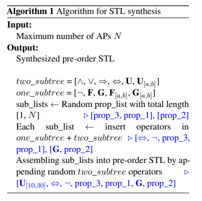

# NL2TL深度研究报告：基于大语言模型的自然语言至时序逻辑转换框架全景解析

## 1. 执行摘要

本报告旨在对论文《NL2TL: Transforming Natural Languages to Temporal Logics using Large Language Models》（arXiv:2305.07766）进行详尽的深度剖析与评估。该研究由麻省理工学院（MIT）、哈佛大学及MIT-IBM Watson AI Lab的研究人员Yongchao Chen, Rujul Gandhi, Yang Zhang与Chuchu Fan共同完成 ^1^。

https://arxiv.org/html/2305.07766?_immersive_translate_auto_translate=1

## 2. 研究背景与问题陈述

### 2.1 形式化方法与自然语言交互的鸿沟

在现代工程系统中，**时序逻辑（Temporal Logic, TL）** 是描述系统行为规范的“通用语”。与普通的布尔逻辑不同，时序逻辑引入了时间维度，能够精确表达“在...之前”、“总是”、“最终”等时间约束。

* **线性时序逻辑 (LTL):** 常用于离散系统，如软件验证或网格世界的机器人路径规划。
* **信号时序逻辑 (STL):** 引入了连续的实数时间约束（例如 **$G_{}$** 表示在0到5秒的时间窗口内全局成立），使其成为描述物理世界（如自动驾驶车辆速度控制、电路信号波形验证）的首选语言 ^1^。

然而，时序逻辑的数学严谨性也构成了其应用的巨大门槛。撰写一条正确的 STL 公式（如 `G(req -> F ack)`）需要深厚的逻辑学背景，这对于非专家的终端用户（如工厂操作员、家庭机器人用户）是极其困难的。因此，**自然语言到时序逻辑（NL-to-TL）** 的自动转换技术，被视为实现普适化人机交互的关键一环。

### 2.2 现有技术瓶颈：数据孤岛与泛化困境

尽管近年来自然语言处理（NLP）取得了飞跃，但 NL-to-TL 领域的发展相对滞后，主要受限于以下痛点：

1. **数据稀缺性 (Data Scarcity):** 不同于拥有海量语料的代码生成（Text-to-Code），高质量的 NL-TL 对非常稀缺。标注这些数据需要兼通语言学与形式化逻辑的专家，成本极高。现有的数据集往往规模极小，且大多由简单的模板生成，缺乏语言多样性 ^1^。
2. **领域过拟合 (Domain Overfitting):** 传统方法（如基于 LSTM 的 Seq2Seq 模型）通常在特定领域的数据集上进行端到端训练。例如，在“室内导航”数据集上训练的模型，学会了将“去厨房”映射为逻辑谓词 `goto_kitchen`。然而，一旦应用场景切换到“无人机巡检”，涉及的动作变为“检测裂缝”，模型就必须从零开始重新训练，因为其词汇表和原子命题（Atomic Propositions, APs）完全改变。这种缺乏**跨领域泛化能力** 的问题，使得 NL-to-TL 系统难以大规模部署 ^4^。

### 2.3 NL2TL 的核心破局思路

NL2TL 的核心假设是：尽管不同领域的原子命题（动作、对象）千差万别，但人类发出指令的逻辑结构（Logical Structure）是通用的。

例如：

* 场景A（导航）：“如果（检测到障碍物），那么（停止移动）。”
* 场景B（办公）：“如果（收到邮件），那么（发送通知）。”
  两者虽然领域不同，但逻辑结构均为 Global(AP1 -> Future(AP2))。NL2TL 通过 “提升（Lifting）” 策略，将具体内容剥离，专注于学习这种通用的逻辑映射，从而实现了前所未有的泛化能力 。

---

## 3. 理论框架：信号时序逻辑与提升表示法

在深入具体算法之前，必须明确 NL2TL 所处理的逻辑对象的数学属性及其独特的表示方法。

### 3.1 信号时序逻辑 (STL) 语法基础

STL 是基于连续信号 $s(t)$ 定义的。一个 STL 公式 $\Phi$ 的语法可以递归定义为：

$$
\Phi ::= \pi^\mu \mid \neg \Phi \mid \Phi \wedge \Psi \mid \Phi \vee \Psi \mid \Phi \to \Psi \mid F_{[a,b]} \Phi \mid G_{[a,b]} \Phi \mid \Phi U_{[a,b]} \Psi

$$

其中：

* **$\pi^\mu$** 是原子谓词（Atomic Predicate），通常形式为 **$f(s(t)) > c$**，表示信号在某时刻满足数值约束。
* **$F_{[a,b]}$** (Finally/Eventually): 在时间区间 **$[t+a, t+b]$** 内至少有一刻 **$\Phi$** 成立。
* **$G_{[a,b]}$** (Globally/Always): 在时间区间 **$[t+a, t+b]$** 内 **$\Phi$** 始终成立。
* **$U_{[a,b]}$** (Until): **$\Phi$** 持续成立，直到 **$\Psi$** 在区间内某刻成立。

相比于 LTL，STL 的核心挑战在于其包含实数时间参数 **$[a, b]$**，这使得逻辑结构更加复杂，对模型的数值敏感度要求更高 ^1^。

### 3.2 “提升”表示法 (Lifted Representation)

这是 NL2TL 区别于以往工作的核心创新。传统的端到端翻译试图同时解决“语义理解”（将“苹果”映射为 `apple`）和“逻辑解析”（处理 if-then 关系）。NL2TL 将这两个任务解耦。

#### 3.2.1 定义

在“提升”版本的数据中，所有的具体原子命题（AP）都被抽象化占位符替换。

* **完整 NL (Full NL):** "If a response is created in Slack, or the Acoustic Campaign contact is being updated then in response the scenario that a response is created in Asana shall be instantly observed."
* **提升 NL (Lifted NL):** "If (prop_1), or (prop_2) then in response the scenario that (prop_3) shall be instantly observed."
* **完整 STL (Full STL):** `globally (((create_Slack) or (update_Acoustic_Campaign)) imply (create_Asana))`
* **提升 STL (Lifted STL):** `globally (((prop_1) or (prop_2)) imply (prop_3))`

#### 3.2.2 理论优势

这种表示法具有双重优势：

1. **通用性:** 模型学会的是 `if...or...then...` 对应 `G((... or...) ->...)` 的规则。这种规则是语言学通用的，不依赖于特定领域的词汇表。
2. **数据合成便利性:** 由于不需要生成特定领域的合理语义（如不需要通过物理引擎验证“机器人能否飞”），我们可以大规模合成复杂的逻辑结构用于训练。

---

## 4. 方法论详解：生成式数据管道与模型训练

NL2TL 的方法论可以概括为“合成-微调-迁移”。为了训练一个强大的提升逻辑转换器，作者首先构建了一个基于 LLM 的数据生成管道。

### 4.1 数据集生成框架：LLM 赋能的合成策略

为了解决数据匮乏问题，作者利用 GPT-3（Davinci-003）作为一个高能力的“翻译官”和“改写者”，构建了一个包含 28,000 对样本的 NL-TL 数据集。这一过程采用了独特的“人在回路”（Human-in-the-loop）与双向验证机制。

#### 4.1.1 算法 1：多样化 STL 结构的合成

首先，需要生成大量的“答案”（STL公式）。为了避免模型只学会简单的逻辑，作者设计了递归算法（Algorithm 1）来生成复杂的 STL 二叉树

* **输入:** 最大 AP 数量 **$N$**。
* **过程:**
  1. 生成随机长度的 AP 列表（如 `[prop_3, prop_1, prop_2]`）。
  2. 将列表切分为子列表。
  3. 从单操作数算子集（One-subtree operators: **$\neg, F, G$**）和双操作数算子集（Two-subtree operators: **$\wedge, \vee, U, \to$**）中随机采样，插入树结构中。
  4. 为时序算子随机生成时间区间 **$[a, b]$**。
* **输出:** 结构多样的前序（Pre-order）STL 公式。

这一步确保了生成的逻辑公式在深度、广度和算子组合上具有极高的丰富度（Corpus Richness），这是以往基于模板的方法无法比拟的 ^1^。

#### 4.1.2 框架一 (Framework 1): 单向生成与人工修正

获得 STL 公式后，需要将其翻译为自然语言。

1. **规则化转换:** 将 STL 符号转换为自然语言友好的中间形式（例如将符号 `->` 转换为单词 `imply`，将 `&` 转换为 `and`），以辅助 LLM 理解。
2. **GPT-3 提示学习:** 使用 GPT-3 将中间形式的 STL 翻译为自然语言。

   * *Prompt 示例:* 提供了约 20 对 NL-STL 样本作为上下文，引导 GPT-3 模仿这种翻译风格 ^1^。
3. **人工校验:** 由 10 名具有逻辑学背景的志愿者对生成结果进行校验。由于 Algorithm 1 生成的 STL 可能是随机组合（如“如果 A，则直到 B，否则 C”），其语义可能极其生硬。人类标注员的任务是修正自然语言，使其读起来更通顺，或者剔除逻辑上完全不合理的样本。

   

#### 4.1.3 框架二 (Framework 2): 循环一致性优化

为了减轻人工标注的负担并提高数据质量，作者引入了更复杂的闭环机制。

* **动机:** 纯随机生成的 STL（STL-1）往往包含人类语言中极少出现的逻辑结构，导致 GPT-3 生成的 NL（NL-1）质量低劣。
* **流程:**

  1. **STL-1 -> NL-1:** 同框架一，由 GPT-3 生成初始自然语言。
  2. **NL-1 -> STL-2:** 将生成的 NL-1 再次输入 GPT-3，要求其反向翻译回 STL。
  3. **逻辑过滤:** 这一步利用了 GPT-3 的“常识修正”能力。如果 STL-1 过于反人类，GPT-3 在试图理解 NL-1 并回译时，往往会将其简化或修正为更合理的逻辑结构（STL-2）。
  4. **最终生成:** 如果 STL-2 是合法的，则保留 (NL-1, STL-2) 作为最终数据对。
* **效果:** 实验表明，框架二生成的自然语言更符合人类习惯。人工标注效率从每小时 80 对提升至 120 对 ^1^。

  

### 4.2 模型微调策略 (Model Finetuning)

#### 4.2.1 基础模型架构：T5

研究选择了 **T5 (Text-to-Text Transfer Transformer)** 作为基础模型。与仅使用 Decoder 的 GPT 系列不同，T5 的 Encoder-Decoder 架构更适合序列到序列（Seq2Seq）的翻译任务。

* **规模:** 对比了 T5-Base (220M) 和 T5-Large (770M)。
* **优势:** 相比于 GPT-3，微调后的 T5 参数量小，推理成本低，且在严格的形式化语言生成上表现更稳定，不易产生幻觉 ^5^。

#### 4.2.2 线性化格式的深度探索 (Linearization Formats)

STL 本质上是树状结构。如何将其线性化输入 Transformer 对性能有重大影响。论文详细对比了四种格式：

| **格式名称**                       | **示例结构**                        | **特点**               | **适用性**         |
| ------------------------------------ | ------------------------------------- | ------------------------ | -------------------- |
| **前序 + 符号** (Pre-order/Symbol) | `[G, ->, prop_1, prop_2]`           | 类似波兰表达式，无括号 | 传统程序合成常用   |
| **前序 + 单词** (Pre-order/Word)   | `[globally, imply, prop_1, prop_2]` | 使用自然语言单词       | 易于 LLM 理解      |
| **中序 + 符号** (In-order/Symbol)  | `(G (prop_1 -> prop_2))`            | 标准数学表达式         | 括号匹配复杂       |
| **中序 + 单词** (In-order/Word)    | `(globally (prop_1 imply prop_2))`  | 接近自然语言语序       | **NL2TL 最终选择** |

**关键发现: 实验数据显示，“中序遍历 + 单词” 的组合表现呈现压倒性优势（T5-Large 达到 97.52% 准确率，而前序格式仅约 73%）。**

深度解析: 这一结果反直觉，因为前序遍历通常消除了括号匹配的问题，被认为更适合机器生成。但作者深刻指出，LLM（如 T5）是在大量自然语言文本上预训练的，而人类语言逻辑通常遵循“主-谓-宾”或中序结构（"If A implies B" 对应 A -> B）。因此，保持与自然语言结构相似的中序格式，能最大化地激活模型的预训练知识，降低微调难度 1。

---

## 5. 实验生态系统：数据集与评估基准

为了验证模型的泛化能力，研究构建了一个包含五个不同领域的评估生态系统。这些领域涵盖了从抽象电路到具体机器人的广泛场景。

### 5.1 评估数据集概览

| **领域数据集**   | **来源**                                | **特点**                                               | **逻辑类型** | **样本规模 (Full NL-TL)**  |
| ------------------ | ----------------------------------------- | -------------------------------------------------------- | -------------- | ---------------------------- |
| **Circuit**      | DeepSTL (He et al., 2022) ^3^           | 描述信号波形（电压、频率），逻辑嵌套极深，数值约束复杂 | STL          | ~120K (仅抽取部分用于测试) |
| **Navigation**   | Wang et al., 2021 ^6^                   | 机器人移动指令，涉及区域（Room）、动作（Grab）         | LTL/STL      | 5K                         |
| **Office Email** | Fuggitti & Chakraborti, 2023 ^7^        | IFTTT 风格的工作流自动化（Slack, Gmail）               | LTL          | ~150 (小样本)              |
| **GLTL**         | Gopalan et al., 2018 ^4^                | 几何 LTL，侧重于空间移动                               | GLTL         | 11K                        |
| **CW**           | Cleanup World (Squire et al., 2015) ^6^ | 简单的机器人拾取与放置任务                             | LTL          | 3.3K                       |

**数据集统计特征:** NL2TL 合成的“提升”数据集在唯一公式数量（Unique STL Formulas）上远超现有数据集（达到 14,438 个唯一公式，而 Circuit 数据集虽大但公式重复率高），这保证了模型见识过足够多的逻辑变体 ^1^。

### 5.2 基准模型 (Baselines)

为了公平对比，研究选取了各领域的 SOTA 模型作为基准：

1. **Transformer (DeepSTL):** 专为电路领域设计的端到端 Transformer。
2. **Seq2Seq (RNN/GRU):** 用于 GLTL 和 Navigation 领域的传统模型。
3. **GPT-3 Few-shot:** 直接使用 GPT-3 进行端到端翻译（2023年 Fuggitti 等人提出的方法）。
4. **GPT-4 (Ad-hoc):** 在部分实验中引入了 ChatGPT Plus 进行小样本测试。

---

## 6. 实验结果深度分析

### 6.1 核心实验：跨领域泛化性能

实验的核心设置是：在合成的 Lifted 数据集上预训练 NL2TL 模型，然后在目标领域仅使用极少量数据（<10%）进行微调。

#### 6.1.1 准确率与数据效率对比

下表总结了 NL2TL 与各领域基准模型的性能对比（Metric: Exact Match Accuracy）：

| **领域**         | **训练数据量** | **基准模型准确率** | **NL2TL (T5-Large) 准确率** | **性能提升** |
| ------------------ | ---------------- | -------------------- | ----------------------------- | -------------- |
| **Circuit**      | ~2000 vs ~200  | ~80% (Transformer) | **> 95%** (仅需 ~200 样本)  | +15%         |
| **Navigation**   | ~600 vs ~100   | ~60% (Seq2Seq)     | **> 95%** (仅需 ~100 样本)  | +35%         |
| **GLTL**         | Full vs ~200   | ~70% (RNN)         | **> 96%**                   | +26%         |
| **Office Email** | Few-shot       | 58.73% (GPT-3)     | **96.73%**                  | +38%         |

数据解读与洞察 ^1^:

* **小样本学习的胜利:** 在 Circuit 领域，DeepSTL 模型即便使用了数千条数据，准确率也难以突破 85%。而 NL2TL 仅用 200 条数据就达到了 95% 以上。这强有力地证明了，**逻辑结构的学习是可以迁移的** 。模型在预训练阶段已经学会了“逻辑语法”，微调阶段只需学习特定领域的“语义词典”（即如何将“电压”映射为信号变量）。
* **碾压 GPT-3:** 在 Office Email 领域，直接提示 GPT-3 的准确率仅为 58.73%。这揭示了通用 LLM 在处理严格逻辑时的弱点——容易产生幻觉或忽略复杂的嵌套结构。相比之下，经过专项微调的 T5 模型表现出了极高的严谨性。
* **GPT-4 的表现:** 作者在 Ad-hoc 测试中发现，GPT-4 的端到端准确率约为 77.7%，虽然优于 GPT-3，但仍显著低于 NL2TL (>95%)。这说明即便对于最强的 LLM，在缺乏微调的情况下，处理形式化语言的稳定性仍有待提高 ^1^。

### 6.2 消融研究 (Ablation Studies)

#### 6.2.1 人工标注的必要性

研究对比了完全使用 GPT-3 生成的“原始数据”与经过人工修正的“标注数据”训练的模型。

* **结果:** 使用标注数据训练的模型准确率比使用原始数据高出约 10% ^8^。
* **洞察:** 尽管 LLM 生成能力强大，但其产生的逻辑谬误（如时间区间重叠错误）会成为噪声，干扰模型的学习。少量高质量的人工修正数据对于建立高质量的“逻辑基准”至关重要。

#### 6.2.2 框架二 (Framework 2) 的贡献

* **结果:** 结合框架一和框架二的数据训练，比仅用框架一数据准确率提升约 2%。
* **洞察:** 循环一致性检查（Cycle Consistency）不仅过滤了低质量数据，还隐式地筛选出了那些“GPT-3 认为自然”的表达方式，使得训练数据分布更接近真实的人类语言分布。

#### 6.2.3 模型容量：T5-Base vs T5-Large

* 在处理简单的逻辑时，两者差异不大。但在逻辑深度增加（如嵌套层数 > 3）或涉及复杂时间区间（如 `U` 与 `F` 组合）时，T5-Large 的优势显著。这表明逻辑推理需要更大的参数容量来捕捉长距离依赖 ^5^。

---

## 7. 落地策略与实际应用：从逻辑到行动

NL2TL 生成的“提升 STL”（如 `G(prop_1 -> F(prop_2))`）本身只是中间产物，机器无法直接执行。论文提出了两种将抽象逻辑转化为可执行指令（Grounding）的策略。

### 7.1 策略一：基于 AP 识别的模块化方法 (Modular Approach)

这是一种无需训练数据（Zero-shot/Few-shot）的灵活方案。

1. **AP 识别:** 使用 GPT-3 作为“提取器”。
   * *Input:* "If the robot sees a red ball, pick it up."
   * *Prompt:* "Extract actions and replace with placeholders."
   * *Output:* `prop_1: sees a red ball`, `prop_2: pick it up`.
2. **逻辑转换:** 将替换后的句子 "If prop_1, prop_2" 输入 NL2TL 模型，得到 `(prop_1 -> prop_2)`。
3. **符号回填:** 将 `prop_i` 映射回系统 API。

优势: 极高的灵活性，适用于 API 经常变动的系统。

实验结果: 配合 GPT-3 进行 AP 识别，整体系统的准确率在 Circuit, Nav, Office 领域均保持在 95% 左右 1。这意味着 GPT-3 在“提取短语”这一简单任务上表现极佳（准确率 >98%），与 NL2TL 的逻辑强项形成了完美互补。

### 7.2 策略二：端到端迁移学习 (End-to-End Transfer Learning)

如果用户拥有少量的领域数据（Full NL-TL），可以直接在 NL2TL 预训练模型基础上进行微调。

* 此时，模型不再输出 `prop_1`，而是直接输出 `grab_apple`。
* **学习机制:** 模型同时进行两项任务的学习——逻辑结构的迁移（来自预训练）和词汇映射的学习（来自微调）。
* **效果:** 如图 6 ^1^ 所示，这种方法在数据量极少（如 50 条）时，学习曲线极其陡峭，迅速达到高准确率。这是典型的迁移学习优势。

  

  ## **① 预训练带来巨大优势（蓝线远高于橙线与绿色）**

  尤其在数据少的时候：

  * 100–300 条数据即可达到 80–95% 精度
  * 而 baseline（绿色）甚至不到 40–60%
  * 无预训练模型（橙线）需要更多数据才能逼近蓝线水平

  > **说明：Lifted 预训练极大增强了模型对时序逻辑结构的理解能力，使得模型在极少领域数据下即可高精度迁移。**
  >

  ---

  ## **② 预训练的收益随着模型规模更明显（T5-large > T5-base）**

  * T5-large（图 d–f）在所有数据量区间表现更高、更稳、更快收敛
  * 蓝线在 100~200 个样本时已达成约 90% 精度

  > **说明：大模型的结构理解能力强，加上 lifted 数据预训练后，其泛化能力比小模型更突出。**
  >

  ---

  ## **③ Seq2Seq / Transformer baseline（绿线）表现最差且增长慢**

  * 需要数千训练样本才能接近 80%+
  * 且曲线始终落后 T5 模型较多

  > **说明传统 Seq2Seq 不具备良好的逻辑结构泛化能力，难以处理复杂 TL 结构。**
  >

## 8. 局限性与批判性展望 (2024-2025 视角)

尽管 NL2TL 在 EMNLP 2023 发表时具有里程碑意义，但结合 2024 年及 2025 年的最新文献（如 VLTL-Bench ^9^），我们必须客观审视其局限性。

### 8.1 语义接地（Grounding）的“最后一公里”难题

2025 年发布的 VLTL-Bench 对 NL2TL 进行了复现评估。结果显示，虽然 NL2TL 在生成“提升 STL”方面准确率极高（接近 100%），但在**语义接地** 方面存在盲区 ^11^。

* **问题:** 策略一（模块化方法）依赖 GPT-3 提取 AP。如果 GPT-3 提取的文本（如 "go to the kitchen"）不能精确匹配机器人预定义的函数名（如 `navigate_to(kitchen)`），系统仍无法执行。NL2TL 框架本身没有包含将自然语言短语映射到严格 API 的机制（Map-to-API）。
* **影响:** 在实际部署中，这往往是故障的高发区。

### 8.2 共指消解 (Coreference Resolution)

论文明确指出，当前模型不处理复杂的代词指代。

* *例子:* "Pick up the apple and wash **it** ."
* 在 NL2TL 中，这可能被处理为两个独立的命题 `prop_1` 和 `prop_2`，丢失了 `it` 指代 `apple` 的信息。
* **未来方向:** 需要引入专门的指代消解模块或使用更强的上下文感知模型。

### 8.3 验证性 (Verifiability)

NL2TL 关注的是翻译的**准确性** （即翻译结果是否忠实于自然语言）。但在工程中，更重要的是**正确性** （即生成的逻辑是否会导致系统崩溃或死锁）。目前的框架缺乏内置的形式化验证器（Model Checker）来在生成阶段即时过滤不安全的逻辑 ^12^。

### 8.4 与 Lang2LTL 等同类工作的对比

* Lang2LTL ^13^: 专注于机器人导航，引入了视觉语言模型（VLM）来处理地标识别（如“红色的椅子”）。相比之下，NL2TL 更侧重于纯逻辑结构，不包含视觉感知模块，因此在涉及视觉描述的任务中处于劣势。
* DeepSTL ^3^: 仅在电路领域有效。NL2TL 通过“提升”策略完全超越了其泛化性，证明了 DeepSTL 是 NL2TL 的一个特例。

---

## 9. 结论

《NL2TL: Transforming Natural Languages to Temporal Logics using Large Language Models》是一项奠基性的研究工作。它通过创造性地提出“提升（Lifting）”策略，成功打破了自然语言处理与形式化方法之间的壁垒。

**核心结论:**

1. **解耦有效性:** 将逻辑结构与语义内容解耦，是解决 NL-to-TL 领域数据稀缺与泛化难题的最优解。
2. **LLM 作为数据引擎:** 展示了利用 LLM 合成大规模、高质量结构化数据的可行性，为其他“小样本、高精度”领域（如法律文本解析、医疗诊断逻辑）提供了方法论参考。
3. **模型微调的优越性:** 证明了在严格的逻辑转换任务中，专项微调的小模型（T5）在准确率和稳定性上可以超越通用的大模型（GPT-3/4）。

对于未来的研究者与工程师而言，NL2TL 提供了一个强大的“逻辑解析内核”。将其与领域特定的“语义接地模块”和“形式化验证器”相结合，将是构建下一代可信赖、自然交互的智能系统的必由之路。
