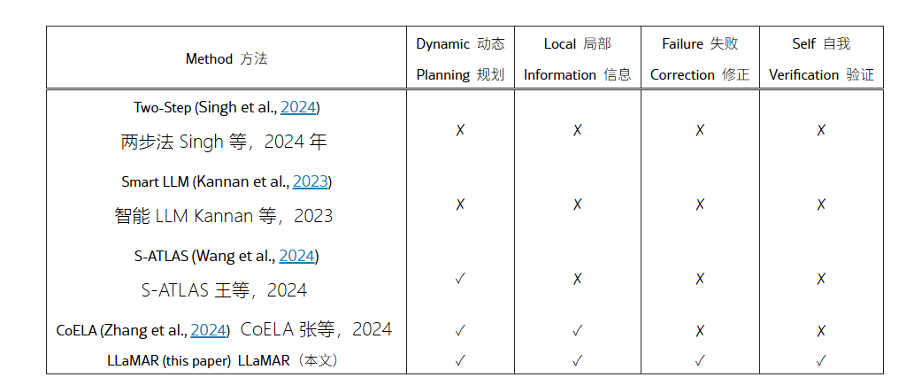

# LLaMAR: Long-Horizon Planning for Multi-Agent Robots in Partially Observable Environment

## 1. 执行摘要

LLaMAR（Language Model-based Long-Horizon Planner for Multi-Agent Robotics）的提出标志着具身智能（Embodied AI）领域在多智能体协作规划方面的重要转折。作为一种基于大语言模型（LLM）的认知架构，LLaMAR 旨在解决多智能体在部分可观测、非平稳环境下的长程任务规划难题。其核心贡献在于摒弃了传统的“开环”规划范式，转而采用一种鲁棒的 **Plan-Act-Correct-Verify（规划-行动-纠正-验证）** 闭环框架。这一架构使得智能体能够在缺乏环境先验知识、不依赖模拟器“上帝视角”（Oracle）的情况下，通过实时视觉反馈迭代修正策略，从而在复杂的家务任务和搜救场景中实现了显著的性能提升 ^1^。

本报告将对 LLaMAR 的技术架构进行详尽的解构，深入剖析其四个核心模块（Planner、Actor、Corrector、Verifier）的运作机理及交互流，并详细阐述其在 **MAP-THOR** 和 **Search & Rescue (SAR)** 环境下的实验表现。更重要的是，本报告重点整合了 2024 年底至 2025 年间学术界对 LLaMAR 的最新评价与对比研究，包括 **VIKI-R** 、**COMPASS** 、**L2M2** 等新兴架构对其的挑战，以及 **Jackson Zhang (2025)** 关于其在噪声环境下脆弱性的深度分析。通过这些后续研究的视角，我们不仅能看到 LLaMAR 的先进性，更能清晰地识别其集中式架构在可扩展性、感知鲁棒性及底层执行层面的局限性。

---

## 2. 核心架构深度解析：Plan-Act-Correct-Verify 框架

LLaMAR 的设计哲学在于承认大语言模型在生成静态长程计划时的局限性，特别是在多智能体环境中，其他智能体的行为会导致环境状态的非平稳变化，使得单一的初始计划极易失效。为此，LLaMAR 构建了一个模块化的认知系统，由四个经过特定角色提示（Prompting）微调的 LLM 实例组成。

### 2.1 Planner 模块：不确定性下的任务分解

**Planner（规划器）** 是整个认知架构的起点，其主要职责是将模糊的高层自然语言指令转化为结构化的子任务序列。

* **动态子任务生成** ：Planner 接收用户的自然语言指令（例如“把所有的杂货放进冰箱”），结合当前所有智能体的联合观测信息（**$o$**）和历史记忆（**$\mathcal{M}$**），生成一个开放子任务列表（**$\mathcal{G}_O$**）。与传统的静态规划器不同，Planner 是动态的。它并不假设自己拥有环境的全知地图，而是基于智能体当前的视野（Field of View）进行推理。例如，如果智能体在探索过程中发现了一个之前未知的“番茄”，Planner 会实时更新子任务列表，增加“将番茄运送到冰箱”这一项 ^1^。
* **语义理解与消歧** ：Planner 利用 LLM 的常识推理能力来处理指令的模糊性。对于“清理桌子”这样的指令，Planner 需要推断出“书应该去书架”、“碗应该去水槽”以及“垃圾应该去垃圾桶”等隐含目标。这种能力使得 LLaMAR 能够处理高度抽象的人类意图，将其转化为具体的环境交互目标 ^1^。

### 2.2 Actor 模块：集中式高层动作选择

**Actor（行动者）** 模块充当认知规划与物理执行之间的桥梁。在 LLaMAR 的 **集中式多智能体系统（CMAS）** 架构中，Actor 负责在每个决策步为所有智能体同时选择高层动作。

* **联合动作空间决策** ：Actor 接收联合观测**$O = \{o_1, \dots, o_N\}$**，并从动作空间**$\mathcal{A}$** 中为每个智能体**$i$** 选择动作**$a_i$**。动作空间**$\mathcal{A}$** 被划分为三类：
  1. **导航动作（**$\mathcal{A}_{NAV}$**）** ：如`NavigateTo(object)`，利用 A* 算法等底层导航策略移动到目标物体附近。
  2. **交互动作（**$\mathcal{A}_{INT}$**）** ：如`PickUp(object)`、`Open(receptacle)`、`Slice(food)`。
  3. **探索动作（**$\mathcal{A}_{EXP}$**）** ：这是 LLaMAR 应对部分可观测性的关键机制。当 Planner 需要寻找物体但当前视野中不可见时，Actor 会触发探索动作。该动作基于 CLIP 模型生成的语义相关性热图，引导智能体向最可能出现目标物体的方向（例如，找“碗”时优先探索“餐桌”而非“沙发”）移动 ^1^。
* **同步执行与冲突规避** ：由于采用集中式决策，Actor 能够显式地协调智能体行为以避免冲突。例如，如果两个智能体需要通过同一狭窄通道，Actor 可以安排一个智能体等待（`StayIdle`），另一个先行。这种协调能力是相对于去中心化方法（如 CoELA）的一个主要优势，后者往往依赖复杂的通信协议来解决此类冲突 ^2^。

### 2.3 Corrector 模块：基于视觉反馈的故障诊断与修复

**Corrector（纠正器）** 是 LLaMAR 架构中最具创新性的组件，直接针对长程任务中低层执行失败的问题。

* **闭环反馈机制** ：在 Actor 输出动作后，底层的元动作策略（Primitive Policies）会尝试执行。由于物理模拟或现实世界的复杂性，这些动作经常失败（例如，机器人试图抓取物体但距离稍远）。传统的规划器往往会陷入死循环，不断重试同一失败动作。
* **视觉归因与重规划** ：Corrector 接收执行反馈和当前的视觉图像，利用 VLM（视觉语言模型）的能力来诊断失败原因。
  * *案例分析* ：如果智能体执行`PickUp(Plate)` 失败，Corrector 通过分析图像可能发现“盘子在柜子里，而柜门是关着的”。
  * *修正策略* ：基于诊断，Corrector 会修改动作序列，插入`Open(Cabinet)` 动作，或者建议智能体`NavigateTo(Plate)` 以调整位置。
* **独立性** ：Corrector 的运作完全基于智能体的感知，不依赖模拟器提供的特权错误代码（Oracle Feedback）。这种“基于感知的自我纠正”极大地增强了系统在真实世界部署的潜力，因为它模拟了人类在操作失败时的直觉反应 ^1^。

### 2.4 Verifier 模块：环境落地的任务验证

**Verifier（验证器）** 负责确保持续的规划过程与环境的真实状态保持一致。

* **视觉确认** ：当 Actor 报告某个子任务（如“把苹果放进冰箱”）已完成时，Verifier 不会盲目信任，而是通过分析最新的环境图像来验证这一断言。只有当视觉证据确凿时，该子任务才会从**$\mathcal{G}_O$** 移动到已完成列表**$\mathcal{G}_C$**。
* **防止幻觉** ：LLM 在长程规划中容易出现“幻觉”，即错误地认为自己已经完成了某些步骤。Verifier 作为一个独立的审查模块，有效地切断了这种错误的传播链，确保 Planner 基于真实的环境状态生成后续计划 ^1^。

### 2.5 语义转换与执行落地 (SentenceBERT)

为了解决 LLM 输出的自由文本（Free-form text）与机器人 API 严格参数要求之间的鸿沟，LLaMAR 引入了一个经过微调的 **SentenceBERT** 模型。

我们采用来自（Huang et al., 2022）的余弦相似度方法，对预训练的 sentence-BERT（Reimers and Gurevych, 2019）进行微调，将自由文本转换为可接受的高层动作。sentence transformer 微调的超参数和更多细节请参见附录 J。

* **语义映射** ：Actor 输出的可能是“去抓那个红色的东西”，SentenceBERT 计算该文本与当前环境中所有可行 API 调用（如`PickUp(Apple_1)`）的余弦相似度，将意图映射为最具可能性的执行指令。
* **鲁棒性增强** ：这种机制允许 LLM 使用更自然的语言进行推理，而不必过拟合到特定的 API 语法上，从而提高了模型的泛化能力 ^1^。

---

## 3. 实验环境与基准测试体系

LLaMAR 的评估建立在两个精心设计的模拟环境之上，旨在分别测试其在家务逻辑和紧急协作方面的能力。

### 3.1 MAP-THOR：家庭服务机器人的综合基准

作者开发了 **MAP-THOR** （Multi-Agent Planning in THOR），这是一个基于 AI2-THOR 模拟器的扩展基准，专门用于评估多智能体在部分可观测环境下的表现。

* **任务模糊性分级** ：为了全面测试规划器的认知能力，MAP-THOR 将任务分为四个难度等级，模糊性逐级递增：
  1. **显式指令** ：“把面包放在冰箱里。”（对象和目标明确）。
  2. **隐含数量** ：“把*所有* 苹果放进冰箱。”（需要遍历环境并计数）。
  3. **隐含对象类型** ：“把*杂货* 放进冰箱。”（需要基于常识分类，识别出苹果、生菜等属于杂货）。
  4. **隐含目标与对象** ：“清理桌子。”（这是最具挑战性的，智能体必须根据常识推断每个物体——书、碗、笔——的正确归宿，如书去书架，碗去厨房）^1^。
* **环境多样性** ：每个任务都在 5 个不同的房间布局中进行测试，以验证策略的鲁棒性，防止对特定地图的过拟合。

### 3.2 Search & Rescue (SAR)：高压协作场景

SAR 环境是一个抽象的网格世界，用于测试在时间压力和强协作约束下的规划能力。

* **强协作约束** ：某些任务具有硬性的物理约束，例如“搬运伤员”必须由两名智能体同时在相邻位置执行`Carry` 动作。这直接考验了 Actor 模块同步多智能体动作的能力。
* **不可逆后果** ：环境包含动态扩散的火源。如果智能体决策过慢或路径规划不当，火势蔓延将导致任务不可逆转地失败。这要求 Planner 能够进行优先级排序，权衡“探索”与“灭火”的紧迫性。
* **长程依赖** ：完成一次救援可能涉及 100 个以上的低层动作（寻找水源 -> 汲水 -> 移动 -> 灭火 -> 寻找伤员 -> 协同搬运 -> 运送），对记忆和长程一致性提出了极高要求 ^1^。

---

## 4. 原始论文中的性能评估与基准对比

在 2024 年发表时，LLaMAR 在各项指标上均显著优于当时的 SOTA 方法。

### 4.1 定量性能优势

在 2 智能体配置下，LLaMAR 在 MAP-THOR 和 SAR 任务中均取得了压倒性优势。

| **算法模型**      | **LLM 后端** | **成功率 (SR)** | **运输率 (TR)** | **覆盖率 (C)** | **平衡度 (B)** |
| ----------------------- | ------------------ | --------------------- | --------------------- | -------------------- | -------------------- |
| **LLaMAR (Ours)** | GPT-4V             | **0.62**        | **0.87**        | **0.95**       | **0.82**       |
| Act (Baseline)          | GPT-4V             | 0.33                  | 0.67                  | 0.91                 | 0.59                 |
| ReAct (Baseline)        | GPT-4V             | 0.34                  | 0.72                  | 0.92                 | 0.67                 |
| CoELA                   | GPT-4V             | 0.25                  | 0.46                  | 0.76                 | 0.73                 |
| SmartLLM                | GPT-4V             | 0.11                  | 0.23                  | 0.91                 | 0.45                 |

(数据来源：^1^)

**核心洞察** ：

* LLaMAR 的成功率（0.62）几乎是 ReAct（0.34）的两倍，是 SmartLLM（0.11）的六倍。
* **运输率（TR）** 的高分（0.87）表明，即使在未完全成功的任务中，LLaMAR 也完成了大部分子任务，这归功于 Corrector 对单步失败的有效挽救。
* **覆盖率（C）** 高达 0.95，证明了基于 CLIP 的语义探索策略非常有效，几乎总能找到任务相关物体。

### 4.2 基准方法的失效模式分析

通过对比，可以清晰地看到基准方法的结构性缺陷：

* **SmartLLM 的全知假设谬误** ：SmartLLM 假设智能体拥有环境的完整状态信息（上帝视角）。在部分可观测的 MAP-THOR 中，这种假设导致它生成的计划包含大量针对“不可见物体”的操作，导致执行器立刻报错并陷入死循环。LLaMAR 的动态规划彻底解决了这一问题 ^1^。
* **CoELA 的 Oracle 依赖** ：CoELA 作为一个去中心化框架，其动作生成依赖于模拟器提供的“有效动作列表”（Oracle Filter）。在去除这一特权信息后，CoELA 的性能大幅下降（SR 0.25），因为它无法自行判断哪些动作在物理上是可行的，导致大量无效尝试。此外，由于缺乏统一的中央协调，CoELA 的智能体经常出现目标冲突 ^3^。
* **Act/ReAct 的开环缺陷** ：简单的 Act 或 ReAct 提示虽然能生成合理的单步动作，但缺乏长程记忆和显式的错误恢复机制。一旦发生“手滑”（如抓取失败），它们往往无法从上下文中推断出需要调整位置，而是机械地重复抓取指令 ^1^。

---

## 5. 后续研究评价与局限性分析（2025 年视角）

尽管 LLaMAR 在发布时确立了新的基准，但随着 2025 年多智能体具身智能（Embodied Multi-Agent Systems, EMAS）领域的飞速发展，后续研究对其进行了深入的剖析和批判。这些评价主要集中在架构的可扩展性、感知的鲁棒性以及学习机制的缺失上。

### 5.1 VIKI-R 与具身协作的层级划分：任务规划 vs. 轨迹感知

2025 年发布的 **VIKI-R** 框架及其对应的基准 **VIKI-Bench** 对 LLaMAR 的定位提出了尖锐的挑战。VIKI-R 的作者认为，LLaMAR 过于专注于认知层面的**任务规划（Task Planning）** ，而忽视了更底层的**轨迹感知（Trajectory Perception）** 。

* **层级缺失** ：VIKI-Bench 将具身协作划分为三个层级：
  1. 智能体激活（Level 1）
  2. 任务规划（Level 2，LLaMAR 的主战场）
  3. 轨迹感知（Level 3，涉及具体的物理路径预测和避障）
     后续研究指出，LLaMAR 在 Level 2 表现尚可，但在 Level 3 上完全依赖预定义的底层策略，缺乏对复杂物理交互（如精细的机械臂协同）的感知推理能力 6。
* **性能对比** ：在同等任务规划层级（Level 2）的对比中，采用“监督微调（SFT）+ 强化学习（RL）”范式的 VIKI-R 取得了**96.5%** 的成功率，远超 LLaMAR 在 MAP-THOR 上的表现。这表明，单纯依赖 Prompt Engineering（提示工程）的 LLaMAR 在上限上不如经过特定领域微调的模型 ^6^。
* **异构智能体支持** ：VIKI-R 引入了异构机器人（如轮式机器人与人形机器人的协作），批评 LLaMAR 的集中式 Actor 难以处理不同构型机器人的运动学约束差异。LLaMAR 倾向于将所有智能体视为具有相同能力集的通用实体，限制了其在异构车队中的应用 ^7^。

### 5.2 COMPASS 与中心化架构的瓶颈：可扩展性危机

**COMPASS (Cooperative Multi-Agent Planning with Adaptive Skill Synthesis, 2025)** 的研究工作直接抨击了 LLaMAR 的 **CMAS（集中式）** 架构。

* **计算与通信瓶颈** ：COMPASS 指出，LLaMAR 的集中式 Planner 需要收集所有智能体的视频流并将其拼接进同一个 Context Window 中。随着智能体数量**$N$** 的增加，输入 Token 数量呈线性甚至超线性增长，导致推理延迟急剧上升，且极易超出 LLM 的上下文长度限制。实验数据显示，LLaMAR 的**工作负载平衡度（Balance）** 从 2 个智能体时的 0.82 下降到 5 个智能体时的 0.54，佐证了随着规模扩大，中心节点无法有效分配任务，倾向于“过载”某个视野最好的智能体 ^1^。
* **动态对抗环境下的失效** ：COMPASS 在**SMACv2（星际争霸多智能体挑战）** 环境中进行了对比。这是一个高度动态、对抗性的环境，不仅仅是协作搬运。结果显示，COMPASS 实现了比基线高**30%** 的胜率，而 LLaMAR 类基于固定技能库（Fixed Primitives）的方法难以适应。COMPASS 提出了“自适应技能合成”（Adaptive Skill Synthesis），即 LLM 可以实时编写代码生成新技能，而 LLaMAR 只能从预定义的**$\mathcal{A}_{INT}$** 中选择，限制了其应对未知物理机制的能力 ^8^。
* **去中心化闭环** ：COMPASS 倡导去中心化闭环控制，每个智能体拥有独立的 VLM，仅共享必要的语义信息。这种设计在通信受限或中心节点失效的情况下具有更强的鲁棒性，被认为是比 LLaMAR 更符合大规模集群（Swarm）部署的方案 ^10^。

### 5.3 Jackson Zhang 论文分析：感知噪声下的“修正器悖论”

2025 年 Jackson Zhang 的硕士论文《Contextual Knowledge Sharing in Multi-Agent Long-Horizon Planning Settings》为 LLaMAR 提供了一个极具价值的压力测试：当输入的世界状态不再完美时，会发生什么？

* **噪声导致性能倒退** ：该研究向规划器输入由神经网络生成的、带有噪声的（Imperfect）世界状态，而非模拟器的真值（Ground Truth）。令人惊讶的是，简单的 CoT 或 ReAct 规划器在获得共享（即使是充满噪声的）信息后性能有所提升，但**LLaMAR 的成功率反而从 0.62 下降到了 0.595** ^11^。
* **修正器（Corrector）的脆弱性** ：分析认为，LLaMAR 的性能倒退源于其核心优势——Corrector 模块。Corrector 的设计逻辑是“发现差异即修正”。当输入包含感知噪声（例如，视觉模型错误地将一个阴影识别为障碍物）时，Corrector 会过度反应，试图修正一个不存在的错误（例如，指示智能体绕开不存在的障碍）。这种对输入信号的“过度信任”使得 LLaMAR 在非理想感知条件下变得脆弱。相比之下，较简单的规划器因为对细节关注较少，反而对噪声表现出了一定的鲁棒性。这揭示了 LLaMAR 架构在真实世界（Sensors are noisy）落地时的一个关键隐患 ^11^。

### 5.4 L2M2 与课程学习：静态提示 vs. 动态成长

**L2M2 (2025)** 框架从学习机制的角度批评了 LLaMAR。

* **缺乏进化能力** ：LLaMAR 依赖于上下文学习（In-Context Learning），每次任务重置后，智能体都是“白板”，不会从之前的数千次失败中积累经验（除了即时的短期记忆）。L2M2 引入了课程学习（Curriculum Learning），通过逐步增加任务难度来训练智能体。实验表明，在极长程任务中，经过课程训练的架构比 LLaMAR 这种“试图一次性解决所有问题”的架构表现更稳定，错误率随时间推移显著降低 ^12^。

---

## 6. 关键评估指标的综合分析

为了更全面地理解 LLaMAR 的优势与短板，我们需要深入解读其在各项指标上的具体表现及其隐含意义。

### 6.1 成功率 (SR) 与 平衡度 (B) 的权衡

LLaMAR 的 **成功率 (SR)** 确实很高（2 智能体 0.62，3 智能体 0.70），这证明了其 Plan-Act-Correct 循环在解决死锁方面的有效性。然而，**平衡度 (B)** 的急剧下降（5 智能体时跌至 0.54）是一个严重的警示信号。

* **现象解读** ：低平衡度意味着任务负载极不均匀。在集中式推理中，LLM 倾向于生成一条“最简单”的路径，往往是指挥同一个智能体（通常是位置最好、视野最开阔的那个）连续完成多个任务，而让其他智能体闲置。这虽然能完成任务，但在时间效率和能源消耗上是极不优化的。这暴露了 LLaMAR 在**多任务并行调度（Parallel Scheduling）**能力上的算法缺陷。

### 6.2 覆盖率 (C) 的高光表现

**覆盖率 (C)** 稳定在 0.95 以上，这是 LLaMAR 最坚挺的指标。

* **机制验证** ：这直接验证了其探索启发式算法（Exploration Heuristic）的有效性。通过计算子任务文本嵌入与周围环境图像嵌入的 CLIP 相似度（**$\mathcal{E}_d = \sum (g_O \cdot I_d)$**），智能体能够像人类一样进行“语义寻宝”（例如，去厨房找刀，而不是去卧室）。这种基于语义先验的探索远胜于随机游走，是 LLaMAR 能够处理隐含对象任务（"Find all groceries"）的关键 ^1^。

### 6.3 运输率 (TR) 与“最后一公里”问题

高 **运输率 (TR)** （0.87-0.91）表明 LLaMAR 极好地解决了操作层面的“最后一公里”问题。

* **Corrector 的功劳** ：在 Act 或 ReAct 基线中，智能体经常成功导航到物体面前，却因坐标微小偏差导致抓取失败，进而放弃任务。LLaMAR 的 Corrector 能够识别这种微小的物理失败，并发出微调指令（如“后退 0.2 米再抓”）。这种微观层面的鲁棒性是其相对于粗粒度规划器的最大优势 ^1^。

---

## 7. 综合讨论与未来展望

LLaMAR 的提出在具身智能发展史上具有里程碑意义。它强有力地证明了：**LLM 不仅可以作为高层的任务规划者，还可以作为中层的故障诊断者（Debugger）** 。通过引入视觉反馈闭环，LLaMAR 填补了符号规划与物理执行之间的鸿沟。

然而，站在 2025 年的时间节点回望，LLaMAR 更像是一个过渡性的架构。后续研究（VIKI-R, COMPASS）揭示了纯粹依赖提示工程（Prompt Engineering）和集中式控制的局限性。

### 7.1 从“全知全能”到“去中心化专家”

未来的趋势明显指向去中心化。LLaMAR 那种试图用一个大脑控制所有手脚的模式（CMAS），在面对大规模机器人集群时遇到了算力和通讯墙。COMPASS 的成功表明，**分层混合架构** ——即中心化节点仅负责极其抽象的战略目标设定，而具体的战术执行、技能合成与故障修复下放给每个智能体独立的 VLM——将是主流方向 ^8^。

### 7.2 引入不确定性量化

Jackson Zhang 的论文指出的“噪声敏感性”问题，呼唤在 Verifier 和 Corrector 模块中引入**不确定性量化（Uncertainty Quantification）** 。未来的修正器不应仅仅输出“修正动作”，而应输出“修正置信度”。如果基于模糊图像的诊断置信度低，智能体应选择“靠近观察”或“询问队友”，而不是盲目执行修正动作。这将是解决 LLaMAR 在噪声环境下性能倒退的关键 ^11^。

### 7.3 从“预定义动作”到“技能合成”

LLaMAR 受限于预定义的动作空间 **$\mathcal{A}$**。VIKI-R 和 COMPASS 展示了通过代码生成（Code-as-Policy）或强化学习来动态合成新技能的巨大潜力。这意味着未来的规划器不仅要决定“何时用哪个动作”，还要能“发明”出当前动作库中不存在的动作来解决新颖的物理难题 ^7^。

---

## 表 1：2024-2025 多智能体规划架构对比总结

| **特性维度** | **LLaMAR **               | **SmartLLM **   | **CoELA **        | **COMPASS **            | **VIKI-R **           |
| ------------------ | ------------------------- | --------------- | ----------------- | ----------------------- | --------------------- |
| **架构范式** | 集中式 (CMAS)             | 集中式          | 去中心化 (DMAS)   | 去中心化闭环            | 层级式 (Hierarchical) |
| **核心方法** | Prompting (Zero-shot)     | Prompting       | Prompting         | VLM + 技能合成          | SFT + RL 微调         |
| **观测模式** | 部分可观测 (视觉)         | 全观测 (Oracle) | 部分可观测 (视觉) | 部分 + 多跳通信         | 部分可观测 (视觉)     |
| **纠错机制** | **显式 (视觉反馈)** | 无              | 无                | 自我反思 (Self-Reflect) | RL 反馈信号           |
| **验证机制** | **显式 (视觉验证)** | 无              | 无                | 隐式 (奖励函数)         | 隐式 (奖励函数)       |
| **动态规划** | 是                        | 否              | 是                | 是                      | 是                    |
| **可扩展性** | 低 (Context 瓶颈)         | 低              | 中                | 高                      | 高                    |
| **抗噪能力** | 弱 (Corrector 过敏)       | N/A             | 中                | 高                      | 高                    |
| **主要场景** | 家务 / 搜救               | 家务            | 家务              | RTS 游戏 (SMACv2)       | 具身协作 (Embodied)   |

此表清晰地定位了 LLaMAR 的历史地位：它是 Prompting 时代在部分可观测环境下的巅峰之作，但在可扩展性、抗噪性和技能灵活性上，正逐渐被结合了微调、RL 和代码生成的下一代架构所超越。
