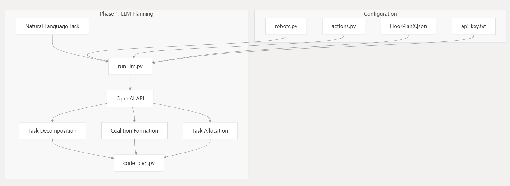
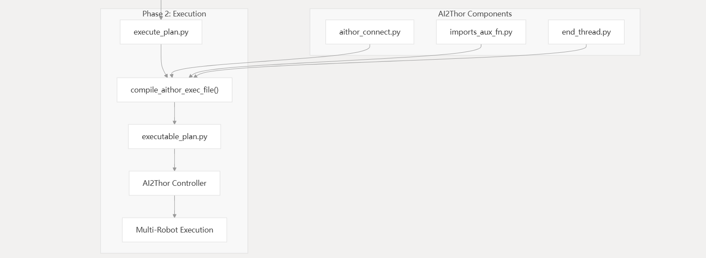

# SMART-LLM: Smart Multi-Agent Robot Task Planning using Large Language Models

## 1. 执行摘要与研究综述

摘要——在这项工作中，我们引入了 SMART - LLM，这是一个为具身多机器人任务规划而设计的创新框架。SMART - LLM：利用大语言模型（LLMs）的智能多智能体机器人任务规划，利用大语言模型的能力将作为输入提供的高级任务指令转换为多机器人任务计划。它通过执行一系列阶段来实现这一目标，包括**任务分解、联盟形成和任务分配**，所有这些都在少样本提示范式内由程序化的大语言模型提示引导。我们创建了一个基准数据集，用于验证多机器人任务规划问题，涵盖了在任务复杂性上有所不同的四类高级指令。我们的评估实验跨越了模拟和现实世界场景，表明所提出的模型在生成多机器人任务计划方面可以取得有前景的结果。这项工作的实验视频、代码和数据集可以在SMART-LLM网页找到。

## 2. 研究背景：从经典规划到语言模型驱动

### 2.1 多机器人任务规划（MRTP）的演进

多机器人系统的核心优势在于通过并行化和功能互补来提升任务执行效率。然而，这种优势的发挥高度依赖于有效的任务规划与分配机制。在经典机器人学中，MRTP 通常被建模为任务分配问题（Task Allocation Problem, TAP）或车辆路径问题（VRP）的变体，常采用拍卖算法（Auction-based Algorithms）、混合整数线性规划（MILP）或马尔可夫决策过程（MDP）来求解 ^1^。

尽管这些数学方法在封闭、结构化的环境中能提供理论最优解，但它们在面对开放世界的不确定性时显得极其脆弱。具体挑战包括：

1. **指令模糊性** ：人类用户的自然语言指令通常是不完整且充满歧义的。例如，指令“准备晚餐”隐含了大量的常识性子任务（洗菜、切菜、加热），传统规划器缺乏这种常识推理能力 ^1^。
2. **环境动态性** ：硬编码的算法难以适应环境的细微变化（如物体位置改变），导致泛化能力差。
3. **异构性协调** ：协调不同能力（如飞行、抓取、移动）的机器人需要复杂的约束满足逻辑，随着机器人数量增加，计算复杂度呈指数级上升。

### 2.2 自动化层级的跨越

自动化程度取决于方法能够执行的任务规划步骤数量，这一概念已被提出[4]。大多数方法主要属于自动化程度的第一或第二层级。第一层级仅自动化任务执行[17, 18]。同时，第二层级则自动化任务分配与执行[19, 20]，或联盟形成与执行[21]。第三层级的自动化涵盖联盟、分配和执行，但不涉及任务分解[22, 23]。在迈向第四层级自动化的开创性尝试[24]中，一种方法能够通过自然语言提示和长短期记忆网络（LSTM）高效管理任务规划的四个方面。

## 3. SMART-LLM 核心方法论


SMART-LLM 采用了一种分阶段的模块化设计，利用 Python 脚本作为中间表示（Intermediate Representation），将自然语言处理与逻辑控制紧密结合。该框架的核心假设是：编程语言（如 Python）具有严格的语法结构和逻辑流控制，比自然语言更适合表达复杂的任务依赖和并行逻辑 ^1^。

### 3.1 形式化问题定义

在深入架构之前，必须对问题进行数学形式化。

给定：

* **高层指令 (**$I$**)** ：如“Close the laptop and watch TV in a dimly lit room” ^1^。
* **环境 (**$E$**)** ：包含实体和物体及其状态的集合。
* **机器人集合 (**$\mathbb{R}$**)** ：**$\mathbb{R}=\{R^1, R^2,..., R^N\}$**，其中每个机器人**$R^n$** 拥有特定的技能集**$S^n \subseteq \Lambda$**（**$\Lambda$** 为全集技能）。

目标是生成一个时间有序的子任务集合 **$\mathbb{T}$**，并为每个子任务 **$T^k$** 分配一个机器人联盟 **$\mathbb{A} \subseteq \mathbb{R}$**，使得联盟的联合技能集覆盖任务需求（**$T^k_S \subseteq \cup_{R \in \mathbb{A}} S$**），并最大化并行执行效率 ^1^。

系统概览：SMART-LLM 包含四个关键阶段：

i) 任务分解：一个包含机器人技能、对象和任务分解样例的提示与输入指令结合，然后输入到 LLM 模型中以分解输入任务；

ii) 联盟形成：一个包含机器人列表、环境中可用的对象、样本分解任务示例及其对应的联盟策略（描述机器人团队的形成方式），以及前一阶段生成的输入任务分解计划的提示被提供给 LLM，以生成输入任务的联盟策略；

iii) 任务分配：一个包含样本分解任务、其对应的联盟策略以及基于该策略分配的任务计划的提示被提供给 LLM，同时附上前一阶段为输入任务生成的联盟策略。LLM 根据这些信息输出分配的任务计划；

iv) 任务执行：基于生成的分配代码，机器人执行任务。“…”用于简洁起见。

### 3.2 阶段一：任务分解 (Task Decomposition)

功能逻辑：

此阶段充当系统的认知解析器。它不仅需要识别显式指令，还要基于常识推理挖掘隐式步骤。例如，指令中提到的“dimly lit room”（昏暗的房间）隐含了“关灯”这一动作，尽管用户未明确下令 1。

提示工程设计：

SMART-LLM 采用了少样本提示（Few-shot Prompting），向 LLM 提供：

1. **机器人技能库 (**$\Delta$**)** ：以 Python 列表形式提供，如 ``。
2. **环境信息 (**$E$**)** ：物体列表及其属性（如位置、可交互性）。
3. **示例对** ：输入指令与对应的 Python 函数调用序列。

输出形式：

LLM 生成一系列参数化的函数调用，如 turn_off_light(location='desk_lamp')。这些调用被组织成逻辑块，这在后续阶段将决定执行顺序。此时，系统尚未指定具体的机器人，而是关注“做什么” 2。

### 3.3 阶段二：联盟形成 (Coalition Formation)

功能逻辑：

这是解决异构性问题的关键步骤。系统需要评估每个子任务的技能需求，并将其与现有机器人的能力进行匹配。如果单机无法完成（例如，物体重量超过单机负载），系统必须组建多机联盟 1。

提示策略：

提示中包含了“联盟策略”（Coalition Policy）的示例。这些策略描述了如何根据技能约束（如 mass_limit）选择机器人。例如：

* *场景 A* ：任务需要`PickUp`，且物体质量 5kg。机器人 R1 最大负载 10kg。策略：分配 R1。
* *场景 B* ：任务需要`PickUp`，物体质量 15kg。机器人 R1 负载 10kg，R2 负载 10kg。策略：分配 {R1, R2} 联盟。

通过这种方式，LLM 学习到了如何进行资源匹配，输出一个映射字典，将子任务 ID 映射到候选机器人组 ^2^。

### 3.4 阶段三：任务分配 (Task Allocation)

功能逻辑：

在此阶段，抽象的计划被转化为具体的可执行脚本。系统根据上一阶段的联盟策略，将具体的机器人实例绑定到函数参数中，并利用 Python 的 threading 库构建并行执行逻辑 1。

并行化机制：

SMART-LLM 的一大亮点是利用代码结构来显式处理并行性。LLM 被引导识别独立的子任务（如“由机器人 A 关灯”和“由机器人 B 开电视”互不干扰），并将其封装在不同的线程中：

**Python**

```
import threading
# 并行执行示例
t1 = threading.Thread(target=turn_off_lamp, args=(robot1,))
t2 = threading.Thread(target=switch_on_tv, args=(robot2,))
t1.start(); t2.start()
t1.join(); t2.join()
```

这种代码生成的方式比单纯的文本描述（如“同时做 A 和 B”）更加精确，直接解决了多机器人协作中的同步问题 ^1^。

### 3.5 阶段四：任务执行 (Task Execution)

生成的 Python 脚本被传递给解释器，脚本中的高层函数调用被映射为机器人底层的 API（如 ROS 动作或 AI2-THOR 控制器命令）。这一阶段验证了生成的计划在物理仿真或现实世界中的可行性 ^1^。

## 代码架构

SMART-LLM 实现了一个两阶段架构，将自然语言任务转换为协调的多机器人操作：





有关联盟：联盟形成根据技能需求和负载容量限制来决定哪些机器人应该协同工作。这一阶段分析机器人能力与子任务需求之间的匹配情况，以组建最优的机器人团队。

联盟形成逻辑考虑：

* 场景描述：告诉LLM当前有多少机器人可用
* 约束条件：
* 使用最少数量的机器人（最小化资源使用）
* 机器人必须技能匹配子任务需求
* 机器人必须质量承载能力满足物体重量要求
* 需要推理出满足所有约束的分配方案

## 4. 基准数据集与实验环境

为了系统地评估 LLM 在多机器人规划中的能力，作者构建了一个基于 **AI2-THOR** 模拟器的基准数据集。AI2-THOR 提供了包含 120 个房间和 2000 多个可交互物体的逼真 3D 环境，支持物理仿真（如物体碰撞、重力） ^4^。

### 4.1 数据集分类与复杂度

数据集包含 36 个精心设计的高层指令，根据任务的依赖关系和资源需求被划分为四个复杂度层级。这种分类对于分析模型在不同难度下的表现至关重要 ^1^。

| **任务类别**             | **定义描述**                                         | **典型指令示例**                                                            | **机器人配置**                       |
| ------------------------------ | ---------------------------------------------------------- | --------------------------------------------------------------------------------- | ------------------------------------------ |
| **基础任务 (Elemental)** | 单个机器人即可完成的原子级任务，无须协作。                 | "Pick up the apple" (拿起苹果)                                                    | 单机 (1 Robot)                             |
| **简单任务 (Simple)**    | 涉及多个物体，可分解为并行或串行子任务，机器人能力同构。   | "Put the apple and orange in the bowl" (把苹果和橘子放进碗里)                     | 多机同构 (Multi-Robot Homogeneous)         |
| **复合任务 (Compound)**  | 涉及多个物体，执行策略灵活，机器人能力异构（各有专长）。   | "Microwave a plate containing an egg and a tomato" (微波加热盛有鸡蛋和番茄的盘子) | 多机异构 (Heterogeneous)                   |
| **复杂任务 (Complex)**   | 单个机器人因能力限制无法独立完成子任务，必须通过联盟协作。 | "Move the heavy sofa" (移动沉重的沙发 - 需双机抬)                                 | 多机异构协作 (Heterogeneous Collaboration) |

该数据集的设计不仅测试了 LLM 的自然语言理解能力，还深度考察了其对物理约束（如载重限制）和逻辑依赖（如先开盖再放入）的推理能力。

### 4.2 评估指标

研究采用了五个核心指标来全方位衡量系统性能 ^1^：

1. **成功率 (Success Rate, SR)** ：最严格的指标，要求任务完成且机器人并行利用率（RU）达到最优（即该并行时必须并行）。
2. **任务完成率 (Task Completion Rate, TCR)** ：仅关注最终目标状态是否达成，不考虑执行效率。
3. **目标条件召回率 (Goal Condition Recall, GCR)** ：衡量最终环境状态与目标状态的匹配程度（例如，4 个目标完成了 3 个，GCR=0.75）。
4. **机器人利用率 (Robot Utilization, RU)** ：量化并行化程度。通过比较实际的状态转换次数与理论最优转换次数计算。
5. **可执行性 (Executability, Exe)** ：生成的代码中有多少比例的动作在物理上是可执行的。

## 5. 实验结果深度分析

实验在 AI2-THOR 仿真环境及真实机器人平台上进行，主要对比了不同 LLM 骨干网络（Backbone）的性能以及消融研究的影响。

### 5.1 不同 LLM 骨干的性能对比

表 1 展示了 SMART-LLM 使用不同模型（GPT-4, GPT-3.5, Llama-2, Claude-3）在各类任务上的表现 ^1^。

**Table 1: SMART-LLM 在不同任务类别下的性能评估 (AI2-THOR)**

| **方法 (Backbone)**      | **任务类别** | **SR (成功率)** | **TCR (完成率)** | **GCR (召回率)** | **RU (利用率)** | **Exe (可执行性)** |
| ------------------------------ | ------------------ | --------------------- | ---------------------- | ---------------------- | --------------------- | ------------------------ |
| **SMART-LLM (GPT-4)**    | Elemental          | 1.00                  | 1.00                   | 1.00                   | 1.00                  | 1.00                     |
|                                | Simple             | 0.62                  | 1.00                   | 1.00                   | 0.62                  | 1.00                     |
|                                | Compound           | 0.69                  | 0.76                   | 0.85                   | 0.92                  | 1.00                     |
|                                | Complex            | **0.71**        | 0.85                   | 0.92                   | 1.00                  | 0.97                     |
| **SMART-LLM (Claude-3)** | Elemental          | 1.00                  | 1.00                   | 1.00                   | 1.00                  | 1.00                     |
|                                | Simple             | **0.87**        | 1.00                   | 1.00                   | 0.93                  | 1.00                     |
|                                | Complex            | **0.71**        | 0.71                   | 0.87                   | 0.97                  | 0.92                     |
| **SMART-LLM (GPT-3.5)**  | Elemental          | 0.83                  | 0.83                   | 0.83                   | 1.00                  | 0.91                     |
|                                | Complex            | 0.14                  | 0.28                   | 0.35                   | 0.85                  | 0.62                     |
| **SMART-LLM (Llama-2)**  | Elemental          | 1.00                  | 1.00                   | 1.00                   | 1.00                  | 1.00                     |
|                                | Complex            | 0.63                  | 0.71                   | 0.83                   | 0.90                  | 0.89                     |

**深度洞察** ：

1. **GPT-4 的统治力** ：在最具挑战性的“复杂任务”中，GPT-4 达到了 0.71 的成功率，远超 GPT-3.5 (0.14)。这表明处理异构协作和联盟形成需要极强的逻辑推理能力，而较弱的模型难以捕捉这种深层依赖。
2. **GPT-3.5 的逻辑缺陷** ：GPT-3.5 在复杂任务中的低分主要源于其无法正确处理“先决条件”（例如，未检测到需要协作搬运），导致生成的计划在物理上不可执行（Exe 仅 0.62）。此外，它更容易产生幻觉，生成不存在的物体交互。
3. **Llama-2 的惊喜表现** ：作为开源模型，Llama-2-70B 的表现令人印象深刻（Complex SR 0.63），甚至优于 GPT-3.5。研究认为，这归功于 SMART-LLM 的 Pythonic Prompt 设计。Python 代码的严格结构为模型提供了强有力的“脚手架”，即使推理能力稍弱的模型，也能通过模仿代码模式来生成正确的逻辑结构 ^1^。
4. **Claude-3 的并行化优势** ：在简单任务中，Claude-3 实现了最高的成功率（0.87），这得益于其在生成并行线程代码时的优异表现，能够最大化机器人利用率（RU）。

### 5.2 消融研究：代码注释的重要性

研究者进一步探讨了提示内容对性能的影响。结果显示，移除 Prompt 代码中的“注释”（Comments）会导致成功率显著下降 ^1^。

* **注释作为思维链（CoT）** ：代码注释不仅仅是解释，它们实际上充当了思维链推理的载体。例如，注释`# This task requires two robots due to weight limit` 显式地引导模型关注约束条件。
* **移除联盟阶段的后果** ：如果跳过第二阶段（联盟形成）直接进行分配，系统在复杂任务上的表现会崩溃。这证明了将“谁能做”与“怎么做”解耦的必要性——直接生成最终代码对于当前的 LLM 来说认知负担过重。

### 5.3 真实环境迁移 (Sim-to-Real)

实验还验证了从仿真到现实的迁移能力。在涉及异构机器人（地面车与无人机）的覆盖率任务中，SMART-LLM 成功根据机器人的视野参数（Visibility Area）分配了巡逻区域 ^1^。这一成功表明，利用 Python 代码作为抽象层，有效地隔离了底层硬件差异，使得高层规划逻辑具有极强的通用性。


## 6. 比较评估与局限性批判

为了全面定位 SMART-LLM 的学术价值，我们需要将其与同期及后续的相关工作（如 ProgPrompt, Text2Motion, LLaMAR）进行对比分析。

### 6.1 与其他方法的横向对比

* vs. ProgPrompt ^2^：
  * **相似点** ：两者都利用 Python 代码作为 LLM 的输出载体。
  * **差异** ：ProgPrompt 更侧重于单体机器人的任务状态检查（通过断言 assertions），而 SMART-LLM 引入了专门的“联盟形成”模块，解决了多机器人协作中的资源匹配问题。对于异构团队，ProgPrompt 缺乏显式的分配机制。
* vs. Text2Motion ^11^：
  * **差异** ：Text2Motion 关注生成几何上可行的低层运动轨迹，通常需要结合传统的几何规划器。SMART-LLM 则位于决策链的更高层，关注任务逻辑和资源调度。两者在完整的机器人软件栈中是互补关系。
* vs. LLaMAR (NeurIPS 2024) ^5^：
  * **LLaMAR 的批判** ：作为较新的研究，LLaMAR 指出 SMART-LLM 依赖于“完全可观测性”（Full Observability）假设，即机器人预先知道所有物体的位置和状态。此外，LLaMAR 批评 SMART-LLM 的数据集局限于单层平面图，缺乏对长程探索任务的支持。
  * **SMART-LLM 的局限** ：在部分可观测环境（Partially Observable Environments）中，SMART-LLM 的“开环”规划（Open-loop Planning）模式显得脆弱。如果环境状态与预设不符（例如洋葱不在桌子上），生成的静态 Python 脚本将执行失败，缺乏运行时的感知-纠错闭环。

### 6.2 核心局限性总结

尽管 SMART-LLM 在多机器人协作规划上取得了突破，但本报告识别出以下关键局限：

1. **开环执行风险** ：缺乏实时反馈机制。生成的计划是一次性的，无法动态适应执行过程中的扰动。
2. **上下文窗口瓶颈** ：尽管代码提示比自然语言紧凑，但在包含数千个物体的大型环境中，将完整环境状态注入 Prompt 仍可能超出 LLM 的上下文限制。
3. **对基座模型的依赖** ：实验表明，系统的性能高度依赖于 LLM 的推理能力（如 GPT-4）。对于逻辑较弱的模型（如 GPT-3.5），系统容易产生幻觉，生成无效的 API 调用。

## 7. 结论与未来展望

SMART-LLM 框架通过将多机器人任务规划解构为模块化的代码生成过程，成功展示了大型语言模型在具身智能协作领域的巨大潜力。其核心贡献——基于 Python 的程序化提示策略和标准化的多机器人基准数据集——为后续研究奠定了坚实基础。

未来的研究方向应集中在以下几个维度：

1. **闭环规划系统** ：引入感知反馈模块，使系统能够监控执行状态并在失败时触发重新规划（Re-planning），从而解决部分可观测性问题。
2. **去中心化协作** ：探索多智能体 LLM（Multi-Agent LLM）架构，让每个机器人拥有独立的 LLM 代理，通过通信协商而非中央指令来完成任务，这将大幅提升系统的鲁棒性和扩展性。
3. **多模态融合** ：结合视觉语言模型（VLM），让规划器直接理解环境图像而非依赖文本化的状态列表，从而实现端到端的自主规划。

综上所述，SMART-LLM 是迈向通用多机器人智能的重要一步，其“代码即协作”的理念将在未来的智能仓储、服务机器人集群及自动化探索任务中发挥关键作用。
