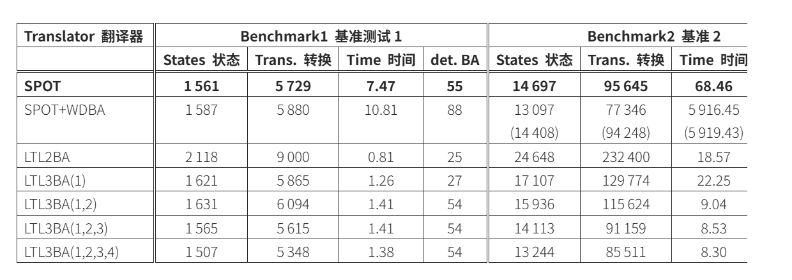
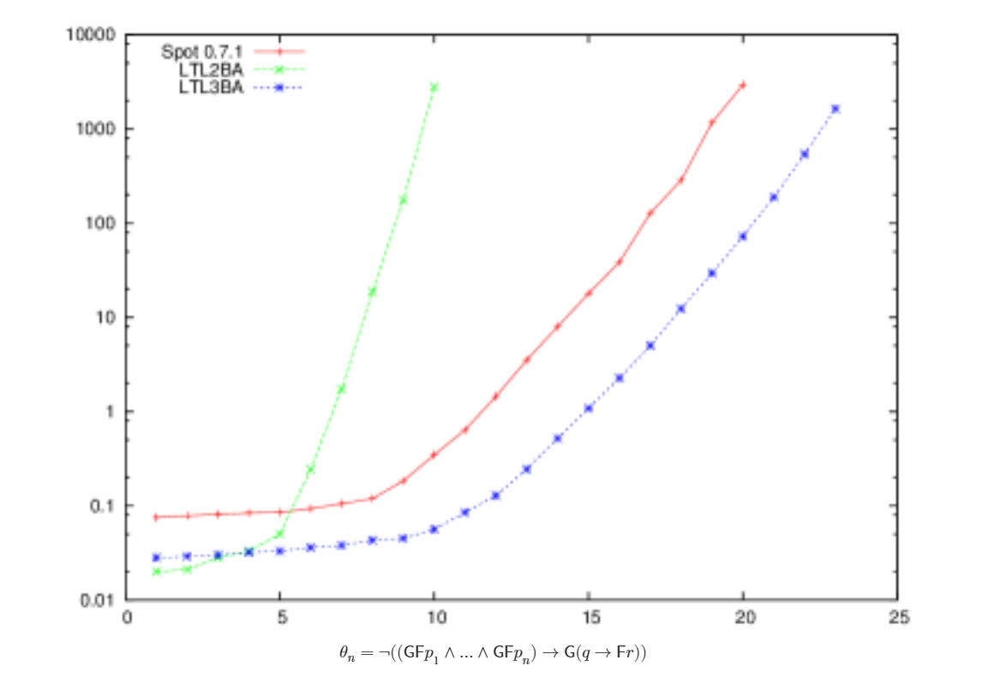

LTL的求解器 有 ltl2ba ltl3ba spot owl等

速度上ltl2ba和LTL3ba 远远快于spot 这就是为什么论文还是用这个最老的

参考论文https://ar5iv.labs.arxiv.org/html/1201.0682?_immersive_translate_auto_translate=1

SPOT 未能在一小时内翻译 Benchmark2 中的 6 个公式   

图 9：LTL 到 BA 翻译器在参数公式 θn of [11]上的运行时间（垂直轴是对数表示时间，单位为秒，而水平轴是线性表示参数 n ）。
