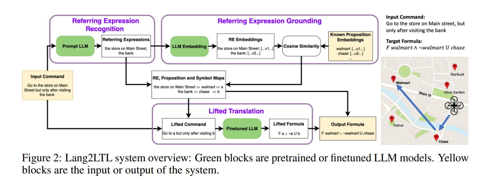

# Lang2LTL: Grounding Complex Natural Language Commands for Temporal Tasks in Unseen Environments

## 1. 执行摘要

在人机交互（HRI）与机器人技术的交叉领域，如何使机器人准确理解并执行人类发出的复杂自然语言指令，一直是一个核心挑战。传统的指令往往局限于简单的动作描述（如“去厨房”），而现实世界的任务通常包含复杂的时序约束和逻辑条件（如“先去银行，再去超市，且全过程避开施工区域”）。为了解决这一难题，布朗大学与普林斯顿大学的研究团队在 2023 年机器人学习会议（CoRL）上提出了 **Lang2LTL** 系统 ^1^。

本报告对 Lang2LTL 进行了详尽的解构与分析。Lang2LTL 是一个基于模块化神经符号（Neuro-Symbolic）架构的系统，它利用大型语言模型（LLMs）的泛化能力，将自然语言导航指令转化为线性时序逻辑（Linear Temporal Logic, LTL）规范 ^1^。该系统的核心创新在于引入了“提升转换”（Lifted Translation）机制，通过将具体的环境地标抽象为符号占位符，实现了指令逻辑结构与具体环境实体的解耦 ^1^。这种设计使得 Lang2LTL 能够在无需针对新环境重新训练的情况下，实现零样本（Zero-Shot）迁移，有效解决了传统端到端方法在面对新环境（Vocabulary Shift）和数据稀缺（Data Scarcity）时的瓶颈 ^1^。

本报告详细阐述了 Lang2LTL 的三大核心模块——指称表达式识别（RER）、指称表达式落地（REG）和提升转换（LT）——并深入分析了其在 21 个城市规模环境中的实验表现 ^1^。实验结果显示，Lang2LTL 在未见过的测试环境中达到了 **81.83%** 的落地准确率，显著优于传统的 CopyNet 模型和直接提示 GPT-4 的端到端基线 ^4^。此外，通过在波士顿动力公司的 Spot 机器人上的物理部署，验证了该系统在真实世界中处理 52 条语义多样的导航指令的能力，展示了其在处理“不可满足”指令时的安全性与鲁棒性 ^1^。本报告还对该研究提出的五种泛化行为定义进行了深入探讨，为评估机器人语言落地系统提供了新的方法论标准 ^7^。

## 2. 引言

### 2.1 研究背景与动机

随着服务机器人在家庭、物流和公共服务领域的普及，赋予机器人理解自然语言指令的能力变得至关重要。自然语言为人类提供了一种直观、高效的交互方式，能够表达极其复杂的任务需求。然而，自然语言的模糊性、多样性与机器人控制系统所需的精确性、结构化之间存在巨大的鸿沟。

早期的研究主要集中在通过语义解析器（Semantic Parsers）将语言映射到预定义的简单动作序列（如由动词和名词组成的元组）。这类方法通常受限于特定领域的语法规则，难以处理复杂的逻辑关系。随后，随着深度学习的兴起，端到端（End-to-End）的神经网络模型成为主流，它们尝试直接从指令映射到机器人的动作序列或轨迹。虽然这些模型在单一环境中表现出色，但它们往往存在严重的过拟合问题：模型倾向于记忆特定的地标名称（如“厨房”、“卧室”），一旦环境发生变化（如变为“银行”、“公园”），模型便失效，需要收集大量新数据进行重新训练 ^1^。

更为棘手的是任务的**时序复杂性** （Temporal Complexity）。现实生活中的指令往往是非马尔可夫（Non-Markovian）的，即当前动作的正确性不仅取决于当前状态，还取决于历史状态和未来约束。例如指令：“在访问药店之前不要去公园，并且要在访问药店后去两次杂货店。” 这里，“不要去公园”是一个持续的约束，“去两次杂货店”涉及计数，“之前/之后”涉及严格的时序依赖。传统的马尔可夫决策过程（MDP）和简单的指令跟随模型难以有效捕捉这些长程依赖关系 ^1^。

### 2.2 形式化方法的引入：线性时序逻辑 (LTL)

为了解决时序约束的表达与验证问题，机器人学界引入了形式化方法，特别是**线性时序逻辑（LTL）** ^1^。LTL 是一种模态逻辑，能够精确地描述系统随时间变化的行为属性。通过引入时间算子——如“下一步”（Next, **$\bigcirc$**）、“直到”（Until, **$\mathcal{U}$**）、“最终”（Eventually, **$\Diamond$**）和“总是”（Globally, **$\Box$**）——LTL 提供了一种无歧义的目标表示语言 ^4^。

将自然语言落地为 LTL 公式具有双重优势：

1. **精确性与无歧义性** ：LTL 能够清晰地界定任务的边界条件，消除自然语言的模糊性。
2. **规划与验证** ：一旦任务被表示为 LTL 公式，现有的自动化规划算法（如基于自动机的规划器 AP-MDP ^8^）可以生成保证满足时序约束的控制策略，或者在任务逻辑不可满足时立即报错，从而提供安全性保证 ^1^。

然而，LTL 是一种数学语言，普通用户无法直接编写。因此，核心问题转化为：如何构建一个系统，能够将非结构化的自然语言指令准确、鲁棒地翻译为结构化的 LTL 公式，且该系统能够泛化到从未见过的环境中。Lang2LTL 正是为解决这一核心问题而生。

## 3. 问题定义与形式化

在深入系统架构之前，我们需要对研究问题进行严格的形式化定义。

### 3.1 任务描述

Lang2LTL 关注的是在环境 **$\mathcal{M} = \langle \mathcal{S}, \mathcal{A}, T \rangle$** 中的导航任务 ^1^。

* **$\mathcal{S}$**：机器人状态空间。
* **$\mathcal{A}$**：动作空间。
* **$T$**：环境的转换动力学。

用户的输入是一个自然语言指令 **$u$**（例如：“去红色的房间，但在那之前先去蓝色的房间”）。系统的目标是将 **$u$** 转化为一个接地的（Grounded）LTL 公式 **$\varphi$**，该公式定义在环境特定的原子命题（Atomic Propositions, AP）之上。

### 3.2 语义知识库

为了实现对新环境的适应，系统假设机器人拥有一个语义知识库（Semantic Database）**$\mathcal{D} = \{k : (z, f)\}$** ^1^。

* ****$k$** (Key)** ：命题的唯一字符串标识符（例如`landmark_101`）。
* ****$z$** (Semantic Info)** ：与该地标相关的语义元数据，通常以序列化格式（如 JSON）存储。例如：`{"name": "Starbucks", "amenity": "cafe", "street": "Main St"}`。
* ****$f$** (Classifier)** ：一个布尔函数**$f: \mathcal{S} \rightarrow \{0, 1\}$**，用于在运行时判断机器人当前状态**$s$** 是否满足该命题（即是否到达了该地标）。

这一假设至关重要，因为它将“对环境的感知”抽象为“语义查询”，使得语言处理模块可以与底层的传感器数据解耦。

### 3.3 线性时序逻辑 (LTL) 语法

LTL 公式由原子命题 $\alpha \in AP$、布尔算子和时序算子构成。其语法定义如下 1：

$$
\varphi := \alpha \mid \neg \varphi \mid \varphi_1 \vee \varphi_2 \mid \bigcirc \varphi \mid \varphi_1 \mathcal{U} \varphi_2
$$

除了基本算子外，Lang2LTL 还使用了常见的导出算子：

* **$\wedge$** (And):**$\varphi_1 \wedge \varphi_2 \equiv \neg(\neg \varphi_1 \vee \neg \varphi_2)$**
* **$\Diamond$** (Eventually/Finally):**$\Diamond \varphi \equiv \text{True } \mathcal{U} \varphi$**（未来某时刻为真）
* **$\Box$** (Globally/Always):**$\Box \varphi \equiv \neg \Diamond \neg \varphi$**（永远为真）

本研究采用了 Menghi 等人  总结的 15 种机器人任务规范模式 ^1^，涵盖了从简单的“访问”（Visit）到复杂的“严格有序访问”（Strictly Ordered Visit）和“受限回避”（Restricted Avoidance）等模式。这些模式构成了 Lang2LTL 训练和评估的核心逻辑骨架。

## 4. Lang2LTL 系统架构

Lang2LTL 的核心设计理念是**模块化（Modularity）** 。与试图用一个巨大的神经网络直接从 **$u$** 映射到 **$\varphi$** 的端到端方法不同，Lang2LTL 将问题分解为三个子问题：指称表达式识别、指称表达式落地、提升转换。这种分解是实现零样本泛化的关键 ^1^。

### 4.1 模块一：指称表达式识别 (Referring Expression Recognition, RER)

**功能** ：RER 模块的任务是从自然语言指令 **$u$** 中提取出所有指代具体地理实体或对象的子字符串，即指称表达式（Referring Expressions, REs）**$\{r_i\}$**。

机制：

该模块利用了大型语言模型（如 GPT-3 或 GPT-4）强大的上下文学习（In-Context Learning）能力。研究团队设计了特定的提示词（Prompt），包含任务描述和少量的输入输出示例 1。

本研究仅关注识别名词短语与专有名称的任务。指称表达式作为指代单一实体的完整子字符串，其外延涵盖命名实体。例如，"主街上的商店"构成一个指称表达式，但其中包含"商店"与"主街"两个命名实体。

深入分析：

指称表达式不仅限于命名实体（如 "Starbucks"），还包括复杂的名词短语（如 "the red building next to the park"）。传统的命名实体识别（NER）模型往往只能识别专有名词，难以处理描述性短语。LLM 在海量文本上预训练获得的语言理解能力，使其能够精准识别这些复杂的指称边界，而无需针对特定领域的标注数据进行微调。这一步有效地将“语言中的物体”与“语言中的逻辑”分离开来。

### 4.2 模块二：指称表达式落地 (Referring Expression Grounding, REG)

**功能** ：REG 模块的任务是将提取出的指称表达式 **$\{r_i\}$** 映射到语义知识库 **$\mathcal{D}$** 中的具体地标键值 **$k$**。

机制：

Lang2LTL 采用基于嵌入（Embedding）的语义匹配方法。

1. **编码** ：使用预训练的语言模型（如 OpenAI 的`text-embedding-ada-002`）作为嵌入函数**$g_{embed}$**，将每个指称表达式**$r_i$** 和数据库中每个地标的语义描述**$z_k$** 转换为高维向量。
2. 匹配：计算余弦相似度（Cosine Similarity），选择相似度最高的地标作为落地目标 1。
   $$
   k^* = \operatorname*{argmax}_{k \in \mathcal{D}} \frac{g_{embed}(r_i) \cdot g_{embed}(z_k)}{||g_{embed}(r_i)|| \cdot ||g_{embed}(z_k)||}
   $$

创新点：

这种基于语义嵌入的方法赋予了系统极强的鲁棒性，使其能够应对转述（Paraphrasing）和词汇漂移（Vocabulary Shift）。

* 如果用户说 "The financial institution"（金融机构），而地图数据中只有 "Chase Bank"（大通银行），传统的字符串匹配会失败。但在语义向量空间中，这两个词的距离非常近，因此 REG 模块能够正确匹配。
* 这一机制使得 Lang2LTL 无需针对每个新环境的地标名称进行重新训练。只要地图提供了文本描述，系统就能通过语义相似度“理解”地标。

### 4.3 模块三：提升转换 (Lifted Translation, LT)

**功能** ：这是 Lang2LTL 最核心的创新模块。它的任务是将指令的逻辑结构翻译为 LTL 模板。

“提升”（Lifting）过程：

为了使翻译模型独立于具体环境，系统首先对指令进行“提升”处理：

1. **符号替换** ：利用 RER 和 REG 的结果，将指令中的指称表达式**$\{r_i\}$** 替换为来自固定词汇表**$\Omega = \{A, B, C, \dots\}$** 的抽象符号占位符。
   * *原始指令* ："Go to**the store** , then**the bank** ."
   * *提升后指令* ："Go to**A** , then**B** ."
2. **逻辑翻译** ：将提升后的指令输入到一个序列到序列（Seq2Seq）模型中，生成“提升后”的 LTL 公式。
   * *模型输出* ：**$\Diamond (B \wedge \Diamond A)$** （注：这是一个“先 B 后 A”的时序逻辑结构）。
3. **具体化（Grounding）** ：将生成的 LTL 公式中的抽象符号**$A, B$** 替换回具体的地标标识符**$k_{store}, k_{bank}$**。
   * *最终输出* ：**$\Diamond (k_{bank} \wedge \Diamond k_{store})$**。

模型选择与训练：

研究团队对比了多种实现 LT 模块的模型，包括微调的 T5-Base、微调的 GPT-3、以及少样本提示的 GPT-4 1。实验发现，在特定的 LTL 翻译任务上，微调的 **T5-Base 模型表现最佳**。这表明对于形式化语言的句法转换，较小但经过特定微调的模型可能优于通用的巨型模型。

类型约束解码 (Type Constrained Decoding, TCD)：

为了保证生成的 LTL 公式在语法上是合法的，研究团队在推理阶段引入了类型约束解码 1。

* LTL 语法可以被解析为一棵二叉树。在生成每个 Token 时，TCD 算法会检查当前语法树的状态，仅允许模型生成合法的后续 Token（例如，在算子**$\mathcal{U}$** 之后必须跟一个命题或左括号，而不能是另一个算子）。
* 这一机制消除了“语法错误”这一类常见的生成式模型故障，显著提高了系统的可靠性。

## 5. 实验数据与评价指标

为了全面评估 Lang2LTL 的泛化能力，作者构建了全新的大规模数据集，并提出了严格的泛化评估标准。

### 5.1 泛化评估的五个维度

论文明确定义了五种泛化行为，为该领域设立了新的标杆 ^1^：

| **泛化类型**                                                        | **定义**                                                                                         | **意义**                                     |
| ------------------------------------------------------------------------- | ------------------------------------------------------------------------------------------------------ | -------------------------------------------------- |
| **1. 转述鲁棒性 (Robustness to Paraphrasing)**                      | 模型能否理解同一指令的不同表述方式？``例如：“先去 A 后去 B” vs “在访问 A 之后访问 B”。             | 测试模型对自然语言多样性的适应能力。               |
| **2. 替换鲁棒性 (Robustness to Substitutions)**                     | 模型能否处理地标实体的排列组合？``例如：训练时见过“去 A”，测试时能否处理“去 B”？                   | 验证模型是否过拟合于特定的地标名称。               |
| **3. 词汇漂移鲁棒性 (Robustness to Vocabulary Shift)**              | 模型能否处理训练集中从未出现过的全新地标词汇？``例如：训练集只有“厨房”，测试集出现“核反应堆”。     | 测试跨域迁移能力，这是端到端模型的主要痛点。       |
| **4. 未见公式鲁棒性 (Robustness to Unseen Formulas)**               | 模型能否生成训练集中未出现过的 LTL 逻辑结构？                                                          | 测试模型是否真正学习了逻辑组合规则，而非死记硬背。 |
| **5. 未见模板实例鲁棒性 (Robustness to Unseen Template Instances)** | 模型能否处理已知模式的不同参数实例？``例如：训练集全是“访问 2 个地点”，测试集要求“访问 3 个地点”。 | 测试模型对任务复杂度的外推能力。                   |

### 5.2 数据集构建

#### 5.2.1 提升数据集 (Lifted Dataset)

为了训练 LT 模块，作者生成了一个大规模的平行语料库 ^1^。

* 基于 Menghi 等人的 15 个 LTL 模式，并通过排列组合生成了**47 个唯一的 LTL 公式骨架** 。
* 通过变换命题数量（1 到 5 个），生成了**2,125 个唯一的 LTL 公式** 。
* 收集了**49,655 条** 对应的英语指令。
* **对比** ：相比于 CleanUp World 数据集（仅 4 种骨架）和 Wang et al. 数据集（45 种骨架，但数据量小），Lang2LTL 的提升数据集在规模和逻辑多样性上都有数量级的提升。

#### 5.2.2 接地数据集 (Grounded Dataset - OSM & CleanUp)

为了测试完整系统的落地能力，作者构建了基于真实地理信息的数据集。

* **OpenStreetMap (OSM)** ：选取了 21 个不同的城市区域。
* **多样化生成** ：利用 GPT-4 对 OSM 中的地标名称进行改写，生成多样化的指称表达式。例如，将“Panda Express”改写为“那个卖陈皮鸡的地方”或“第五大道上的中餐厅”。这极大地增加了 REG 模块的挑战性 ^1^。
* **CleanUp World** ：包含约 3,300 条指令的模拟家庭环境数据集，用于跨域测试。

## 6. 实验结果与分析

### 6.1 组件级评估

实验首先验证了各个模块的独立性能 ^1^。

* **RER 准确率** ：**98.01% ± 2.08%** 。这证明了利用 LLM 进行少样本学习可以极高精度地提取指称表达式。
* **REG 准确率** ：**98.20% ± 2.30%** 。基于嵌入的匹配方法在处理改写和同义词方面表现卓越。
* **LT 准确率** ：在“提升”领域，微调后的 T5-Base 模型在处理未见过的语句结构时表现最佳。对于更具挑战性的“未见公式类型”测试，所有模型性能均有下降，但 T5 结合 TCD 依然保持了相对优势。

### 6.2 系统级评估：81.83% 的突破

在 21 个从未见过的 OSM 城市环境中，Lang2LTL 展示了惊人的性能。

表 1：Lang2LTL 与基线模型的落地准确率对比 ^1^

| **模型**         | **方法论**  | **OSM 测试集准确率** | **备注**                  |
| ---------------------- | ----------------- | -------------------------- | ------------------------------- |
| **Lang2LTL**     | 模块化 + 提升转换 | **81.83%**           | 在包含多样化地标描述的新环境中  |
| **Prompt GPT-4** | 端到端提示        | < 50% (估算)               | 如图 3b 所示，显著低于 Lang2LTL |
| **CopyNet**      | 端到端序列生成    | 45.91%                     | 在基线数据集上的表现            |

深度洞察：

Lang2LTL 达到 81.83% 的准确率是一个里程碑。相比之下，端到端的 GPT-4 虽然是目前最强的通用模型，但在该任务上表现不佳。原因在于端到端方法要求模型同时完成实体提取、地图查找（这是 GPT-4 无法直接访问外部知识库做到的）和逻辑翻译。Lang2LTL 通过架构设计，让每个模块各司其职——LLM 负责理解语言，向量数据库负责知识检索，专用翻译模型负责逻辑构建——从而实现了“1+1+1 > 3”的效果。

### 6.3 零样本跨域评估 (Zero-Shot Cross-Domain Evaluation)

为了验证系统是否真的做到了“环境无关”，作者将仅在 OSM（城市导航）和合成数据上训练的 Lang2LTL 系统，直接应用于 **CleanUp World** （家庭机器人）数据集，未进行任何微调。

表 2：跨域评估结果 ^1^

| **模型**                   | **CleanUp World 准确率** | **分析**                                                                        |
| -------------------------------- | ------------------------------ | ------------------------------------------------------------------------------------- |
| **Lang2LTL (Zero-Shot)**   | **78.28% ± 1.73%**      | 即使从未见过家庭环境数据，仍能保持高准确率。                                          |
| **CopyNet (Baseline)**     | 2.57%                          | 彻底失败。因为它是端到端训练的，完全无法理解新词汇（如从“街道”变成“厨房”）。      |
| **RNN-Attn (Specialized)** | 95.51%                         | 该模型是在 CleanUp World 上专门训练和测试的（非零样本），因此分数高，但不具备泛化性。 |

结果解读：

CopyNet 的 2.57% 准确率生动地揭示了端到端监督学习的局限性：它们本质上是在拟合特定数据集的分布。一旦词汇表发生变化（Vocabulary Shift），模型就会崩溃。而 Lang2LTL 的 78.28% 证明了其“提升”机制的有效性——逻辑是通用的，只有地标是特定的。

### 6.4 错误分析

虽然 Lang2LTL 表现优异，但并非完美。作者对错误案例进行了详细分类 ^1^：

1. **未知模板 (Unknown Template)** ：这是微调 T5 模型最常见的错误来源。当指令的逻辑结构非常罕见或极其复杂（超出训练集的分布）时，模型可能生成一个语法正确但不符合原意的 LTL 公式。
2. **错误命题 (Incorrect Propositions)** ：模型正确识别了逻辑类型（如“顺序访问”），但生成的参数数量错误（如需要访问 3 个点，只生成了 2 个）。
3. **语法错误 (Syntax Errors)** ：在使用 TCD 之前，这是一个主要问题；引入 TCD 后，这类错误几乎被消除。

## 7. 机器人实机演示 (Robot Demonstration)

理论验证之外，Lang2LTL 还在物理机器人上进行了验证，展示了其从算法到现实世界的落地能力 ^1^。

### 7.1 实验设置

* **平台** ：波士顿动力（Boston Dynamics）的**Spot** 四足机器人。
* **规划器** ：**AP-MDP** （Abstract Product Markov Decision Process）规划器 ^8^。该规划器接收 LTL 公式和语义地图，构建产品自动机（Product Automaton），并在抽象状态空间中搜索最优策略。
* **环境** ：两个不同的室内环境（办公区/实验室），包含约 8 个语义地标（如“书架”、“白色桌子”、“电梯”）。
* **指令集** ：52 条语义多样的导航指令。

### 7.2 对比基线：Code-as-Policies (CaP)

作者将 Lang2LTL 与 Google 提出的 **Code-as-Policies (CaP)** ^1^ 进行了对比。CaP 利用 LLM 直接生成 Python 代码来控制机器人。

**表 3：实机实验结果对比**

| **指令类型**          | **Lang2LTL 表现**                | **CaP 表现**       | **原因分析**                                           |
| --------------------------- | -------------------------------------- | ------------------------ | ------------------------------------------------------------ |
| **总指令数 (52)**     | **52/52 正确处理**               | **23/52 正确处理** | -                                                            |
| **可满足指令 (40)**   | 成功生成规划并执行                     | 成功 23 条               | CaP 在处理简单的顺序任务时表现尚可，但在复杂逻辑上挣扎。     |
| **不可满足指令 (12)** | **拒绝执行 (Correctly Aborted)** | **尝试执行并失败** | CaP 生成的代码往往缺乏死锁检测机制，强行执行逻辑矛盾的指令。 |

关键洞察：

CaP 的失败揭示了直接用代码生成处理时序逻辑的短板。LLM 生成的 Python 脚本往往难以维护复杂的状态机逻辑（例如“在访问 B 之前不允许访问 A”）。相比之下，Lang2LTL 通过生成 LTL 公式，利用了形式化验证工具的数学完备性。对于逻辑矛盾的指令（如“去 A，同时永远避开 A”），LTL 规划器会直接返回“Unsatisfiable”，保证了机器人的安全性。这种**安全性保障（Safety Guarantee）**是 LTL 方法相对于纯大模型方法的决定性优势。

## 8. 讨论与局限性

### 8.1 提升范式的意义

Lang2LTL 的成功验证了神经符号人工智能（Neuro-Symbolic AI）的潜力。通过将“感知/语言理解”（Neural）与“逻辑/规划”（Symbolic）解耦，并利用“提升”技术作为中间桥梁，系统获得了极强的组合泛化能力（Compositional Generalization）。这与人类的认知方式相符——我们理解“先 X 后 Y”的逻辑，不需要知道 X 和 Y 具体是什么。

### 8.2 当前局限性

尽管性能卓越，Lang2LTL 仍存在局限 ^1^：

1. **歧义消解** ：如果环境中有两个“星巴克”，且用户只说“去星巴克”，当前系统会随机选择一个，缺乏通过多轮对话（Dialog）主动询问用户的能力。
2. **空间推理** ：CoRL 2023 版本的 Lang2LTL 主要关注**时序** 逻辑。对于涉及复杂**空间** 关系的指令（如“去大楼后面的那辆车”），RER 模块可能难以精确处理。这在后续的**Lang2LTL-2** 工作中通过引入视觉语言模型（VLM）得到了解决 ^10^。
3. **指代消解** ：系统目前主要处理名词短语，对于复杂的代词指代（Coreference Resolution，如“去银行，然后再回到那里”）处理能力有限。

## 9. 结论

**Lang2LTL** 代表了机器人自然语言指令落地领域的一次重要飞跃。通过创新的模块化架构和“提升转换”机制，它成功打破了长期以来困扰该领域的“数据稀缺”与“环境过拟合”魔咒。

本报告总结的核心贡献如下：

1. **架构创新** ：提出了 RER-REG-LT 三阶段模块化架构，有效结合了 LLM 的泛化能力与 LTL 的精确性。
2. **泛化基准** ：定义了 5 种严格的泛化行为，并发布了包含 2,125 个 LTL 公式的大规模数据集，为领域建立了新的评估标准。
3. **性能突破** ：在 21 个未见城市环境中实现了**81.83%** 的落地准确率，在零样本跨域测试中达到**78.28%** ，远超现有基线。
4. **实机验证** ：在 Spot 机器人上证明了系统在真实物理环境中的可行性与安全性，特别是在处理不可满足约束时的鲁棒性。

Lang2LTL 不仅是一个具体的系统，更是一种方法论的胜利：它证明了在深度学习时代，**形式化方法** 不仅没有过时，反而因为大模型的加持而焕发了新的生命力。它为未来构建更安全、更智能、更通用的服务机器人提供了一张清晰的蓝图。

---

*报告编制日期：2026年1月12日*
