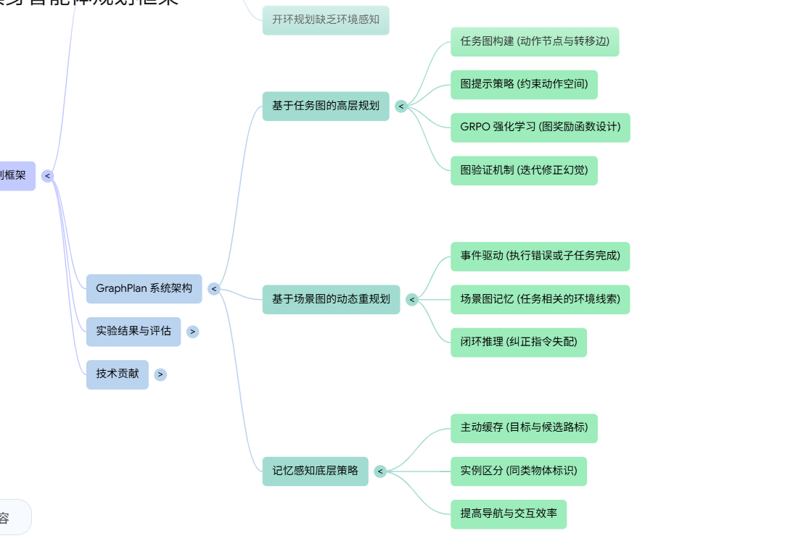

DELTA：利用了一个静态的3D场景图（3DSG）和PDDL设计 其他没什么特别的其实 PDDL 域文件甚至都是一次生成 应该有迭代 但是也没啥改进方式
也是主打一个开环设计
优化方向：

* **闭环 DELTA** ：引入“事件驱动的重规划”（Event-Driven Replanning），在执行过程中实时监控状态，一旦检测到偏差立即触发局部的子目标重规划。
* **多模态增强** ：引入视觉语言模型（VLM），直接从图像中提取场景图信息，实现端到端的感知-规划闭环。

GraphPlan：更偏向具身智能 三部分：基于任务图（Task Graph）的高层规划器（GRPO训练的qwen7b）、具备记忆感知的底层动作策略
该模块负责将抽象的子任务（如“加热土豆”）转化为具体的机器人原始动作（如移动、旋转、开启、拾取）、 基于场景图（Scene Graph）的事件驱动重规划
这是一个让系统从“开环”转向“闭环”的关键模块，确保智能体能根据环境变化实时调整计划

未来扩展：向多机器人协作系统的演进
来源在结论部分明确指出，“将该方法扩展到多机器人协作系统”是未来的研究方向之一。
为了使 GraphPlan 适用于多机器人系统，来源建议在技术架构上进行以下调整：
• 增强任务图边缘约束： 需要在任务图的边缘（Edges）中加入时间约束（Temporal Constraints）和状态约束（State Constraints），以协调多个机器人之间的动作先后顺序和依赖关系。
• 构建多层图（Multi-layer Graphs）： 通过构建更复杂的图结构来管理多个机器人之间的任务分配和协同工作。
• 引入异步规划（Asynchronous Planning）： 适应多个机器人在不同步的时间轴上执行任务的需求

