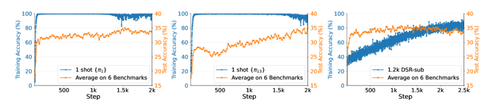

# Reinforcement Learning for Reasoning in Large Language Models with *One* Training Example

https://arxiv.org/html/2504.20571?_immersive_translate_auto_translate=1

## 1. 引言：推理能力激活的新范式

Wang等人提出的“单样本RLVR”（1-shot RLVR）研究具有极其重要的理论突破性 ^1^。该研究通过极限测试——仅使用**一个** 训练样本——来探究模型推理能力的边界。

这一研究的核心假设是：**基座模型（Base Models）在预训练阶段已经内化了绝大多数必要的推理模式与知识，但在缺乏特定激励信号的情况下，这些能力处于“休眠”或“未对齐”状态。因此，RLVR的过程可能并非“注入知识”，而是“唤醒能力”。**

实验结果证实了这一假设：仅需一个精心选择（甚至随机选择）的训练样本，配合策略梯度（Policy Gradient）和熵正则化（Entropy Regularization），就能“点燃”基座模型的推理能力。例如，Qwen2.5-Math-1.5B模型在MATH500基准测试上的准确率从36.0%飙升至73.6%，这一提升幅度（+37.6%）完全颠覆了传统的“缩放定律”（Scaling Laws）在数据数量维度上的直觉 ^1^。

本报告将深入剖析这一现象背后的技术细节与理论机制，探讨其对未来AI训练范式的深远影响。

---

## 2. 理论框架与算法架构

### 2.1 强化学习与可验证奖励（RLVR）

强化学习在LLM中的应用通常通过近端策略优化（PPO）或其变体来实现。在推理任务中，RLVR范式具有独特的优势，因为它不需要昂贵的人工标注偏好数据（如RLHF），而是利用数学或代码任务的客观正确性作为奖励信号。

在RLVR中，奖励函数的设计至关重要。主要分为两类：

* **结果奖励（Outcome Reward/ORM）** ：仅在模型生成的最终答案与标准答案（Ground Truth）一致时给予奖励。这是本研究采用的主要方式。其优势在于实现简单、无需过程标注；劣势在于奖励信号稀疏（Sparse Reward），模型可能难以归因。
* **过程奖励（Process Reward/PRM）** ：对推理链的每一步进行评分。虽然能提供更密集的信号，但标注成本极高。

本研究表明，即便是在极其稀疏的单样本结果奖励下，模型依然能够通过自我探索找到正确的推理路径，这极大地降低了RLVR的实施门槛 。

### 2.3 数据选择机制：历史方差分数（HVS）

如何在数千个候选题目中，选出那“唯一”一个能撬动模型能力的题目？研究者并未采用复杂的语义分析，而是提出了一种基于训练动力学的指标——“历史方差分数”（Historical Variance Score, HVS） ^1^。

#### 2.3.1 筛选流程与逻辑

1. **预训练探测** ：首先使用全量数据集（如DeepScaleR-Preview-Dataset子集）对目标模型进行短周期的RLVR训练（例如500步）。
2. **轨迹记录** ：对于数据集中的每一个样本 **$i$**，记录其在 **$E$** 个训练周期内的准确率序列 **$L_i = [s_{i,1}, s_{i,2},..., s_{i,E}]$**。
3. **方差计算** ：计算该准确率序列的方差 **$v_i = \text{var}(L_i)$**。
4. **排序与选择** ：将所有样本按方差 **$v_i$** 从大到小排序。排在第一位的样本 **$\pi_1$** 即被认为是具有最大训练潜力的样本。

**理论依据** ：

* **方差为0（总是正确）** ：题目太简单，处于模型舒适区内，无法提供有效的学习梯度。
* **方差为0（总是错误）** ：题目太难或存在标注错误，模型始终无法探索到正确路径，奖励信号持续为0，也无法学习。
* **高方差（忽对忽错）** ：**这意味着题目处于模型能力的“最近发展区”（Zone of Proximal Development）。模型有时能做对，有时做错，这种波动性提供了最丰富的正负反馈信号，能够最大程度地驱动策略梯度的更新** ^6^。

#### 2.3.2 训练数据的构建策略

为了在现有的深度学习框架（如verl）中实现单样本训练，研究者采用了一种“数据增强”的策略：

* **复制填充** ：将选中的那**一个** 样本（例如 **$\pi_{13}$**）复制 **$N$** 次，直到填满训练的批次大小（Batch Size，例如128）。
* **随机性保证** ：尽管输入的是同一个Prompt，但由于在生成阶段设置了非零的温度参数（Temperature > 0），模型在每一次Rollout中生成的推理路径（Reasoning Paths）都是不同的。
* **意义** ：这意味着在每一个训练步中，模型实际上是在对同一个问题进行128次不同的思维尝试。这种高强度的单一问题攻坚，可能迫使模型穷尽了该问题的所有解法空间，从而习得了通用的推理模式。

---

## 3. 实验环境与设置详解

为了确保研究结论的可靠性与可复现性，本研究在多个模型尺度和架构上进行了广泛验证。

### 3.1 基础模型（Base Models）

实验主要围绕Qwen系列模型展开，同时也涵盖了Llama和DeepSeek系列，以验证结论的普适性 ^1^：

1. **Qwen2.5-Math-1.5B** ：作为核心实验对象。该模型参数量适中，便于快速迭代，且经过了数学领域的预训练，具备良好的数学基础。
2. **Qwen2.5-Math-7B** ：用于验证参数规模扩大后的效应。
3. **Llama-3.2-3B-Instruct** ：用于验证非数学专用模型（通用指令模型）在单样本RLVR下的表现。
4. **DeepSeek-R1-Distill-Qwen-1.5B** ：这是一个已经经过蒸馏强化的模型，用于探究“强者”是否还能通过单样本训练“更强”。

### 3.2 数据集与基准（Benchmarks）

#### 3.2.1 训练数据集

* **DeepScaleR-Preview-Dataset (DSR-sub)** ：从中随机抽取了1209个样本作为全量对比集，并作为筛选单样本的候选池。该数据集包含了AIME、AMC等高质量数学竞赛题目 ^1^。
* **MATH Training Set** ：包含7500个样本，用于更大规模的全量训练对比。

#### 3.2.2 评估基准

研究采用了六大主流数学推理基准，涵盖了从高中竞赛到大学水平的各类数学问题 ^1^：

1. **MATH500** ：从MATH测试集中精选的500道题，是本研究的核心评估指标。
2. **AIME 2024 / 2025** ：美国数学邀请赛试题，代表高难度竞赛水平。
3. **AMC 2023** ：美国数学竞赛试题，考察基础扎实度。
4. **Minerva Math** ：包含本科水平的STEM问题，考察深度科学推理。
5. **OlympiadBench** ：包含奥林匹克级别的开放性数学问题。

---

## 4. 核心实验结果分析：单样本的奇迹

本章将详细展示单样本RLVR与全量数据训练的对比结果，揭示“一”即是“多”的惊人发现。

### 4.1 总体性能对比：打破数量迷思

表1展示了Qwen2.5-Math-1.5B在不同训练设置下，于MATH500及六大基准平均分上的表现。

**表1：Qwen2.5-Math-1.5B 在不同RL设置下的性能对比**

| **训练设置 (Training Setup)**             | **样本数量** | **MATH500 准确率 (avg@1)** | **六项基准平均准确率** | **备注**                     |
| ------------------------------------------- | -------------- | ---------------------------- | ------------------------ | ------------------------------ |
| **Base Model (基座模型)**                 | 0            | 36.0%                      | 17.6%                  | 初始状态，无RL训练           |
| **Format Reward (格式奖励)**              | 1209         | 65.0%                      | 28.7%                  | 仅奖励正确格式，不看答案对错 |
| **1-shot RLVR (**$\pi_{13}$**)**          | **1**        | **73.6%**                  | **35.7%**              | **核心发现：单样本匹敌全量** |
| **1-shot RLVR (**$\pi_{1}$**)**           | 1            | 72.8%                      | 35.0%                  | 不同单样本依然有效           |
| **RLVR (1.2k DSR-sub)**                   | 1209         | 73.6%                      | 35.9%                  | 1.2k样本全量训练             |
| **2-shot RLVR (**$\pi_{1}, \pi_{13}$**)** | 2            | **74.8%**                  | **36.6%**              | 略微超越全量数据             |
| **RLVR (7.5k MATH)**                      | 7500         | 74.4%                      | 36.7%                  | 7.5k样本并未带来质变         |

#### 4.1.1 核心洞察

1. **从36%到73.6%的跃升** ：仅通过反复训练**一道题** （**$\pi_{13}$**），模型在MATH500上的解题准确率翻了一倍有余。这种提升幅度在传统机器学习观念中是难以想象的。
2. **数据的边际效用递减** ：使用1209个样本训练的模型（73.6%），其表现与仅使用1个样本训练的模型（73.6%）完全一致。甚至增加到7500个样本（74.4%），提升也微乎其微。这表明在激活推理能力这一目标上，**数据质量与训练机制的重要性远超数据数量** 。
3. **超越格式修正** ：有人可能质疑模型只是学会了输出`\boxed{}`格式。然而，对比“Format Reward”基线（65.0%），单样本RLVR带来了额外的**8.6%**的纯推理能力提升（Non-format Gain）。这意味着模型不仅学会了“怎么写答案”，更确实学会了“怎么正确思考” ^1^。

### 4.2 样本特异性分析：神奇的 **$\pi_1$** 与 **$\pi_{13}$**

究竟是什么样的题目具有如此魔力？研究者对表现最好的两个单样本进行了深度剖析。

#### 4.2.1 样本 **$\pi_1$** (Algebra/Physics)

* **题目内容** ：这是一个关于风帆压力与风速关系的代数应用题。
  > "The pressure P exerted by wind on a sail varies jointly as the area A of the sail and the cube of the wind's velocity V. When the velocity is 8 miles per hour, the pressure on a sail of 2 square feet is 4 pounds. Find the wind velocity when the pressure on 4 square feet of sail is 32 pounds." ^1^
  >
* **知识点** ：联合变分（Joint Variation）、代数方程求解、立方根计算。
* **基座表现** ：基座模型在未训练前，约有20%-50%的概率能做对这道题。它并不算一道绝对的难题。
* **关键障碍** ：模型往往卡在最后一步计算 **$\sqrt{2048} \approx 12.699...$** 上，容易给出12.8或12.7等近似值。
* **作用机制** ：通过反复训练这道题，模型学会了如何处理多步代数推导，并强化了对数值计算的敏感度。

#### 4.2.2 样本 **$\pi_{13}$** (Geometry)

* **题目内容** ：涉及圆的方程与直线交点的几何题。
  > "Given that circle C passes through points P(0,-4), Q(2,0), and R(3,-1). (1) Find the equation of circle C. (2) If the line l: mx+y+1=0 intersects circle C at points A and B, and |AB|=4, find the value of m." ^6^
  >
* **知识点** ：解析几何、圆的标准方程、点到直线距离公式、垂径定理。
* **跨域效应** ：令人惊讶的是，使用这道**几何题** 训练的模型，不仅几何题做得好，在**代数（Algebra）**和** 数论（Number Theory）**板块的得分也大幅提升 ^1^。这有力地证明了RLVR激活的是通用的推理元能力（Meta-Reasoning Capability），而非特定领域的记忆。

#### 4.2.3 Prompt简化的负面效应

研究者还尝试简化 **$\pi_1$** 的Prompt，仅保留最后一步计算 **$\pi_1'$**："Calculate **$\sqrt{2048}$**"。结果发现，使用 **$\pi_1'$** 进行训练的效果远不如原题。这说明，**完整的题目语境（Context）和多步推理过程（CoT）对于激发模型能力至关重要** 。简单的计算题无法提供足够的思维链长度供模型探索和优化 ^9^。

### 4.3 跨模型验证：普遍存在的规律

单样本效应并非Qwen模型的专利，实验证实了其广泛的普适性 ^6^：

| **模型**                     | **Base MATH500** | **1-shot MATH500** | **提升幅度** |
| ------------------------------ | ------------------ | -------------------- | -------------- |
| **Qwen2.5-Math-1.5B**        | 36.0%            | 73.6%              | +37.6%       |
| **Qwen2.5-Math-7B**          | 51.0%            | 79.2%              | +28.2%       |
| **Llama-3.2-3B-Instruct**    | 40.8%            | 46.4%              | +5.6%        |
| **DeepSeek-R1-Distill-1.5B** | 82.9%            | 83.9%              | +1.0%        |

---

## 5. 训练动力学与涌现现象分析

本研究最引人入胜的部分在于其揭示了微观训练过程中出现的反直觉动力学现象。这些现象挑战了我们对“过拟合”和“泛化”的传统认知。

### 5.1 过饱和后泛化 (Post-Saturation Generalization)

通常认为，当模型在训练集上的准确率达到100%时，应立即停止训练（Early Stopping），否则会导致过拟合，即在测试集上的表现下降。然而，1-shot RLVR展现了一个截然不同的现象——**过饱和后泛化** ^1^。

#### 5.1.1 现象全过程描述

1. **快速拟合期（0-100步）** ：模型对单一样本（如 **$\pi_1$**）的准确率迅速从30%左右攀升至接近100%。此时模型已经完全掌握了这道题的解法。
2. **平台期与持续增长（100-1400步）** ：尽管训练准确率已经饱和（维持在100%），训练损失（Loss）可能已接近于零，但模型在**测试集** （MATH500）上的准确率却**持续上升** 。例如，从步数500到2000，平均测试成绩提升了9.9% ^1^。
3. **异质过拟合（1400步后）** ：在极长的训练步数后，模型对训练样本的输出开始出现异常。它不再输出正常的人类语言，而是生成包含多语言乱码、重复符号但答案依然正确的“怪异路径”。然而，惊人的是，此时模型在**测试集** 上的输出依然清晰、逻辑严密，且准确率维持高位 ^1^。

#### 5.1.2 与 Grokking（顿悟）的区别

研究者明确区分了这一现象与深度学习中的“顿悟”（Grokking）现象 ^1^。

* **Grokking的特征** ：通常发生在长时间的过拟合（训练误差低，测试误差高）之后，测试误差突然“断崖式”下降。Grokking高度依赖于**权重衰减（Weight Decay）**等正则化手段。
* **Post-Saturation的特征** ：测试性能的提升是持续且平滑的，并未出现先升后降再升的“U型”曲线。
* **消融证据** ：消融实验表明，**去除权重衰减并不会消除Post-Saturation现象** ，只要保留策略梯度损失即可 ^12^。这说明该现象的驱动力是RL的探索机制，而非正则化带来的复杂度惩罚。

**机理解释** ：在过饱和阶段，虽然答案正确率已达100%，但模型可能仍在通过熵正则化探索**更优的内部表征** 或**更鲁棒的推理路径** 。模型在反复“花式解题”的过程中，强化了其内部的推理回路（Circuit），这种强化的回路具有很好的泛化性，从而迁移到了未见过的题目上。

## 7. 讨论、局限性与未来展望

### 7.1 “学习”还是“回忆”？

本研究的核心启示在于重新审视了“学习”的定义。在单样本RLVR中，模型显然没有从那一个样本中学到足够的数学知识来解决MATH500中包罗万象的问题。

* **结论** ：模型**不是在学习新知识** ，而是在**对齐（Alignment）**其已有的知识。它学会的是一种** “如何调用自身知识来解决问题”的通用策略** 。
* **类比** ：这就像一个已经背熟了所有公式但不敢下笔的学生，通过做对了一道题受到了极大的鼓舞，从此掌握了考试的节奏。

### 7.2 数据选择的局限性

虽然研究提出了“历史方差分数”（HVS）作为选择 **$\pi_1$** 的标准，但作者在回应社区质疑时也坦诚：**这并非最优解** ^6^。

* **随机选择的有效性** ：实验显示，即使是随机选择的样本，通常也能带来不错的提升（约40.2% on 7B），虽然低于HVS精选样本（42.5%），但依然远超基线。
* **HVS的作用** ：HVS的主要价值可能在于**过滤掉无效样本** （如标签错误的 **$\pi_{1207}$** 或极难的 **$\pi_{1208}$**），而非寻找绝对的“圣杯”。
* **未来方向** ：如何设计更高效、更自动化的数据合成或筛选算法，找到那个能最大程度激活模型能力的“完美样本”，是未来的重要研究方向。

### 7.3 对Scaling Laws的挑战与启示

单样本RLVR的成功，对当下盛行的“堆数据”流派提出了挑战。它暗示在后训练阶段，**数据质量和训练范式（RL vs SFT）的优先级应高于数据数量** 。

* **降本增效** ：对于资源受限的学术界和个人开发者，1-shot RLVR提供了一条低成本提升模型能力的路径。无需构建庞大的数据集，仅需精心设计几道题目，即可显著提升模型表现。

### 7.4 社区反响

该研究在OpenReview、Reddit等社区引发了热烈讨论 ^8^。

* **正面评价** ：普遍认为该研究“充满了有趣的观察”，特别是过饱和后泛化现象，为理解LLM的内部运作提供了新视角。
* **质疑** ：有审稿人关注复现细节，特别是关于batch size的复制操作。作者已在开源代码中澄清。也有讨论指出，虽然单样本有效，但在极高难度的竞赛题（如AIME高分段）上，全量数据可能仍具有不可替代的优势。
