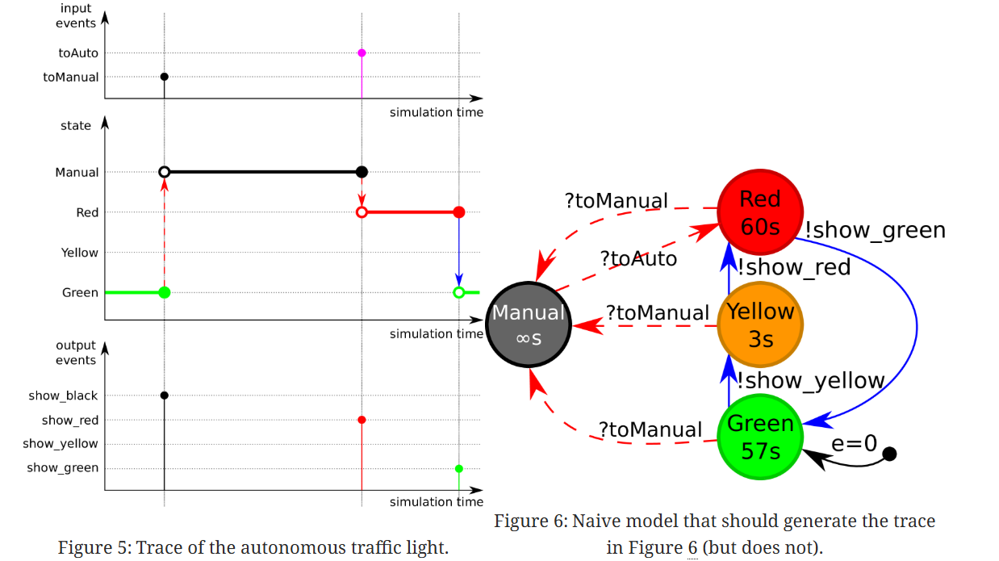
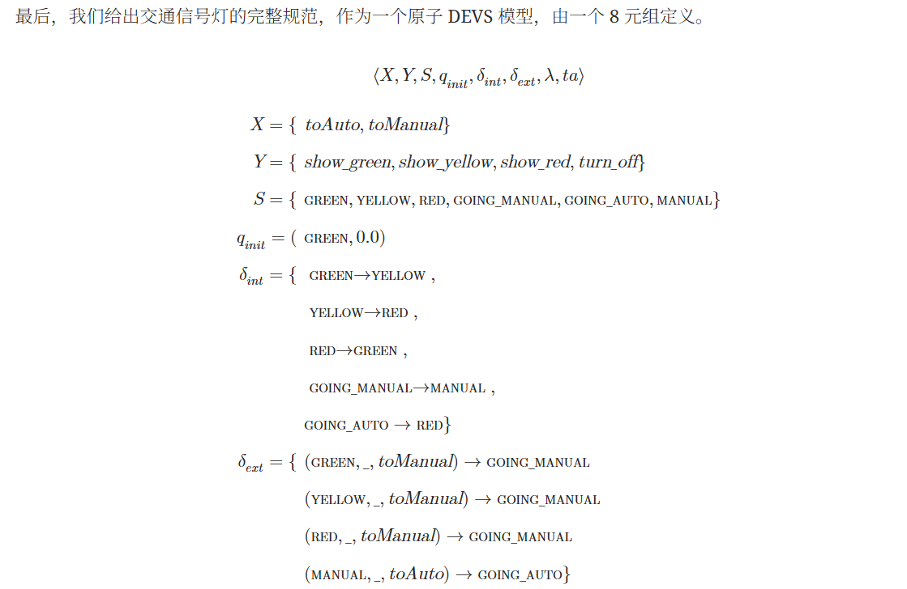
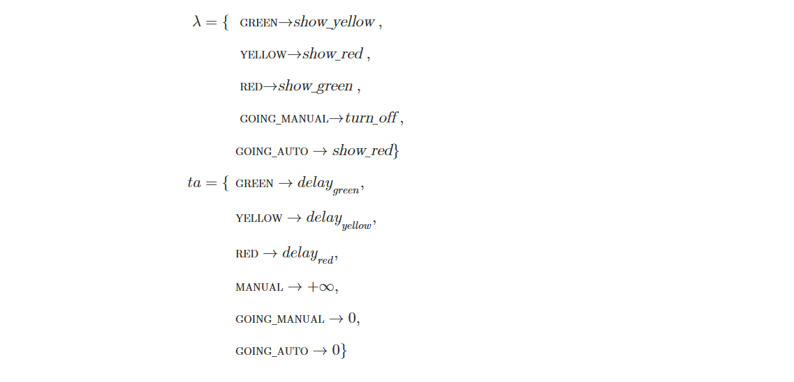
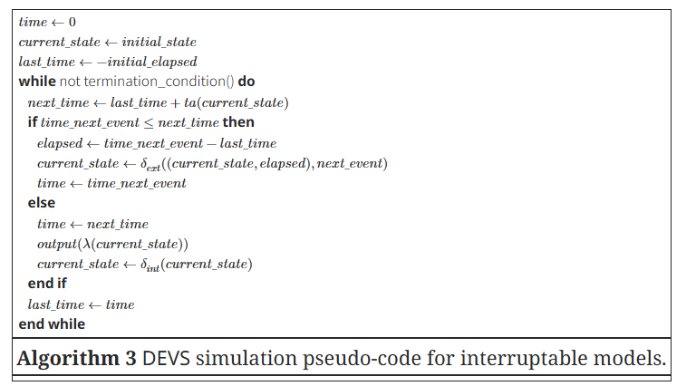
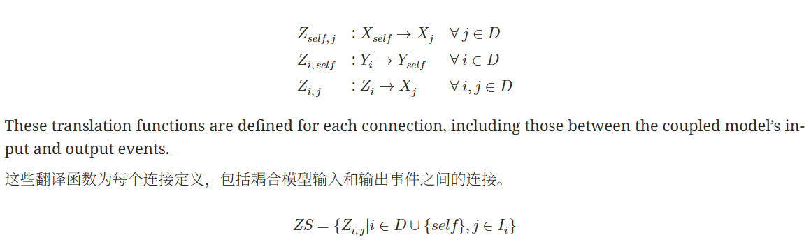
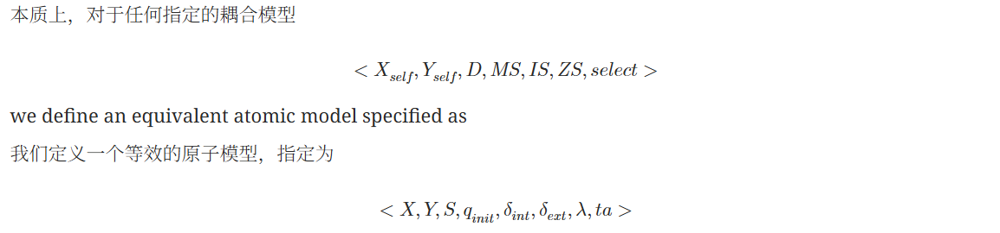
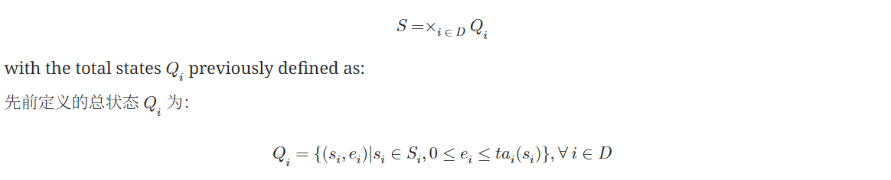
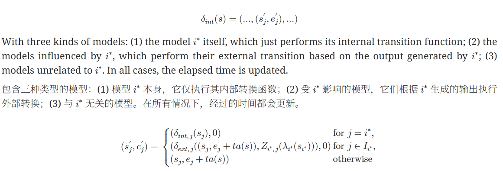

参考链接：
https://ar5iv.labs.arxiv.org/html/1701.07697?_immersive_translate_auto_translate=1  （An Introduction to Classic DEVS）

DEVS 是一种用于对复杂动态系统进行建模的流行形式化方法，采用离散事件抽象。在这个抽象层次上，系统（或在超时情况下为内部）输入的相关事件序列会导致系统状态的瞬时变化。事件之间，状态不会改变，从而形成分段常数的状态轨迹。DEVS 的主要优点在于其严谨的形式化定义，以及对其模块化组合的支持。

# 1 引言

DEVS 是一种用于使用离散事件抽象建模复杂动态系统的流行形式化方法。在这个抽象层次上，输入到系统中的相关“事件”的定时序列会导致系统状态的瞬时变化。这些事件可以由外部（即由另一个模型）或内部（即由于超时而由模型本身）生成。系统的下一个状态是根据系统的先前状态和事件来定义的。在事件之间，状态不会改变，从而形成分段常数的状态轨迹。**仿真内核只需考虑事件发生的状态，跳过所有中间时间点**。这与离散时间模型形成对比，在离散时间模型中，时间是按固定增量递增的，并且仅在此时更新状态。离散事件模型的优势在于其时间粒度可以（理论上）无界，而离散时间模型中的时间粒度是固定的。尽管如此，增加的复杂性使其不适合自然具有固定时间步的系统。

| 维度             | **离散事件模型 (Discrete Event Model)**                                  | **离散时间模型 (Discrete Time Model)**         |
| ------------------ | -------------------------------------------------------------------------- | ------------------------------------------------ |
| **时间推进方式** | 时间根据事件发生的时刻**不规则跳跃**                                     | 时间按照固定步长**均匀递增**                   |
| **状态更新**     | 仅在事件发生时更新，事件之间状态保持不变                                 | 在每个时间步更新，即使状态无变化也要更新       |
| **状态轨迹**     | **分段常数** ：在事件之间状态恒定                                        | **分段近似连续** ：按固定时间步变化            |
| **时间粒度**     | 理论上**无限制** ，由事件发生决定                                        | 固定，由时间步 Δt 决定                        |
| **效率**         | 高效：只处理事件点，跳过冗余区间                                         | 可能低效：即使无变化也要更新                   |
| **建模复杂度**   | 较高，需要明确事件触发条件与调度逻辑                                     | 较低，只需定义状态转移函数和时间步             |
| **适用系统**     | 事件驱动系统：通信网络、排队系统、无人车任务事件（到达、通信、任务切换） | 固定采样系统：物理动力学、控制系统、传感器采样 |
| **优点**         | 精确捕捉事件时序，高效仿真稀疏事件系统                                   | 实现简单，易于与连续系统数值积分结合           |
| **缺点**         | 建模复杂，不适合天然按固定时间步运行的系统                               | 可能浪费计算，Δt 过大则失真，过小则效率低     |
| **典型应用**     | DEVS、Petri 网、网络仿真、任务调度                                       | 离散控制系统、数值模拟、数字信号处理           |

DEVS 与其他离散事件形式化方法相比的主要优势在于其严谨的形式定义和对其模块化组合的支持。可比较的离散事件形式化方法包括 DES 和 Statecharts

与 DES 相比，DEVS 提供了**模块化功能**，这使得模型可以嵌套在组件内部，从而生成模型层次结构

与状态机 Statecharts 相比，DEVS 提供了更严谨的正式定义和不同类型的模块化。状态机留下了很多解释空间，导致存在多种解释 相比之下，DEVS 完全是正式定义的，并且**有一个参考算法（即抽象模拟器）** 虽然 DEVS 和状态机都是模块化形式化方法，但状态机通过复合状态创建层次结构，而 DEVS 使用**复合模型**来实现这一目的。

# 2 原子 DEVS 模型

以交通灯为例 详细的过程看论文

最终生成包含外部中断和输出的自主原子系统

DEVS原子模型的形式化描述可以表示为如下七元组：

***DEVSA = <X,Y,S,ta,δint,δext,λ>***

其中:

* X 是外部输入事件集合；
* Y 是输出事件集合；
* S 是系统状态集合，描述系统所有可能的状态；
* ta 是时间推进函数，
* δint是内部变迁函数；
* δext是外部变迁函数；
* λ是输出函数。

这里还多一个初始总状态q_init:不仅选择系统的初始状态，还定义我们已经处于此状态多长时间

伪代码展示原子模型的完整语义:在每个时间步，我们需要确定是否在内部中断之前安排了外部中断。如果不是这种情况，我们就像以前一样继续执行，通过执行内部转换。如果有必须优先处理的外部事件，我们执行外部转换。

`if time_next_event ≤ next_time`  判断下一个外部事件是否先发生 外部事件优先级

输出是在内部转换执行之前生成 外部事件触发的输出由一个临时状态触发

# 3  Coupled DEVS models 耦合 DEVS 模型

为了将不同的原子模型组合在一起并使它们能够通信，我们现在引入了耦合模型

与原子模型不同，耦合模型没有任何行为与之相关。**行为**是原子模型的职责，而**结构**则是耦合模型的职责。

1 要定义基本结构，我们需要三个元素：

* 模型实例（ D ）：定义了哪些模型包含在这个耦合模型中
* 模型规范（ MS={Mi|i∈D} ）：除了定义子模型的各个实例外，我们必须包含这些模型的原子模型规范。对于 D 中定义的每个元素，我们包含指定原子模型的 8 元组。根据定义，耦合 DEVS 模型的子模型始终需要是原子模型。稍后，我们将看到如何将其扩展以支持任意层次结构。

  
* 模型影响者 ( IS={Ii|i∈D∪{𝑠𝑒𝑙𝑓}}：还需要定义它们之间的连接。连接通过使用影响者集来定义：对于每个原子模型实例，我们定义受该模型影响的模型集。耦合有一些限制，以确保不会创建不一致的模型。施加了以下两个约束：

  * 模型**不应影响自身**。这个约束是有道理的，否则模型可能会直接影响自身。虽然本身没有大问题，但这会导致模型同时触发其内部和外部转换。由于不确定哪个应该先进行，这种情况是不允许的。
  * 耦合模型中**仅允许链接**。这是另一种表达方式，即连接应尊重模块化。模型不应直接影响当前耦合模型之外的模型，也不应影响其他子模型中更深层的模型。换句话说，受影响的模型应该是该耦合模型中模型集合的子集。

因此，耦合模型可以定义为三元组： ⟨D,𝑀𝑆,𝐼𝑆⟩

2 加入输入输出后  耦合的约束需要放宽以适应耦合模型的新功能：模型可以受耦合模型输入事件的影响，同样地，模型也可以影响耦合模型的输出事件。先前定义的约束被放宽，以允许 𝑠𝑒𝑙𝑓 ，即耦合模型本身。

3 DEVS 通过定义一个tie-breaking function 平局打破函数（ select ）来解决这个问题。该函数接收所有冲突的模型，并返回优先级高于其他模型的那个。

4 我们可能并不总是那么幸运的可以重复使用在其他地方定义的原子模型。根据重用模型的应用领域，它们可能与不同的事件协同工作。例如，如果我们的警察和交通灯都是预定义的，警察使用 go_to_work 和 take_break，而交通灯监听 toAuto 和 toManual，那么直接将它们耦合在一起是不可能的。（二者不完全对应）

连接通过一个翻译函数（ Zi,j ）进行增强，指定进入连接的事件在传递给连接端点之前如何被翻译。该函数将输出事件映射到输入事件，并可能修改它们的内容。

通过添加这个最终元素，我们将耦合模型定义为一个 7 元组。

|   | ⟨X𝑠𝑒𝑙𝑓,Y𝑠𝑒𝑙𝑓,D,MS,IS,ZS,select⟩ |   |
| --- | ------------------------------------------- | --- |

## 耦合封闭性

**类似于原子模型，我们需要形式化定义耦合模型的语义。但不是从头解释语义，通过定义一些伪代码，我们将耦合模型映射到等效的原子模型。**

因此，耦合模型的语义是相对于原子模型定义的。此外，这种扁平化消除了耦合模型中其子模型必须是原子模型的约束：如果一个耦合模型是子模型，它可以**被扁平化为原子模型**。

1 **输入和输出变量 X 和 Y** 很容易，因为它们保持不变

2 **状态 S** 包括所有子模型状态的并行组合，包括它们的经过时间（即先前定义的总状态 Q ）

经过时间是分别存储在每个模型中的，因为新原子模型的经过时间更新比每个子模型的经过时间更频繁。

3 **初始总状态**再次由两个组件组成：初始状态（ sinit ）和初始经过时间（ einit ）

考虑经过时间（ einit ），它直观上等于扁平化模型的最后一次转换以来的时间，这意味着它是所有原子子模型中找到的所有初始经过时间的最小值

qinit 指出我们过去进入了状态 sinit ，更具体地说，是 einit 时间单位之前。

4 **推进时间函数 ta** 返回所有剩余时间中的最小值：

即将发生的事件从具有指定 **最小剩余时间 minimum remaining time（ IMM)** 的所有模型集合中选择。

该集合包含所有剩余时间（σi ）与扁平化模型的推进时间（ ta ）相同的模型。然后**使用 select 函数将此集合减少为单个元素 i∗**

5 **输出函数 λ** 执行 i∗ 的输出函数并应用转换函数,当且仅当模型直接影响扁平化模型时（即，**i∗ 的输出路由到耦合模型的输出**）。如果没有连接到耦合模型的输出（即， i∗ 仅与其他原子模型耦合），则此处不调用输出函数。

6 **内部转换函数**为状态每个部分分别定义：

请注意，内部转换函数**包括受 i∗ 影响的子模型的外部转换函数** 也就是第二部分吧 。由于 i∗ 输出的事件被内部消费，所以这一切都在内部发生。

7 **外部转换函数**与内部转换函数类似

(1) 直接连接到模型输入的模型，执行其外部转换；(2) 不直接连接到模型输入的模型，仅更新其经过的时间。

# 4 DEVS 抽象模拟器

原子模型的语义是通过自然语言和高级伪代码定义的。耦合模型的语义是通过映射到这些原子模型来定义的。这两种方法都存在各自的问题。对于原子模型，伪代码不够具体，无法创建符合规范的 DEVS 模拟器：算法的许多细节没有明确规定（例如，外部事件来自哪里）。对于耦合模型，展平过程既优雅又规范，但在**运行时执行此展平操作效率非常低**。

我们将为原子模型和耦合模型定义一个更详细、更正式的仿真算法。原子模型将获得更具体的定义，**并具有清晰的接口**，而耦合模型将**获得自己的仿真算法，而不会进行扁平化处理**。因此，耦合模型将获得“操作语义”而不是“转换语义”。（我擦那前面在干嘛
