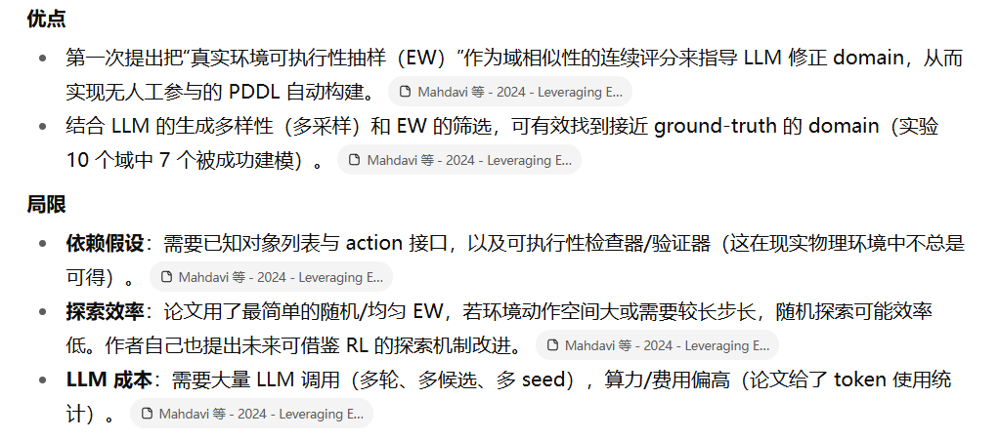

注释都在zotero中，这里只做大体概括

# Leveraging Environment Interaction for Automated PDDL Translation and Planning with Large Language Models

作者要解决的问题是：让大型语言模型（LLM）自动把自然语言描述的规划环境翻成 PDDL（domain + problem）并用经典规划器求解，而不需要人工修正。关键在于：当直接生成 PDDL 出错导致规划失败（planner 返回 nothing）时，如何给 LLM 有用、可微的反馈去迭代修正域（domain）定义？作者提出了一个基于与真实环境交互的Exploration Walk（EW）度量，并用它作为 LLM 迭代生成/筛选 domain 的评价信号，形成一个 EW 指导的树/链式搜索与自我修正流程，从而显著提升自动建模和求解成功率。

## 算法内容

**实际计算细节** ：

* 论文在实验里用最简单的 EW：每一步在当前状态对所有动作做合法性检查，均匀选取一个合法动作（即“uniform over valid actions”）。
* 为了评估一个域对另一域的相似度，要在多问题、多步长（Tmax，论文用 Tmax=10）上求平均。
* 重要结论：EW 分数会随着 domain term 差异数增加而下降（论文用一系列环境实验证明了这种单调性），因此是个有意义的相似性指标

这是第 4 节的重心（你特别关心）。我把算法步骤化并解释每一步的目的与直观为什么有效：

**高层思路** ：

1. 先用 LLM 把自然语言问题翻译出若干个 candidate problem-PDDL（因为 problem 通常比 domain 简单且能马上用来做 EW）。
2. 对每个问题候选项，初始化一个简单的 domain 模板（基于 action 接口），反复向 LLM 请求 domain 提案（多样性采样），用 EW 对这些 domain 提案评分，选择最佳提案并把 EW 的执行轨迹/失败状态以自然语言形式反馈给 LLM，作为下一轮上下文（history）继续生成更好的 domain。循环若干轮后在所有问题候选中选出最终的 (domain, problem) 对。

## 优缺点和改进

**为什么这种流程有效（直观）** ：

* LLM 本身对 PDDL 语法与 predicate 设计常犯细节错误（例如 Grippers 中漏掉 robot 参数的 free predicate 会导致“混用 gripper”的错误——论文在附录给了这个致命例子）。单次生成容易犯错；**而多采样 + 用一个能够反映“可执行性差异”的评分（EW）做筛选，能在样本空间里抓住正确/接近真实语义的候选。=**
* 用“问题先译码再译 domain”的策略可以立刻利用生成的 problem 去做 EW，从而在 domain 生成早期就能得到可用的环境交互反馈（比起先只生成 domain 更快收敛）。
* 把 EW 的**动作序列 + 失败状态** 转成自然语言反馈给 LLM（而不是仅给分数），可以让 LLM 在后续生成时“有上下文信息”去修正 predicate/参数组合（相当于把实验数据转换为可被 LLM 理解的训练信号）。

**计算成本** ：

EW 的计算在整个成本中很小（作者统计 LLM token 成本远大于 EW 计算）。在他们的机器上，单域-问题对的 EW 计算 < 2 分钟（64-core CPU），而 LLM inference 花费的 token 数量巨大（论文列出用 GPT-4 的 token 总量）。

 使用 GPT-4 模型的结果，我们使用了 12.40 百万个输入 token 和 8.73 百万个输出 token。与 LLM 推理成本相比，计算 EW 的成本相对可以忽略不计。

**可改进方向（建议）**

* 用更智能的 EW 策略（基于启发式、信息增益或 RL 的探索）减少采样量同时得到更有判别力的反馈。Mahdavi 等 - 2024 - Leveraging E…
* 在反馈里加入更结构化的失败信息（若环境/validator 能提供细节），或对 LLM 提供 predicate-level 的对比示例以便更精准修正。
* 在 LLM 侧加入 PDDL 语法/类型检查器作为“二次过滤器”，减少明显的语法错误。论文和附录也强调 predicate 设计的细节会严重影响最终结果（例如 Grippers 的 free predicate 示例）。
